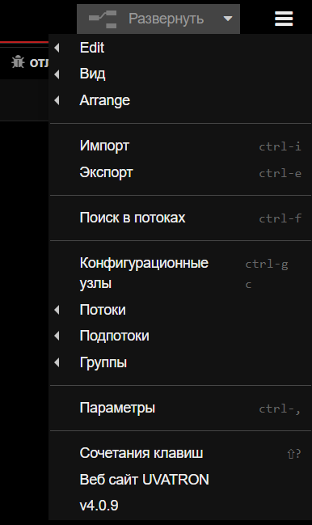
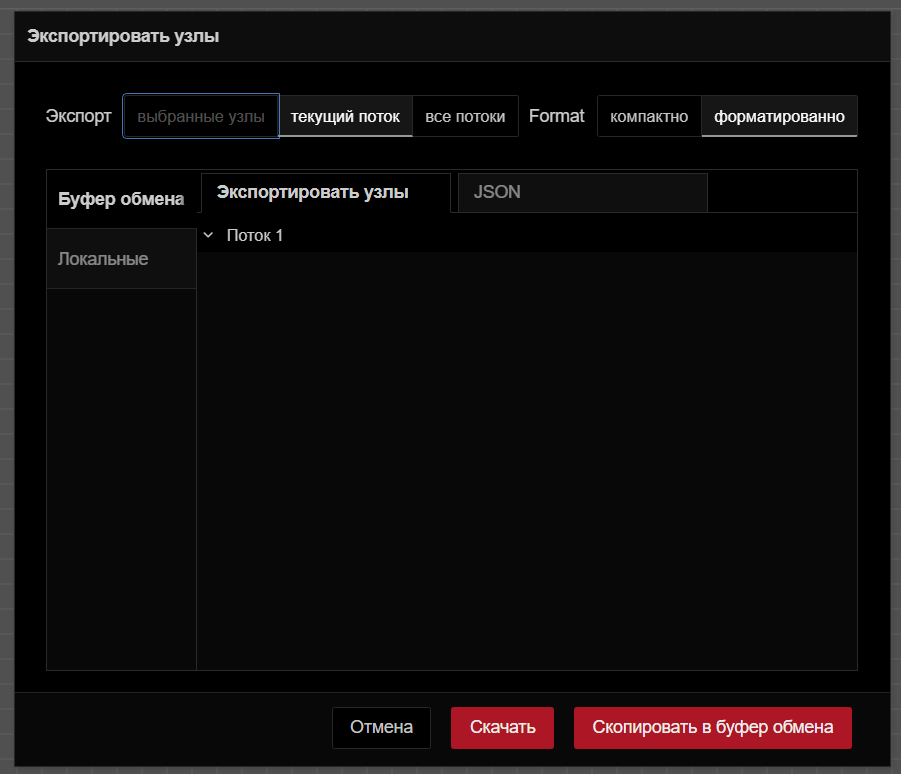
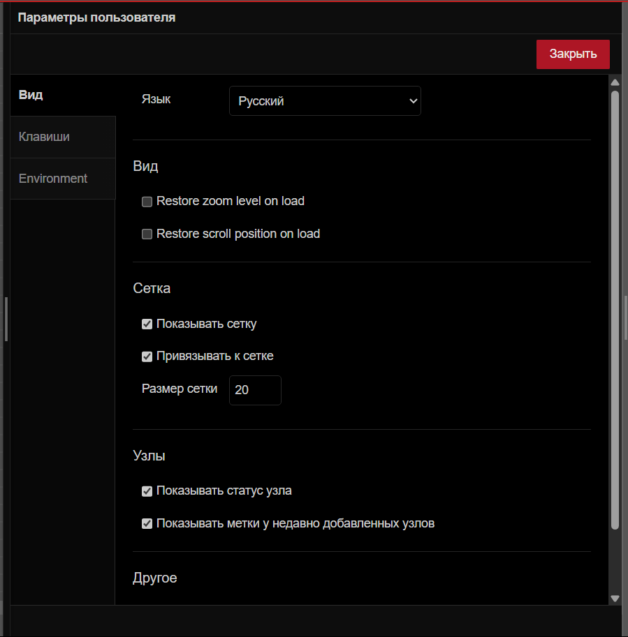

##### Компонент заголовка редактора U-LOGIC

Заголовок редактора U-LOGIC — это центральный компонент, который упрощает навигацию по основным настройкам U-LOGIC, предоставляет кнопку развертывания для выполнения потоков и доступ к профилю пользователя.

##### Кнопка развертывания

С правой стороны заголовка вы найдете красную кнопку развертывания. Нажатие на нее запускает все потоки в экземпляре. Красный цвет указывает на ожидающие изменения для развертывания, а серый — на отсутствие ожидающих изменений.

Чтобы развернуть все в рабочей обалсти, или только потоки, содержащие измененные узлы, или только узлы, которые были изменены, или перезапустить развернутые потоки, нажмите на значок раскрытия кнопки развертывания. Выберите предпочитаемый вариант и затем нажмите кнопку развертывания соответственно

##### Главное меню

Сразу после профиля пользователя в правом углу вы увидите значок меню. Нажав на него, вы откроете список опций, которые упрощают работу с U-Logic.

Ниже приведены опции, доступные в главном меню.

###### Edit

Первая опция в меню позволяет выполнять основные действия по редактированию. Наведение на нее открывает дополнительные опции, такие как «Отменить последнее выполненное изменение», «Выбрать все узлы», «Скопировать выбранные узлы» и т. д.

- **Отменить последнее выполненное изменение**: Отменяет последнее действие или серию действий, выполненных в редакторе.
- **Redo**: Повторно применяет действие, которое было ранее отменено с помощью команды «Отменить последнее выполненное изменение».
- **Вырезать выбранные узлы**: Удаляет выбранные узлы из рабочей области и временно сохраняет их в буфере обмена.
- **Скопировать выбранные узлы**: Сохраняет дубликат выбранных узлов в буфере обмена, не удаляя их из исходного потока.
- **Вставить узлы**: Позволяет вставлять скопированные или вырезанные узлы из буфера обмена обратно в рабочий процесс.
- **Copy group style**: Сохраняет стиль выбранной группы в буфере обмена.
- **Paste group style**: Применяет сохраненный стиль группы к другой выбранной группе.
- **Выбрать все узлы**: Выбирает все группы потоков в текущей рабочей области.
- **Выбрать все соединенные узлы**: Выбирает узлы, подключенные к текущим выбранным узлам.
- **Select none**: Отменяет выбор всех выбранных узлов или групп.
- **Split selection with Link nodes**: Соединяет выбранные узлы с помощью узлов связи.

###### Вид

Эта опция позволяет пользователям управлять отображением и видимостью различных элементов интерфейса в редакторе U-Logic и обеспечивает им беспрепятственный доступ к этим элементам.

- **Показывать палитру**: переключает видимость палитры U-Logic
- **Показывать боковую панель**: включает и выключает видимость боковой панели.
- **Журнал событий**: открывает журнал, в котором регистрируются события и действия в U-Logic.
- **Список действий**: предоставляет список доступных действий или задач в U-Logic, что позволяет быстро получить доступ к часто используемым операциям и функциям.
- **Отладочные сообщения**: отображает сообщения, сгенерированные узлами отладки.

###### Arrange

Эта опция позволяет вам упорядочивать и управлять выбранными группами потоков в рабочем пространстве U-Logic:

- **Align to Left**: Выравнивает выбранные группы потоков по левому краю рабочей области. *(Сочетание клавиш: alt + a l)*
- **Align to Center**: Центрирует выбранные группы потоков по горизонтали в рабочей области. *(Сочетание клавиш: alt + a c)*
- **Align to Right**: Выравнивает выбранные группы потоков по правому краю рабочей области. *(Сочетание клавиш: alt + a r)*
- **Align to Top**: Выравнивает выбранные группы потоков по верхнему краю рабочей области. *(Сочетание клавиш: alt + a t)*
- **Align to Middle**: Центрирует выбранные группы потоков по вертикали в рабочей области. *(Сочетание клавиш: alt + a m)*
- **Align to Bottom**: Выравнивает выбранные группы потоков по нижнему краю рабочей области. *(Сочетание клавиш: alt + a b)*
- **Distribute Vertically**: Равномерно распределяет выбранные группы потоков по вертикали в рабочей области. *(Сочетание клавиш: alt + a v)*
- **Distribute Horizontally**: Равномерно распределяет выбранные группы потоков по горизонтали в рабочей области. *(Сочетание клавиш: alt + a h)*
- **Move Back**: Перемещает выбранные группы потоков на один слой назад в порядке наложения.
- **Move Front**: Перемещает выбранные группы потоков на один слой вперед в порядке наложения.
- **Move Backward**: Перемещает выбранные группы потоков на одну позицию назад в порядке наложения.
- **Move Forward**: Перемещает выбранные группы потоков на одну позицию вперед в порядке наложения.

###### Импорт

Эта опция позволяет импортировать файл приложения flow.json. В общем, вам доступны два основных метода импорта: вы можете использовать поле «Буфер обмена» или загрузить файл из локальной системы, нажав «выберите файл для импорта».

Кроме того, снизу можно выбрать область, в которой поток должен импортироваться:

- **текущий поток**: Выбор «текущий поток» импортирует поток в существующую рабочую область.
- **новый поток**: Выбор «новый поток» создаст новое рабочее пространство для импортированного потока после нажатия кнопки импорта.

С левой стороны после буфера обмена вы найдете три опции:

- **Локальные**: Здесь вы можете просмотреть локальную библиотеку потоков, которая содержит потоки, созданные в том же экземпляре U-Logic. Эта библиотека доступна только из того же экземпляра, где были созданы потоки.
- **Примеры**: В этом разделе содержатся примеры потоков для всех основных узлов, а также сторонних узлов, которые вы установили, если они были добавлены.

###### Экспорт

Эта опция позволяет экспортировать созданный вами поток приложений. Обычно она предоставляет две основные опции: «Скопировать в буфер обмена», которая позволяет копировать flow.json, и «Скачать», которая загружает flow.json файл.

Кроме того, вы можете выбрать область, из которой будет экспортироваться поток приложений, из верхних опций:

- **выбранные узлы**: Выбор этой опции позволяет экспортировать только выбранные узлы из потока.
- **текущий поток**: Выбор этой опции позволяет экспортировать приложение из текущей рабочей области потока.
- **все потоки**: Выбор этой опции позволяет экспортировать поток из всех потоков в данном экземпляре.

В верхней части вы увидите две вкладки:

- **Экспортировать узлы**: Эта вкладка позволяет увидеть узлы и потоки, которые вы собираетесь экспортировать.
- **JSON**: Эта вкладка покажет поток в формате JSON, который вы собираетесь экспортировать.

- **компактно**: Это уплотнит ваш JSON-файл потока в одну строку.
- **форматированно**: Это отформатирует JSON-файл потока, сделав его более удобным для чтения или проверки.

С левой стороны после буфера обмена вы найдете еще опцию:

**Локальные:** Эта опция позволяет создать коллекцию потоков, которые вы создали в текущем экземпляре U-Logic. Вы можете создать новую папку, нажав на значок с тремя точками в правом верхнем углу и выбрав "Новая папка". Кроме того, внизу вы найдете поле ввода, которое позволяет изменить имя файла потока. Нажатие на "Экспорт в библиотеку" сохранит его в коллекции. Теперь вы можете получить доступ к своей коллекции в том же экземпляре.

###### Поиск в потоках

Эта опция позволяет выполнять поиск групп потоков, созданных в этом экземпляре U-Logic.

###### Конфигурационные узлы

При нажатии на эту опцию откроется вкладка "конфиг" боковой панели, которая позволит вам управлять всеми узлами конфигурации текущего экземпляра U-Logic.

###### Потоки

<!--- add link-->
Эта опция позволяет управлять вкладками [потока]().

- **Добавить**: добавляет новую вкладку потока.
- **Edit**: Редактирует текущую вкладку потока.
- **Удалить**: удаляет текущую вкладку потока.

###### Подпотоки

<!--- add link--->
Эта опция позволяет создать [подпоток]().

- **Создать подпоток**: создает новую вкладку подпотока.
- **Выделение в подпоток**: преобразует выбранные узлы в подпоток.

###### Группы

Эта опция позволяет управлять группами потоков.

- **Сгруппировать выделенное**: группирует выбранные узлы.
- **Разгруппировать выделенное**: разгруппирует выбранную группу потоков.
- **Объединить выделение**: объединяет выбранные группы потоков.
- **Удалить из группы**: удаляет выбранные узлы из группы.

###### Управление палитрой

Это позволяет пользователям управлять узлами, доступными в их среде U-Logic. Это включает установку новых узлов, обновление существующих и удаление узлов, которые больше не нужны.

Он содержит две основные вкладки:

- **Узлы**: эта вкладка показывает список установленных узлов. В правом углу каждой записи узла есть опции для:

  

- **удалить**: удалить узел.
- **отключить все**: Временно отключить узел.

- **Установить**: эта вкладка позволяет устанавливать сторонние узлы U-Logic из реестра npm.

  

- **сортировать**: это параметры сортировки, которые позволяют сортировать по relevance (по умолчанию), по алфавиту и по дате.
- **Обновить список модулей**: обновить список доступных сторонних узлов.

###### Параметры

- **Вид**: настройка параметров редактора и параметров интерфейса.
  - **Язык**: выберите язык для редактора U-Logic.
  - **Restore zoom level on load**: включение этой опции восстановит уровень масштабирования редактора при загрузке U-Logic.
  - **Restore scroll position on load**: включение этой опции восстановит позицию прокрутки редактора при загрузке U-Logic.
  - **Показывать сетку**: включите отображение сетки в рабочей области редактора.
  - **Привязывать к сетке**: включите привязку узлов к сетке.
  - **Размер сетки**: отрегулируйте размер квадратов сетки.
  - **Показать статус узла**: переключите, чтобы отобразить статус узлов в редакторе.
  - **Показывать метки у недавно добавленных узлов**: переключите, чтобы метки недавно добавленных узлов стали видимыми
  - **Показать советы**: переключите, чтобы отобразить подсказки в редакторе.
  - **Show guided tours for new versions**: включите пошаговые руководства для новых версий U-Logic.
<!--- add link-->
- **Палитра**: эта опция [управления палитрой]() позволяет управлять узлами, доступными в вашей среде U-Logic.

- **Клавиши**: настройте сочетания клавиш для эффективной навигации и работы в U-Logic.

- **Enviroment**: Управление переменными окружения, используемыми в потоках U-Logic. Это включает в себя настройку, редактирование и удаление переменных, к которым узлы могут получить доступ во время выполнения.

  

  - **+ добавить**: Добавляет новую переменную среды.
  - **x**: Удалить соответствующие переменные среды.
  - **Revert**: отменяет изменения, внесенные в переменные среды.

###### Сочетание клавиш

Эта опция перенаправляет вас в интерфейс, где вы можете настроить сочетания клавиш для эффективной навигации и работы в экземпляре U-Logic.

###### Вебсайт U-Logic

Эта опция перенаправит вас на официальный сайт U-Logic.

###### v4.0.9

Эта опция отображает журнал изменений для текущей версии U-Logic на вкладке "Change Log" боковой панели, подробно описывая, что было изменено или исправлено по сравнению с предыдущими версиями.