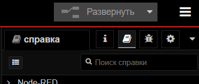
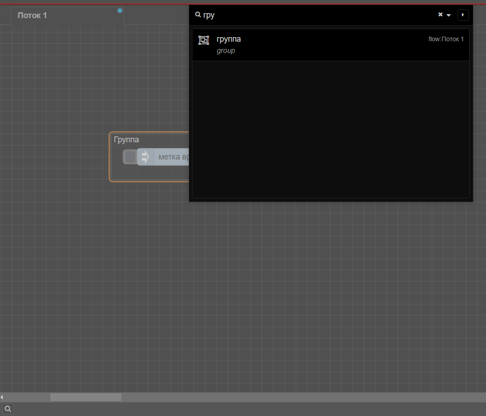
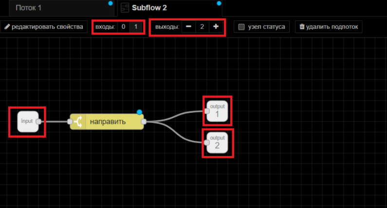
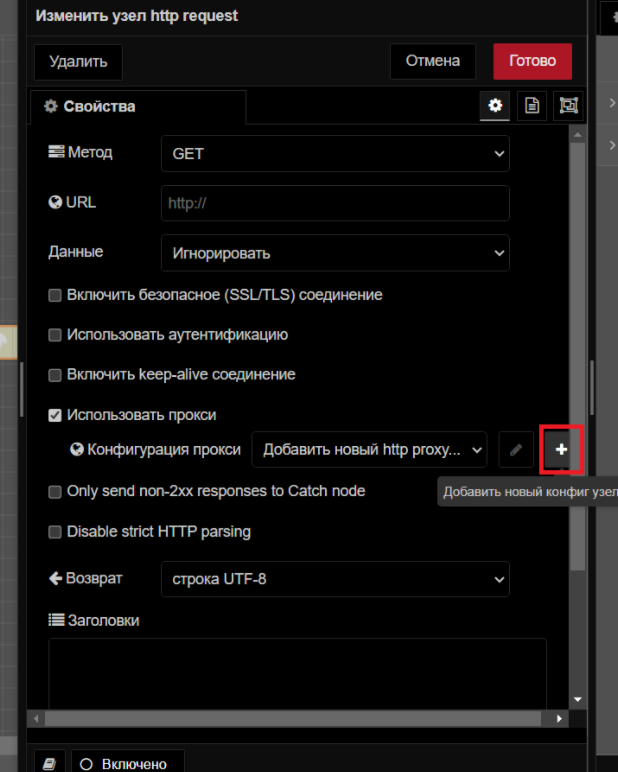
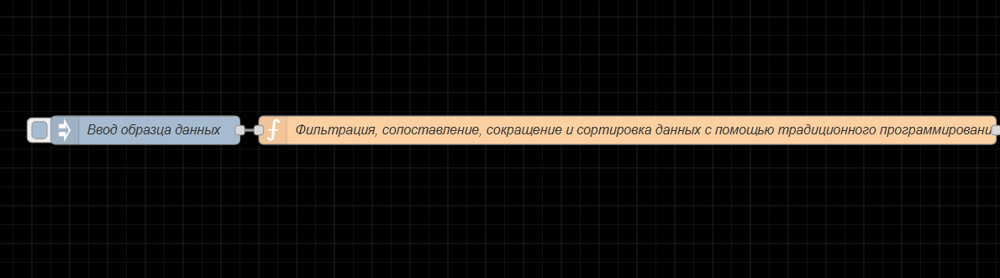
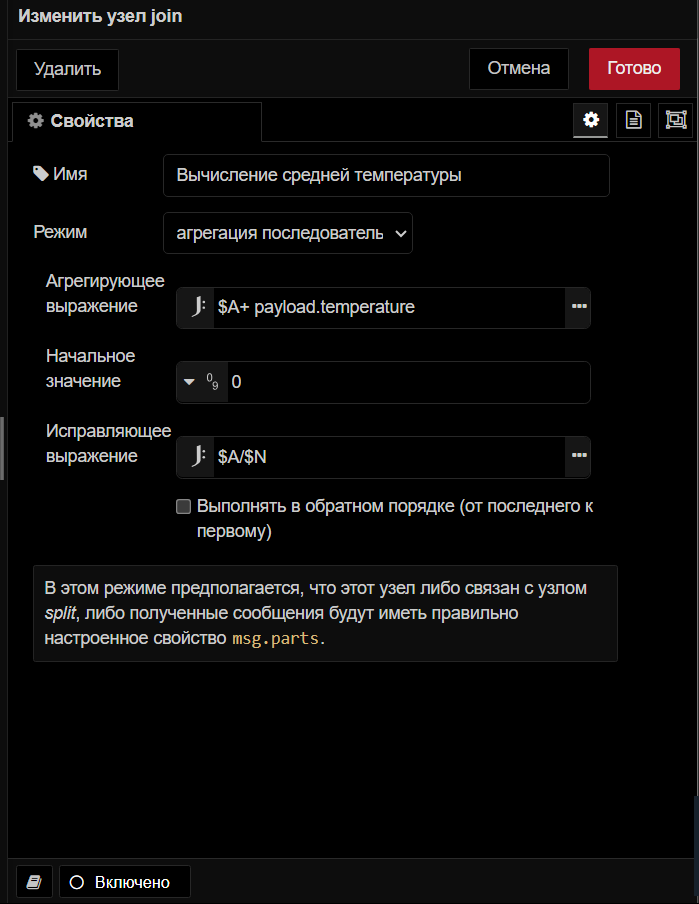
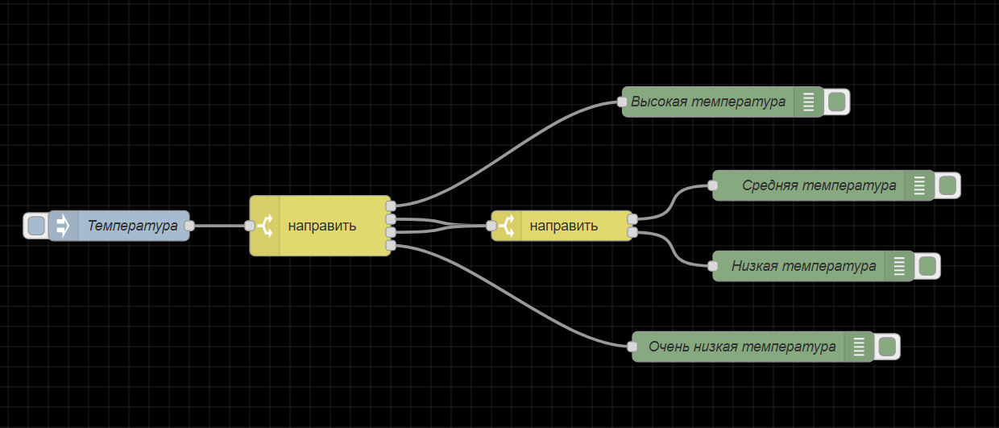
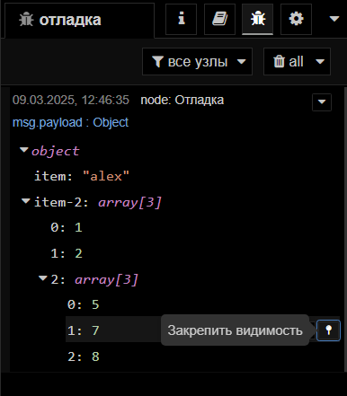

# U-Logic
```{note}
Вся логика, включая логику интерфейса, программируется в **U-Logic**. 
Для доступа к U-Logic откройте в браузере страницу **<IP Контроллера>:1880**. 
```
## Начало работы с U-Logic

### Редактор


**Окно редактора *U-Logic* состоит из четырех компонентов:**

1. Заголовок вверху содержит кнопку развернуть, главное меню, аутентификация пользователя, меню пользователя.
2. Палитра узлов слева содержит доступные для использования узлы.
3. Основное рабочее пространство посередине, где создаются потоки.
4. Боковая панель справа.

#### Заголовок редактора

##### Компонент заголовка редактора U-Logic

Заголовок редактора U-Logic — это центральный компонент, который упрощает навигацию по основным настройкам U-Logic, предоставляет кнопку развертывания для выполнения потоков и доступ к профилю пользователя.


##### Кнопка развертывания

С правой стороны заголовка вы найдете красную кнопку развертывания. Нажатие на нее запускает все потоки в экземпляре. Красный цвет указывает на ожидающие изменения для развертывания, а серый — на отсутствие ожидающих изменений.




Чтобы развернуть все в рабочей обалсти, или только потоки, содержащие измененные узлы, или только узлы, которые были изменены, или перезапустить развернутые потоки, нажмите на значок раскрытия кнопки развертывания. Выберите предпочитаемый вариант и затем нажмите кнопку развертывания соответственно


##### Главное меню

Сразу после профиля пользователя в правом углу вы увидите значок меню. Нажав на него, вы откроете список опций, которые упрощают работу с U-Logic.

Ниже приведены опции, доступные в главном меню.

###### Edit

Первая опция в меню позволяет выполнять основные действия по редактированию. Наведение на нее открывает дополнительные опции, такие как "Отменить последнее выполненное изменение", "Выбрать все узлы", "Скопировать выбранные узлы" и т. д.


- **Отменить последнее выполненное изменение**: Отменяет последнее действие или серию действий, выполненных в редакторе.
- **Redo**: Повторно применяет действие, которое было ранее отменено с помощью команды "Отменить последнее выполненное изменение".
- **Вырезать выбранные узлы**: Удаляет выбранные узлы из рабочей области и временно сохраняет их в буфере обмена.
- **Скопировать выбранные узлы**: Сохраняет дубликат выбранных узлов в буфере обмена, не удаляя их из исходного потока.
- **Вставить узлы**: Позволяет вставлять скопированные или вырезанные узлы из буфера обмена обратно в рабочий процесс.
- **Copy group style**: Сохраняет стиль выбранной группы в буфере обмена.
- **Paste group style**: Применяет сохраненный стиль группы к другой выбранной группе.
- **Выбрать все узлы**: Выбирает все группы потоков в текущей рабочей области.
- **Выбрать все соединенные узлы**: Выбирает узлы, подключенные к текущим выбранным узлам.
- **Select none**: Отменяет выбор всех выбранных узлов или групп.
- **Split selection with Link nodes**: Соединяет выбранные узлы с помощью узлов связи.

###### Вид

Эта опция позволяет пользователям управлять отображением и видимостью различных элементов интерфейса в редакторе U-Logic и обеспечивает им беспрепятственный доступ к этим элементам.


- **Показывать палитру**: переключает видимость палитры U-Logic
- **Показывать боковую панель**: включает и выключает видимость боковой панели.
- **Журнал событий**: открывает журнал, в котором регистрируются события и действия в U-Logic.
- **Список действий**: предоставляет список доступных действий или задач в U-Logic, что позволяет быстро получить доступ к часто используемым операциям и функциям.
- **Отладочные сообщения**: отображает сообщения, сгенерированные узлами отладки.

###### Arrange

Эта опция позволяет вам упорядочивать и управлять выбранными группами потоков в рабочем пространстве U-Logic:


- **Align to Left**: Выравнивает выбранные группы потоков по левому краю рабочей области.
- **Align to Center**: Центрирует выбранные группы потоков по горизонтали в рабочей области.
- **Align to Right**: Выравнивает выбранные группы потоков по правому краю рабочей области.
- **Align to Top**: Выравнивает выбранные группы потоков по верхнему краю рабочей области.
- **Align to Middle**: Центрирует выбранные группы потоков по вертикали в рабочей области.
- **Align to Bottom**: Выравнивает выбранные группы потоков по нижнему краю рабочей области.
- **Distribute Vertically**: Равномерно распределяет выбранные группы потоков по вертикали в рабочей области.
- **Distribute Horizontally**: Равномерно распределяет выбранные группы потоков по горизонтали в рабочей области.
- **Move Back**: Перемещает выбранные группы потоков на один слой назад в порядке наложения.
- **Move Front**: Перемещает выбранные группы потоков на один слой вперед в порядке наложения.
- **Move Backward**: Перемещает выбранные группы потоков на одну позицию назад в порядке наложения.
- **Move Forward**: Перемещает выбранные группы потоков на одну позицию вперед в порядке наложения.

###### Импорт

Эта опция позволяет импортировать файл приложения `flow.json`. В общем, вам доступны два основных метода импорта: вы можете использовать поле "Буфер обмена" или загрузить файл из локальной системы, нажав "выберите файл для импорта".


Кроме того, снизу можно выбрать область, в которой поток должен импортироваться:

- **текущий поток**: Выбор "текущий поток" импортирует поток в существующую рабочую область.
- **новый поток**: Выбор "новый поток" создаст новое рабочее пространство для импортированного потока после нажатия кнопки импорта.

С левой стороны после буфера обмена вы найдете две опции:

- **Локальные**: Здесь вы можете просмотреть локальную библиотеку потоков, которая содержит потоки, созданные в том же экземпляре U-Logic. Эта библиотека доступна только из того же экземпляра, где были созданы потоки.
- **Примеры**: В этом разделе содержатся примеры потоков для всех основных узлов, а также сторонних узлов, которые вы установили, если они были добавлены.

###### Экспорт

Эта опция позволяет экспортировать созданный вами поток приложений. Обычно она предоставляет две основные опции: "Скопировать в буфер обмена", которая позволяет копировать `flow.json`, и "Скачать", которая загружает `flow.json` файл.


Кроме того, вы можете выбрать область, из которой будет экспортироваться поток приложений, из верхних опций:


- **выбранные узлы**: Выбор этой опции позволяет экспортировать только выбранные узлы из потока.
- **текущий поток**: Выбор этой опции позволяет экспортировать приложение из текущей рабочей области потока.
- **все потоки**: Выбор этой опции позволяет экспортировать поток из всех потоков в данном экземпляре.

В верхней части вы увидите две вкладки:

- **Экспортировать узлы**: Эта вкладка позволяет увидеть узлы и потоки, которые вы собираетесь экспортировать.
- **JSON**: Эта вкладка покажет поток в формате JSON, который вы собираетесь экспортировать.


- **компактно**: Это уплотнит ваш JSON-файл потока в одну строку.
- **форматированно**: Это отформатирует JSON-файл потока, сделав его более удобным для чтения или проверки.

С левой стороны после буфера обмена вы найдете еще опцию:


**Локальные:** Эта опция позволяет создать коллекцию потоков, которые вы создали в текущем экземпляре U-Logic. Вы можете создать новую папку, нажав на значок с тремя точками в правом верхнем углу и выбрав "Новая папка". Кроме того, внизу вы найдете поле ввода, которое позволяет изменить имя файла потока. Нажатие на "Экспорт в библиотеку" сохранит его в коллекции. Теперь вы можете получить доступ к своей коллекции в том же экземпляре.

###### Поиск в потоках


Эта опция позволяет выполнять поиск групп потоков, созданных в этом экземпляре U-Logic.

###### Конфигурационные узлы


При нажатии на эту опцию откроется вкладка "конфиг" боковой панели, которая позволит вам управлять всеми узлами конфигурации текущего экземпляра U-Logic.

###### Потоки


Эта опция позволяет управлять вкладками потока.

- **Добавить**: добавляет новую вкладку потока.
- **Edit**: Редактирует текущую вкладку потока.
- **Удалить**: удаляет текущую вкладку потока.

###### Подпотоки


Эта опция позволяет создать подпоток.

- **Создать подпоток**: создает новую вкладку подпотока.
- **Выделение в подпоток**: преобразует выбранные узлы в подпоток.

###### Группы


Эта опция позволяет управлять группами потоков.

- **Сгруппировать выделение**: группирует выбранные узлы.
- **Разгруппировать выделение**: разгруппирует выбранную группу потоков.
- **Объединить выделение**: объединяет выбранные группы потоков.
- **Удалить из группы**: удаляет выбранные узлы из группы.

<!-- Заметка -->
<!-- ###### Управление палитрой -->
<!-- названия сторонних узлов содержат nod-red -->
<!-- Это позволяет пользователям управлять узлами, доступными в их среде U-Logic. Это включает установку новых узлов, обновление существующих и удаление узлов, которые больше не нужны.

Он содержит две основные вкладки:

- **Узлы**: Эта вкладка показывает список установленных узлов. В правом углу каждой записи узла есть опции для:

  

  - **удалить**: Удалить узел.
  - **отключить все**: Временно отключить узел.

- **Установить**: Эта вкладка позволяет устанавливать сторонние узлы U-Logic из реестра npm.

  

  - **сортировать**: Это параметры сортировки, которые позволяют сортировать по relevance (по умолчанию), по алфавиту и по дате.
  - **Обновить список модулей**: Обновить список доступных сторонних узлов. -->
###### Параметры


- **Вид**: настройка параметров редактора и параметров интерфейса.
  - **Язык**: выберите язык для редактора U-Logic.
  - **Restore zoom level on load**: включение этой опции восстановит уровень масштабирования редактора при загрузке U-Logic.
  - **Restore scroll position on load**: включение этой опции восстановит позицию прокрутки редактора при загрузке U-Logic.
  - **Показывать сетку**: включите отображение сетки в рабочей области редактора.
  - **Привязывать к сетке**: включите привязку узлов к сетке.
  - **Размер сетки**: отрегулируйте размер квадратов сетки.
  - **Показать статус узла**: переключите, чтобы отобразить статус узлов в редакторе.
  - **Показывать метки у недавно добавленных узлов**: переключите, чтобы метки недавно добавленных узлов стали видимыми
  - **Показать советы**: переключите, чтобы отобразить подсказки в редакторе.
  - **Show guided tours for new versions**: включите пошаговые руководства для новых версий U-Logic.
<!-- - **Палитра**: эта опция управления палитрой узлов позволяет управлять узлами, доступными в вашей среде U-Logic. -->
- **Клавиши**: настройте сочетания клавиш для эффективной навигации и работы в U-Logic.

- **Enviroment**: Управление переменными окружения, используемыми в потоках U-Logic. Это включает в себя настройку, редактирование и удаление переменных, к которым узлы могут получить доступ во время выполнения.

  

  - **+ добавить**: Добавляет новую переменную среды.
  - **x**: Удалить соответствующие переменные среды.
  - **Revert**: отменяет изменения, внесенные в переменные среды.

###### Сочетание клавиш

Эта опция перенаправляет вас в интерфейс, где вы можете настроить сочетания клавиш для эффективной навигации и работы в экземпляре U-Logic.

###### Вебсайт U-Logic

Эта опция перенаправит вас на официальный сайт U-Logic.

###### v4.0.9

Эта опция отображает журнал изменений для текущей версии U-Logic на вкладке "Change Log" боковой панели, подробно описывая, что было изменено или исправлено по сравнению с предыдущими версиями.

#### Палитра узлов редактора

Палитра узлов — это левая боковая панель, которая содержит все доступные узлы.

##### Панель поиска


Расположенная в верхней части палитры строка фильтра узлов позволяет быстро находить узлы по их названию.

##### Категории узлов


Палитра узлов разделена на несколько категорий, каждая из которых содержит коллекции узлов. Подпотоки категоризируются в разделе "Подпотоки".

Вы можете свернуть или развернуть категории, нажав на нужную категорию.

###### Свернуть все категории


Внизу палитры вы найдете два значка со стрелками. Нажатие на левый значок со стрелкой вверх свернёт все категории.

##### Развернуть все категории

Нажатие на значок со стрелкой вниз развернет все категории обратно в состояние по умолчанию.

##### Показать/скрыть палитру


Нажатие этой кнопки скрывает боковую панель палитры. Чтобы снова ее отобразить, нажмите на кнопку еще раз.

#### Рабочее пространство редактора

Рабочая область — это основная область редактора, в которой вы создаете потоки приложений, перетаскивая узлы из палитры.


##### Просмотреть инструменты


В рабочем пространстве в правом нижнем углу есть инструменты просмотра. Сюда входят кнопки увеличения (`Ctrl`+`+`) и уменьшения (`Ctrl`+`-`) для управления видом рабочего пространства и сброса уровня масштабирования до значения по умолчанию.


Кроме того, он предоставляет навигатор представлений, который позволяет вам видеть уменьшенное изображение всего рабочего пространства. В этом представлении вы также можете видеть текущую видимую область рабочего пространства в редакторе. Чтобы перейти к определенной области рабочего пространства, щелкните эту область в навигаторе представлений.

##### Search flows




В левом нижнем углу рабочей области вы увидите значок поиска. Нажатие на него откроет всплывающее окно, позволяющее быстро искать потоки в вашем экземпляре U-Logic по их имени. Вы можете открыть это диалоговое окно, нажав `Ctrl` + `F`.

##### Поток


Поток представлен в виде вкладки в рабочей области редактора, предоставляя новое рабочее пространство для создания приложений путем соединения узлов. "Поток" также неформально используется для описания одного набора соединенных узлов. Таким образом, поток (вкладка) может содержать несколько потоков (наборов соединенных узлов), но формально поток является родительской группой нескольких соединенных узлов. Поток может иметь имя и описание, которые будут отображаться на информационной боковой панели.

###### Добавление потока


Чтобы создать родительский поток, нажмите на значок "+" в правом верхнем углу, или воспользуйтесь опцией добавления потока в главном меню при помощи раздела "Потоки"

###### Редактирование свойств поиска


Чтобы изменить свойства потока, дважды щелкните вкладку потока, чтобы ввести его имя и описание в появившейся всплывающей форме.

###### Удаление потока


Чтобы удалить поток, дважды щелкните по нему. В появившемся всплывающем окне нажмите кнопку "Удалить" в верхнем левом углу.


Либо щелкните правой кнопкой мыши вкладку потока и выберите в меню пункт "Удалить".

###### Включение и выключение потоков


Чтобы включить или отключить поток, дважды щелкните на вкладке потока. Нажмите кнопку "Отключено" в нижнем левом углу или кнопку "Включено", если он уже отключен.


Либо щелкните правой кнопкой мыши по вкладке потока и выберите в меню "Disable flow/Enable flow". Отключенные потоки не выполняются при развертывании.

###### Переупорядочение потоков

Потоки можно переупорядочить, щелкнув и перетащив вкладку потока в нужную позицию. Дополнительные параметры меню вкладки потока можно получить, щелкнув значок раскрывающейся стрелки в правом верхнем углу.

##### Подпоток
<!-- создание gif -->


Подпоток в U-Logic — это набор узлов, которые свернуты в один узел в рабочей области. Он позволяет группировать набор узлов в повторно используемую единицу. Это помогает в организации потоков, содействии повторному использованию и упрощении сложных конструкций потоков путем инкапсуляции нескольких узлов в единое представление узла более высокого уровня.

```{note}
Подпоток не может содержать экземпляр самого себя — ни напрямую, ни косвенно.
```

###### Создание подпотока


Чтобы создать подпоток, в разделе "Подпотоки" выберите "Создать подпоток" в главном меню.


Он создаст для вас окно подпотока, похожее на вкладку потока.

###### Редактирование подпотока


Чтобы открыть диалоговое окно редактирования подпотока, дважды щелкните по узлу подпотока, затем щелкните "Изменить шаблон подпотока". Вы можете дать имя для этого подпотока, добавить описание, щелкнув в правом верхнем углу


опцию "Описание", а также настроить внешний вид, нажав на опцию "Внешний вид" в правом верхнем углу.


На вкладке свойств вы можете определить пользовательские свойства, которые будут добавлены в диалог редактирования подпотока. Затем эти свойства будут представлены как переменные среды, которые затем могут использоваться узлами этого подпотока. При определении этих свойств вы также можете определить тип данных и метку для каждого.


###### Удаление подпотока


Чтобы удалить подпоток, нажмите кнопку "удалить подпоток" в верхней части вкладки подпотока.

###### Преобразование узлов в подпоток


Если у вас есть узлы на рабочем пространстве и вы хотите создать из них подпоток, вы можете выбрать их, нажав левую клавишу мыши и нарисовав вокруг них прямоугольник. Затем нажмите на `Подпотоки` -> `Выделение в подпоток` в главном меню.

```{note}
Провода, входящие в выборку, должны быть подключены к одному узлу, поскольку результирующий узел подпотока может иметь не более одного входа.
```

###### Входы и выходы



Входы и выходы подпотока изображены серыми квадратными узлами, которые могут быть соединены в рабочем пространстве подпотока как обычные узлы. Верхняя панель инструментов предлагает функции для добавления и удаления этих узлов. Подобно узлам обычного потока, каждый подпоток может иметь максимум один вход, но может вмещать несколько выходов.

###### Статус узла


Узел Status используется для обновления статуса подпотока. Этот узел статуса можно редактировать как обычные узлы потока. Этот узел использует входные данные, `msg.payload` которые могут быть либо простой строкой, либо объектом Status.

##### Узлы


Узел — это фундаментальный строительный блок, используемый для создания потоков. Каждый узел представляет собой отдельную часть функциональности или определенное действие, которое может быть выполнено в потоке. Эти узлы могут быть сторонними дополнениями с использованием менеджера палитры или основных узлов.


Узлы могут иметь один входной и несколько выходных портов, соединенных проводами, которые определяют поток данных внутри потоков. Как входные, так и выходные узлы могут подключаться к нескольким проводам.


Некоторые узлы имеют кнопки либо слева, либо справа. Например, узел inject имеет кнопку слева, а узел debug — справа. Функция этих кнопок различается между узлами.
<!-- 
 -->

Кроме того, некоторые узлы отображают статус внизу со значками, указывающими на их статус выполнения. Например, узлы mqtt in и websocket in показывают текст "подключено" с зеленым кружком, указывающим на успешное подключение.


Все узлы в U-Logic обозначают ошибки красным треугольником, неразвернутые изменения — синим кружком.

###### Добавление узлов в рабочее пространство

Добавить узлы в рабочую область можно тремя способами:

**Перетаскивание из палитры**

Узлы можно добавлять из палитры узлов U-Logic, перетаскивая их на рабочую область.

**Использование диалогового окна быстрого добавления**

Редактор U-Logic предоставляет быстрый и простой способ добавления узлов с помощью палитры:


- Нажмите `Ctrl` или `⌘` и щелкните по рабочей области.
- Выберите нужный узел в диалоговом окне, которое содержит все доступные узлы из основной палитры узлов.
- Используйте строку поиска для быстрого поиска узлов.

При рисовании провода от одного узла оставьте провод на рабочем пространстве, чтобы подключить его к узлу, который будет добавлен с помощью того же диалогового окна быстрого добавления.

**Импорт из библиотеки или буфера обмена**

Узлы также можно добавлять, импортируя их из командной или локальной библиотеки или используя буфер обмена (`главное меню` -> `импорт`).

###### Редактирование свойств узла


Чтобы настроить свойства узла, дважды щелкните по нему или выберите узел и нажмите `Enter`. Появится всплывающая форма для настройки узла. Параметры конфигурации различаются в зависимости от типа узла.


- При нажатии на вторую из трех опций в правом верхнем углу открывается вкладка "Описание", позволяющая написать описание в формате Markdown, которое будет отображаться на боковой панели информации.


- При нажатии на третий параметр открывается вкладка для изменения внешнего вида узла, например, для изменения значков, присвоения имен входным и выходным портам и переключения видимости меток.

###### Включение и отключение узлов


Чтобы включить или отключить узлы, дважды щелкните по узлу и нажмите нижнюю кнопку "Включено" или кнопку "Отключено", если они уже включены.

###### Доступ к справочной информации Node


Чтобы получить доступ к справочной информации об узле, дважды щелкните по узлу и щелкните нижний левый значок "Показать справку", который отображает информацию, связанную с этим узлом, на информационной боковой панели.

###### Конфигурационные узлы

Узлы конфигурации в U-Logic хранят конфигурации, общие для нескольких узлов в потоке.

Например, узлы HTTP-прокси или настройки TLS представляют собой конфигурации для узлов HTTP-запросов.

```{note}
Узлы конфигурации не шифруют данные после конфигурации, что потенциально может раскрыть конфиденциальную информацию при неправильном распространении. Рекомендуется использовать переменные среды для настройки этих узлов, чтобы предотвратить их раскрытие в потоке.
```

Узлы конфигурации можно добавлять с помощью диалогового окна редактирования узлов, требующих настройки:



- Нажмите на значок "+" рядом со значком карандаша и полем с текстом.
- Введите необходимую информацию в диалоговом окне редактирования и нажмите "Добавить".

Узлы конфигурации не видны в рабочей области, как другие узлы, но ими можно управлять на вкладке узлов конфигурации на боковой панели.


Чтобы узнать, сколько узлов используют определенную конфигурацию, проверьте информацию в нижнем колонтитуле диалогового окна редактирования узла конфигурации.

Кроме того, как и общие узлы, узлы конфигурации можно отключать и включать таким же образом.

##### Провода


"Провода" относятся к соединениям, которые связывают узлы вместе, чтобы определить поток данных. Эти провода визуально представляют направление и поток информации от одного узла к другому в потоке U-Logic.

###### Соединение узлов вместе
<!-- 
 -->

Чтобы соединить узлы с помощью проводов, щелкните левой кнопкой мыши на выходном порту узла и перетащите провод к входному порту назначения. Кроме того, если вы нажмете `Ctrl/⌘` и левую клавишу мыши на входном или выходном порту, вам не нужно будет удерживать левую клавишу мыши или любую другую кнопку для перетаскивания провода. Чтобы подключить его к порту назначения, нажмите левую клавишу мыши на порту назначения. Если клавиша `Ctrl/⌘` останется нажатой после подключения к порту назначения, и если узел этого порта имеет выходной порт, будет перетащен новый провод.

Провода можно подключать от входного порта к выходному порту, а не от входного порта к входному порту или от выходного порта к выходному порту.

###### Удаление проводов
<!-- 
 -->

Чтобы удалить провода, щелкните левой кнопкой мыши, чтобы выбрать первый провод. Чтобы выбрать несколько проводов, нажмите и удерживайте клавишу, `Ctrl\⌘` щелкая каждый провод левой кнопкой мыши. Если вы используете только левую кнопку мыши, вы можете выбрать только один провод за раз. После выбора проводов нажмите клавишу "delete" или "backspace", чтобы удалить их.

###### Движущиеся провода
<!-- 
 -->

Чтобы отключить провод от порта, выберите провод, щелкнув по нему. Затем нажмите и удерживайте клавишу `Shift` , пока левая клавиша мыши нажата на порту. При перетаскивании мыши вы увидите, что провод отключается от порта и может быть подключен к другому порту.

Если к порту подключено несколько проводов, и при нажатии кнопки с удерживаемой клавишей Shift ни один из них не выбран, то будут перемещаться все провода.

###### Резка проводов
<!-- 
 -->

Провода также можно удалить, разрезав их. Это можно сделать, удерживая клавишу `Alt/Option`, а затем нарисовав линию разрезания, удерживая левую кнопку мыши.

###### Отсоединение узлов

**Сохранение провода при удалении узла**
<!-- 
 -->

Для этого нажмите и удерживайте клавишу `Ctrl/⌘`, выберите узел, щелкнув левой клавишей мыши, а затем нажмите клавишу `delete` или `backspace`.

**Отсоединение узла от проводов**
<!-- 
 -->

Чтобы использовать эту опцию, необходимо задать сочетание клавиш для действия "Detach Selected Nodes"

##### Группы


В U-Logic можно создавать группы для лучшей организации, содержащие один объект с включенными конфигурациями узлов в редакторе.

###### Создание группы потоков


Чтобы создать группу потоков, выберите узлы (удерживая клавишу Ctrl или рисуя вокруг них прямоугольник). Перейдите `Группы` -> `Сгруппировать выделение` в главном меню или нажмите `Ctrl` + `Shift` + `G`.

###### Редактирование свойств группы


Группа потока может иметь имя, цвет фона и метку границы, видимую в рабочей области. По умолчанию она имеет серую границу без фона или имени.

Чтобы задать стиль и имя группы, дважды щелкните по ней. Введите имя, выберите цвета контура и фона в свойстве заливки, настройте положение и цвет метки, затем щелкните "Готово" в правом верхнем углу.

###### Добавление переменных среды на уровне группы


Чтобы добавить переменные среды на уровне группы, дважды щелкните по ним. Выберите вторую опцию в правом верхнем углу всплывающего окна, расположенного под кнопкой "Готово". Нажмите самую нижнюю кнопку "добавить", чтобы добавить переменные.

###### Добавление описания


Чтобы добавить описание в группу, дважды щелкните по ней. Выберите третий вариант в правом верхнем углу всплывающего окна под кнопкой "Готово". Введите описание в формате Markdown.

###### Добавление узлов в группу
<!-- 
 -->

Чтобы добавить узлы в существующую группу, перетащите их в группу. Это можно делать по одному узлу за раз. Группы также могут быть вложены друг в друга таким же образом.

###### Удаление узлов из группы
<!-- 
 -->

Чтобы удалить узлы из группы, выберите узлы и перейдите `Группы` -> `Удалить из группы` в главном меню. Аналогично удалите группу из другой группы. Или щелкните по узлу, удерживайте клавишу `Alt` и перетащите его за пределы группы.

###### Объединение групп


Чтобы объединить несколько групп в одну, выберите группы. Перейти к главному меню и выбрать раздел `Группы` -> `Объединить выделение`.

###### Разгруппировка выбранных узлов


Чтобы разгруппировать узлы из группы, выберите узлы. Перейти к главному меню в раздел `Группы` -> `Разгруппировать выделение`.

##### Выбор

Редактор U-Logic предоставляет простой интерфейс для выбора узлов и проводов на рабочем пространстве.

Узел можно выбрать или отменить выбор, щелкнув по нему. Чтобы выбрать несколько узлов, нажмите `Ctrl/⌘` клавишу и выберите нужные узлы. Чтобы выбрать все узлы в рабочей области, щелкните `Ctrl`+`A`.

###### Инструмент "Лассо"


U-Logic предоставляет инструмент лассо для более быстрого выбора. Чтобы использовать инструмент лассо, нажмите левую клавишу мыши и перетащите курсор, затем вы можете выбрать несколько узлов, нарисовав вокруг них прямоугольник.

###### Выбор подключенных узлов
<!-- 
 -->

Чтобы выбрать все подключенные к определенному узлу узлы, нажмите `Shift` и щелкните по середине этого узла.

###### Выбор всех вышестоящих узлов
<!-- 
 -->

Чтобы выбрать все подключенные узлы, которые находятся перед этим конкретным узлом, нажмите `Shift` и, удерживая ее, щелкните левую часть этого узла.

###### Выбор всех нижестоящих узлов
<!-- 
 -->

Чтобы выбрать все подключенные узлы, которые находятся после данного конкретного узла, нажмите `Shift` и, удерживая ее, щелкните правую часть этого узла.

###### Выбор потоков


Чтобы выбрать вкладки потока, нажмите клавишу `Ctrl/⌘` и, удерживая ее, щелкните на вкладке потока, которую вы хотите выбрать. Теперь вы можете удалить, экспортировать или скопировать их все вместе.

#### Боковая панель редактора

Боковая панель расположена на правой стороне редактора U-Logic. Она содержит набор различных инструментов, которые упрощают использование U-Logic, например, управление узлами, конфигурация, хранилище контекста и многое другое.


Инструменты, доступные на боковой панели, называются панелями.

##### Панели по умолчанию

Боковая панель U-Logic поставляется со следующими панелями по умолчанию:

##### Панель "инфо"

На информационной панели отображается информация обо всех потоках, узлах, присутствующих в них, подпотоках и узлах, присутствующих в них, а также узлах глобальной конфигурации в древовидной структуре.

Если навести курсор на любой элемент в этой древовидной структуре, вы увидите несколько опций, которые упрощают и ускоряют работу, например, вызвать действие (для активации узлов, если у наведенного узла есть кнопка), включить/отключить (для отключения и включения наведенного узла), Show/Hide (для скрытия и отображения наведенного элемента в рабочей области), Lock/Unlock (для блокировки и разблокировки наведенного элемента), Найти в рабочей области (для быстрого поиска наведенного элемента в рабочей области). Эти опции представлены различными значками.

###### Поиск в потоках

Панель "инфо" имеет строку поиска в верхней части, которая позволяет легко искать потоки, подпотоки и узлы на информационной панели.

Кроме того, он предоставляет фильтр, позволяющий фильтровать эти элементы по различным параметрам, таким как
- Узлы конфигурации
- Неиспользуемые узлы конфигурации
- Modified nodes and flows
- Недействительные узлы
- Неизвестные узлы
- Неиспользуемые подпотоки
- Hidden flows
- Current flow

###### Свойства элемента

Если щелкнуть элемент в древовидной структуре информационной панели, на второй вкладке панели "инфо" вы увидите идентификатор потока, если выбранный элемент является потоком, а также идентификатор узла и тип, если это узел.

Значение узла можно копировать с помощью опции копирования справа от значения

Чтобы увидеть дополнительную информацию, нажмите кнопку "Показать больше", которая отобразит дополнительную информацию обо всех свойствах узла.

В верхней части вы увидите три опции: первая — "Показать справку", при нажатии на которую вы перейдете на панель справки и увидите файл readme, предоставленный автором для выбранного элемента; вторая опция скопирует URL-адрес выбранного элемента, вы можете использовать эту функцию, когда хотите указать или обсудить определенный элемент в рабочей области с членом вашей команды; и третья опция позволяет вам найти этот элемент в рабочей области.

##### Панель "справка"

Эта панель позволяет просматривать docs/readme, добавленные авторами пакета node для помощи пользователям. Макет этой панели немного похож на информационную панель и разделен на две вкладки.

Первая вкладка представляет собой древовидную структуру с двумя основными темами: "U-Logic" и "Справка по Node". U-Logic включает в себя последний журнал изменений и приветственный тур (краткое руководство по недавно добавленным функциям) для всех версий U-Logic.

На второй вкладке отображаются справочные документы/файлы readme выбранного узла.

###### Скрытие тем

Чтобы скрыть/показать первую вкладку панели справки, нажмите на верхнюю левую кнопку "Hide topics".

###### Просмотр документации Node на вкладке "Справка"

Чтобы просмотреть файлы readme/docs на панели справки для узлов, щелкните один раз по узлам в рабочей области или щелкните элемент узла в древовидной структуре раздела "Справка по узлам".

##### Панель "отладка"

Панель отладки отображает сообщения, выводимые узлом отладки. Эта панель помогает легко отлаживать ваше приложение.

Когда сообщения печатаются на панели отладки, каждое сообщение включает дату и время, имя узла, который напечатал это сообщение, имя свойства, его тип данных и значение.

###### Фильтрация отладочных сообщений

В верхней части панели отладки вы увидите опцию фильтра с тремя параметрами, которая позволяет отображать только те сообщения, которые вам нужны:

- все узлы: при выборе этого параметра будут отображаться сообщения, распечатанные всеми узлами.
- выбранные узлы: эта опция позволяет выбрать конкретные узлы отладки, сообщения которых вы хотите видеть на панели отладки.
- текущий поток: при выборе этого параметра будут печататься только сообщения, напечатанные узлами, присутствующими в текущем потоке.

```{note}
Боковая панель "отладка" может отображать только 100 последних сообщений. Если боковая панель в данный момент отображает отфильтрованный список сообщений, скрытые сообщения все равно учитываются в пределе 100.
```

###### Очистка сообщений

Чтобы очистить сообщения, нажмите на кнопку "Очистить журнал" в правом верхнем углу. Или нажмите на `ctrl`+`alt`+`l`.

###### Открытие отдельного окна

Чтобы открыть панель отладки в отдельном окне, щелкните по правой нижней кнопке "Открыть в новом окне" со значком компьютера. Щелчок по нему откроет панель отладки в новом окне браузера, что позволит легко просматривать и управлять сообщениями отладки.


##### Панель "узлы конфигурации"

Панель узлов конфигурации показывает список всех узлов конфигурации, добавленных к текущему экземпляру U-Logic. Все узлы конфигурации организованы по их области действия, например, по всем потокам, по определенному потоку и подпотоку.

Каждый узел конфигурации на панели узлов конфигурации отображает тип и метку этого узла, а также количество текущих узлов, использующих эту конфигурацию.

Эта панель конфигурации также обеспечивает легкий доступ к диалоговому окну редактирования узлов конфигурации. Чтобы открыть его, дважды щелкните по узлам конфигурации на панели.

Для доступа к этой панели узлов конфигурации нажмите `Ctrl/⌘`+`g` +`c`.

###### Фильтрация узлов конфигурации

Панель конфигурации узлов предоставляет возможность фильтровать узлы по всем и неиспользуемым.

##### Панель "контекст"

Эта панель отображает переменные контекста по их области действия. Каждая переменная включает такие данные, как дата и время, ее хранилище (память или постоянное), а также имя и значение. Чтобы получить доступ к этой панели, нажмите `ctrl/⌘`+`g`+`x`.

###### Обновление переменных контекста

Чтобы обновить контекстные переменные, нажмите кнопку обновления, расположенную в правом верхнем углу каждой вкладки области действия, или, чтобы обновить определенную переменную, наведите на нее курсор и нажмите кнопку обновления, которая появляется справа от нее.

###### Удаление контекстных переменных

Чтобы удалить контекстную переменную, наведите указатель мыши на переменную, которую вы хотите удалить, и нажмите кнопку удаления, которая появляется справа от нее.

###### Копирование свойств и значений

Чтобы скопировать имя этой переменной, наведите на нее курсор и нажмите первую кнопку, которая появится справа.

Чтобы скопировать значение этой переменной, наведите на нее курсор и нажмите вторую кнопку, которая появится справа.

##### Сокрытие боковой панели

Чтобы скрыть боковую панель, нажмите на кнопку "Показать/скрыть боковую панель". Чтобы снова отобразить ее, нажмите на кнопку переключения еще раз. В качестве альтернативы вы можете использовать сочетание клавиш `ctrl/⌘`+`space`.

##### Изменение размера боковой панели

Чтобы изменить размер боковой панели, наведите указатель мыши на границу боковой панели, пока курсор не изменится. Затем нажмите левую кнопку мыши и удерживайте ее во время изменения размера.

### Работа с сообщениями

#### Понимание сообщений U-Logic

U-Logic полагается на передачу сообщений между узлами для создания динамичных рабочих процессов IoT, автоматизации и обработки данных. Каждое сообщение содержит данные, которые узлы изменяют, обрабатывают или анализируют, поэтому понимание структуры и обработки этих сообщений является ключевым. Неправильное управление сообщениями может привести к скрытым ошибкам, таким как перезапись данных, бесконечные циклы или сбои. Чтобы избежать ошибок и создавать надежные потоки, важно знать, как эффективно работать с сообщениями.

В этом руководстве мы рассмотрим внутреннюю работу сообщений U-Logic, распространенные ошибки и лучшие практики для обеспечения плавного потока данных без ошибок.

#### Что такое сообщения U-Logic?

В U-Logic сообщения — это пакеты данных, которые перемещаются между узлами в вашем потоке. U-Logic работает на основе событий, что означает, что эмиттер событий инициирует события, а слушатель реагирует на них. В этом контексте узлы в U-Logic выступают как источники событий, так и слушатели, а сообщения служат средством, посредством которого эти события передаются. Эти сообщения представляют собой информацию, которую узлы читают, изменяют и на которую реагируют. Каждый узел обрабатывает эти сообщения и передает их следующему узлу в последовательности.
<!-- additionalyy add animation of messages move -->

Сообщения важны, потому что они передают данные, которые управляют вашими рабочими процессами, будь то показания датчиков, ввод пользователя или ответы от API. В сущности, сообщения U-Logic представляют собой объекты JavaScript, которые являются простыми, но мощными структурами для управления и передачи данных в ваших потоках.

##### Понимание объектов JavaScript

JavaScript объект — это структура данных, используемая для хранения нескольких значений в одной переменной. Она состоит из пар ключ-значение, где каждый ключ (или свойство) связан с определенным значением. Такая организация позволяет вам легко группировать и получать доступ к связанным данным.

Например:

```javascript
{
  name: "Bob",
  age: 24,
  married: true
}
```

В этом примере , `name`, `age` и `married` являются свойствами объекта. Аналогично сообщения U-Logic используют эту структуру для организации и транспортировки данных в ваших потоках.

####  Анатомия сообщений U-Logic

В U-Logic сообщения по умолчанию именуются как `msg`, и узлы разработаны для работы с этим соглашением об именовании.

Сообщения U-Logic состоят из нескольких ключевых свойств, необходимых для обработки данных и связи между узлами:

- `msg._msgid`: Уникальный идентификатор сообщения, автоматически назначаемый U-Logic. Он помогает отслеживать и отлаживать сообщения в потоке.
- `msg.payload`: Это основные данные сообщения. Они содержат основную информацию, которую обрабатывают и на основе которой действуют узлы, например показания датчиков или пользовательский ввод.
- `msg.topic`: Необязательное свойство, используемое для категоризации или идентификации сообщения. Может быть полезно для маршрутизации или фильтрации сообщений на основе их контекста.
Это наиболее распространенные свойства, с которыми вы столкнетесь в U-Logic. При необходимости можно добавлять дополнительные свойства.

Свойство `_msgid` всегда присутствует, даже если вы отправляете пустой объект с одного узла на другой. Это свойство автоматически добавляется U-Logic для отслеживания сообщений в потоке. Однако важно отметить, что свойства `payload` и `topic` не всегда присутствуют в каждом сообщении. Их включение зависит от того, добавляет ли их узел. Большинство узлов в U-Logic, включая добавленные узлы, используют это `payload` свойство в качестве стандарта для коммуникации.

#### Типы данных в сообщениях U-Logic

При работе с сообщениями U-Logic важно понимать типы данных, с которыми вы столкнетесь. Поскольку сообщения всегда являются объектами JavaScript, само сообщение должно быть объектом, иначе U-Logic выдаст ошибку.

Однако возможно отправить `null` как сообщение. Это часто используется, когда вы не хотите отправлять какие-либо данные дальше по потоку, так как это `null` фактически останавливает распространение сообщения на последующие узлы.

Говоря о свойствах сообщений, их значениями могут быть любые типы данных, поддерживаемые JavaScript, такие как строка, число, массив, логическое значение, объект, буфер и другие сложные типы данных.


#### Как клонировать сообщения или свойства сообщений

Клонирование в U-Logic подразумевает создание копии сообщения или его свойств, чтобы вы могли работать с копией независимо от оригинала. Это полезно, когда вам нужно изменить данные, не затрагивая исходное сообщение, или когда вам нужно отправить измененную версию сообщения в разные части вашего потока.

##### Использование узла change

Узел **change** в U-Logic предоставляет удобный способ изменения и клонирования свойств сообщений. Однако важно отметить, что вы не можете клонировать весь `msg` объект сразу; вам нужно копировать его свойства по одному. Кроме того, узел change может клонировать свойства только в другое свойство `msg`, или в свойство контекста потока/глобального контекста.

Вот как можно использовать узел change для обработки свойств сообщения:

- Дважды щелкните узел **change** , чтобы открыть диалоговое окно его конфигурации.
- Вы увидите интерфейс с существующим элементом, добавленным по умолчанию.
- С левой стороны поля вы увидите такие опции, как **"Установить"** , **"Изменить"** , **"Удалить"** и **"Переместить"** . Вы можете использовать эти опции для выполнения соответствующих операций над сообщением.
- Чтобы клонировать свойство `msg.payload` в `flow.data`, выберите действие "**Установить**" . В первом поле "to the value" введите `payload`, выберите flow и введите данные. Для клонирования `msg` свойств в новые `msg` свойства выберите `msg` во втором поле и укажите новое имя свойства.

Для получения дополнительной информации об узле change и для изучения других действий, таких как **Удалить** , **Переместить** и **Изменить** , обратитесь к подробной документации по узлу [change]().

##### Использование узла function

В узле функции вы можете клонировать сообщения или определенные свойства с помощью JavaScript. Вот как это можно сделать:

```javascript
// Клонировать все сообщение
var newMsg = RED.util.cloneMessage(msg);
// Изменить клон при необходимости, изменение клона не повлияет на оригинал
newMsg.payload = "Измененные данные";
// Вернуть оригинал
return msg;
```

```{note}
Прямое назначение, например, `let newMsg = msg;` не создает настоящего клона. Вместо этого оно создает новую ссылку на тот же объект. Это означает, что изменения в `newMsg` также повлияют на msg, поскольку оба ссылаются на одни и те же данные.
```

```javascript
// Присвоить ссылку на оригинальное сообщение
var newMsg = msg;
// Изменение newMsg повлияет на оригинальное сообщение
newMsg.payload = "Измененные данные";
// Вернуть оригинал
return msg;
```

Если вам нужно клонировать только определенные свойства сообщения, вы можете сделать это, вручную скопировав нужные вам свойства:

```javascript
// Клонировать определенные свойства сообщения
var newMsg = {};
newMsg.payload = msg.payload; // Копировать payload
newMsg.topic = msg.topic;     // Копировать topic
// Вернуть новое сообщение с клонированными свойствами
return newMsg;
```

##### Добавление новых свойств к сообщениям

Сообщения U-Logic, как упоминалось ранее, являются объектами JavaScript, что делает их очень гибкими для настройки. Вы можете добавлять столько свойств, сколько необходимо, к сообщению, что позволяет вам переносить дополнительные данные через ваш поток. Это может быть особенно полезно для улучшения информации, доступной для нижестоящих узлов, например, для включения метаданных, тегов или дополнительных деталей конфигурации.

Чтобы добавить новые свойства к сообщению, можно использовать узел **change** или узел **function**.

Узел **change** позволяет вам легко добавлять новые свойства к `msg` объекту без написания кода. Вот как это сделать:

- Перетащите узел **change** в свой поток и дважды щелкните по нему, чтобы открыть конфигурацию.
- Выберите действие **"Установить"** в раскрывающемся меню слева.
- В поле справа введите новое название свойства (например, `msg.customData`).
- В поле "to the value" введите значение, которое вы хотите присвоить этому свойству. Это может быть строка, число, логическое значение или даже выражение.

Если вы предпочитаете больший контроль, вы можете добавлять новые свойства непосредственно через узел **function** с помощью JavaScript.

```javascript
// Добавить новое пользовательское свойство к сообщению
msg.customData = {
    description: "Это описание",
    timestamp: new Date().toISOString()
};
// Вернуть обновленное сообщение
return msg;
```

##### Обработка JSON сообщений

В U-Logic работа с JSON является обычным явлением, особенно при работе с API и данными IoT. JSON (JavaScript Object Notation) — это облегченный формат обмена данными, а U-Logic упрощает процесс отправки и получения объектов JSON.

При работе с U-Logic вы можете столкнуться с двумя формами JSON:

- **JSON Объект**: это простой, структурированный объект JavaScript, которым можно легко манипулировать в U-Logic. Вы можете получить доступ к его свойствам, изменить его значения и передать его через различные узлы в вашем потоке.
- **JSON Строка**: строка JSON — это сериализованная версия объекта JSON, обычно используемая при передаче данных между системами. В отличие от обычного объекта, вы не можете манипулировать строкой JSON напрямую так же, как вы бы это делали с объектом JavaScript.

**Преобразование JSON строки в JSON объект**

Чтобы обработать строку JSON как обычный объект JavaScript, сначала нужно преобразовать ее в объект JSON. U-Logic предоставляет узел json, который упрощает этот процесс. Узел json анализирует строку и преобразует ее в объект, позволяя вам обрабатывать ее как любые другие структурированные данные в вашем потоке.

Вот шаги для достижения этого:

- Перетащите узел json на холст U-Logic.
- Дважды щелкните узел json, чтобы настроить его.
- Установите действие "Всегда преобразовывать в объект JavaScript" и нажмите "Готово".
- Подключите вход узла json к выходу узла, отправляющего строку JSON.
- Подключите выход узла json ко входу следующего узла в вашем потоке, которому требуется обработанный объект JSON.
- Выполнив эти шаги, узел json преобразует входящую строку JSON в пригодный для использования объект JavaScript в потоке U-Logic.

#### Распространенные ошибки, которых следует избегать при работе с сообщениями U-Logic

При работе с сообщениями в U-Logic избегайте следующих распространенных ошибок, чтобы гарантировать бесперебойную и ожидаемую работу ваших потоков:

- **Добавление свойств к необъектному свойству**: Попытка добавить свойства к свойству, не являющемуся объектом (например, строке или числу), может привести к ошибкам или неожиданному поведению. Всегда проверяйте, работаете ли вы с объектами при добавлении свойств.

Неправильный пример:

```javascript
msg.payload = 'stringValue';
msg.payload.newProperty = 'value';  // Ошибка: 'stringValue' не является объектом
return msg;
```

Правильный пример:

```javascript
msg.payload = {};  // Инициализация как объект
msg.payload.newProperty = 'value';  // Теперь безопасно добавлять свойства
return msg;
```

Эта ошибка часто возникает в узле change, где узел inject отправляет данные `msg.payload` как `string` или `number` (например, "hello world"), а узел change пытается добавить свойство, `msg.payload` как если бы это был объект.


```{note}
Неправильно: добавление свойства к типу, не являющемуся объектом (например, строке)
```

Правильный подход:


```{note}
Правильно: Инициализируйте свойство как объект перед добавлением свойств.
```

- **Перезапись объекта сообщения (`msg`)**: Некоторые пользователи ошибочно перезаписывают весь `msg` объект, а не изменяют определенные свойства. Это может привести к потере важного контекста или свойств.

Пример неправильной перезаписи:

```javascript
msg = { newProperty: 'value' };  // Перезаписывается весь объект msg
return msg;
```

Вместо этого измените определенные свойства:

```javascript
msg.newProperty = 'value';
return msg;
```

- **Возврат неправильного типа данных**: потоки U-Logic ожидают, что сообщения будут переданы как объекты. Возврат неправильного типа данных, например строки или числа, прерывает поток и выдает ошибку.

- **Забывание вернуть сообщение**: в узлах function, если вы измените сообщение, но забудете вернуть его, поток остановится на этом узле.

Освоив тонкости объектов сообщений U-Logic и избежав распространенных ошибок, вы сможете создавать более надежные и эффективные рабочие процессы. Понимание того, как работать с данными JSON, клонировать сообщения и правильно обрабатывать свойства, гарантирует, что ваши данные будут бесперебойно передаваться между узлами.

Продолжая изучать и разрабатывать приложения с помощью U-Logic, помните об этих передовых методах, чтобы поддерживать безошибочные и высокопроизводительные процессы.

### Программирование

Концепции программирования U-Logic

- **If-Else**: документация If-Else объясняет, как реализовать условную логику в U-Logic. Это руководство проведет вас через использование узлов function и switch для создания динамических потоков, основанных на решениях.

- **Преобразование данных**: документация по преобразованию данных охватывает методы фильтрации, отображения, сортировки и сокращения данных в U-Logic. Она объясняет, как преобразовывать данные в ваших потоках, предоставляя практические примеры по отображению массивов и обработке данных.

- **Циклы**: документация по циклам объясняет, как реализовать повторяющиеся операции в U-Logic. Это руководство проведет вас через использование узлов for и while для создания циклов, которые позволяют обрабатывать массивы данных или выполнять задачи многократно.

#### Преобразование данных

U-Logic — это визуальная платформа программирования, известная своим удобным интерфейсом и подходом low-code, широко используемым для разработки приложений IoT. В приложениях IoT эффективная обработка данных имеет решающее значение, а такие операции, как фильтрация, отображение, сортировка и сокращение, необходимы для упрощения преобразований данных. Однако многие пользователи испытывают трудности с реализацией этих операций, придерживаясь подхода low-code, часто полагаясь на функциональные узлы, которые могут вносить ненужную сложность. В этом руководстве мы покажем вам, как фильтровать, отображать, сортировать и сокращать данные с помощью U-Logic для эффективного преобразования данных, придерживаясь подхода low-code.

##### Что такое Low-Code

Low-code — это подход к разработке программного обеспечения, который требует минимального или нулевого кодирования для создания приложений и процессов. Вместо использования сложных языков программирования вы используете визуальные интерфейсы с базовой логикой и возможностями перетаскивания.

> *Low-code — это не просто ускорение разработки; это ее демократизация. Это предоставление большему количеству людей возможности создавать решения для бизнес-задач.*
> 
> *— Чарльз Ламанна, корпоративный вице-президент по бизнес-приложениям и платформам в Microsoft*

Более подробную информацию можно найти [здесь](./Low-Code.md):

##### Зачем вам нужно научиться фильтровать, сопоставлять, сортировать и сокращать данные?

Фильтрация, отображение, сортировка и сокращение являются важнейшими функциями в обработке данных, поскольку они эффективно преобразуют, извлекают, организуют и агрегируют данные, что упрощает анализ и извлечение информации из наборов данных. Например, рассмотрим сценарий, в котором у вас есть массив данных датчиков, извлеченных из базы данных. Данные выглядят примерно так:

```javascript
[
    {
        "timestamp": "2024-06-17T10:00:00Z",
        "temperature": 298.15
    },
    {
        "timestamp": "2024-06-17T11:00:00Z",
        "temperature": 299.15
    },
    {
        "timestamp": "2024-06-17T10:30:00Z",
        "temperature": 300.15
    },
    {
        "timestamp": "2024-06-17T10:15:00Z",
        "temperature": 301.15
    },
    {
        "timestamp": "2024-06-17T10:45:00Z",
        "temperature": 303.15
    },
    {
        "timestamp": "2024-06-18T09:00:00Z",
        "temperature": 297.15
    },
    {
        "timestamp": "2024-06-18T10:00:00Z",
        "temperature": 300.15
    },
    {
        "timestamp": "2024-06-18T11:00:00Z",
        "temperature": 301.15
    },
    {
        "timestamp": "2024-06-18T12:00:00Z",
        "temperature": 302.15
    },
    {
        "timestamp": "2024-06-19T10:00:00Z",
        "temperature": 298.15
    },
    {
        "timestamp": "2024-06-19T11:00:00Z",
        "temperature": 299.15
    }
]
```

Однако вы заметили, что данные о температуре указаны в градусах Кельвина, а вам нужны они в градусах Цельсия. Кроме того, данные не упорядочены по временной метке, и вам нужны только данные за 17 июня. Наконец, вы хотите рассчитать среднюю температуру за этот день. Пользователи, не знакомые с основами U-Logic, могут использовать узел функции JavaScript, чтобы добиться этого, как показано ниже:



Использование функциональных узлов не является неправильным, но оно усложняет ваши приложения. Поскольку не все в команде могут быть знакомы с JavaScript, это может ограничить круг лиц, которые могут решать бизнес-задачи. Чтобы сохранить простоту потока приложений, использование подхода с малым количеством кода для выполнения этих операций имеет решающее значение.

В следующих разделах мы рассмотрим, как выполнять эти операции, используя подход с минимальным кодированием.

##### Сопоставление

Сопоставление часто относится к процессу применения функции к каждому элементу в списке, массиве или другой коллекции для создания новой коллекции преобразованных элементов. Здесь, в нашем контексте, нам нужно преобразовать данные о температуре каждого объекта из градусов Кельвина в градусы Цельсия. Для выполнения отображения мы будем использовать узлы split, change и join.

1. Перетащите узел split на холст. Узел split разделит сообщение на последовательность сообщений, что позволит нам работать с каждым сообщением. Кроме того, узел "Разделить" привяжет метаданные к каждому разделенному объекту. Эти метаданные помогут узлу join объединить всю последовательность сообщений обратно в массив.
2. Перетащите узел change на холст и задайте его `msg.payload.temperature` как `payload.temperature - 273.15` выражение JSONata.


3. Теперь перетащите узел join на холст и установите "Режим" на "автоматический". Это автоматически объединит все сообщения, исходящие из узла split, в массив.


##### Фильтрация

Фильтрация — это процесс выбора определенных элементов из массива для создания нового массива. В U-Logic фильтрация достигается с помощью сопоставления и маршрутизации на основе условий. Теперь мы знакомы с сопоставлением и сделали это выше, поэтому нам нужно использовать только один дополнительный узел, который является узлом переключения для маршрутизации на основе условий.

1. Перетащите узел switch и поместите его после узла change и перед узлом join.
2. Установите условие для проверки того, `msg.payload.timestamp` включает ли сообщение "2024-06-17". Это условие гарантирует, что далее будут отправляться только сообщения, содержащие указанную дату в своей временной метке.
3. Далее в узле коммутации отметьте опцию "воссоздать последовательность сообщений", которая восстановит `msg.parts` метаданные, добавленные узлом Split, если какие-либо сообщения будут потеряны узлом коммутации.


##### Сортировка

Сортировка, как следует из названия, означает упорядочивание элементов в определенном порядке. Этот порядок может быть возрастающим (от наименьшего к наибольшему), убывающим (от наибольшего к наименьшему) или основанным на любом определенном критерии. В U-Logic вы можете сортировать числа, алфавиты, массивы, строки и многое другое. Для выполнения сортировки нам нужно использовать узел sort U-Logic.

1. Перетащите узел sort на холст.
2. Установите ключ в `timestamp` качестве выражения JSONata, а затем установите порядок "восходящий. Мы устанавливаем ключ в качестве метки времени, поскольку хотим сортировать данные на основе метки времени. Вы можете установить его в качестве температуры, если хотите сортировать на основе этого.


##### Сокращение

Сокращение относится к процессу объединения элементов структуры данных (например, массива) в одно значение. Оно включает в себя итерацию по элементам структуры данных и многократное применение функции объединения до тех пор, пока все элементы не будут обработаны.

1. Перетащите еще один узел split на холст.
2. Перетащите еще один узел join на холст.
3. Выберите режим "агрегация последовательности", установите "Агрегирующее выражение" на `$A+ payload.temperature`, "начальное значение" на `0` и "Исправляющее выражение" на `$A/$N`



В этой конфигурации узел join настроен на режим сокращения последовательности. Начальное значение аккумулятора (`$A`) инициализируется до `0`. По мере обработки каждого сообщения текущая температура (`payload.temperature`) добавляется к `$A`. После обработки всех сообщений накопленная сумма `$A` делится на общее количество сообщений (`$N`) для вычисления средней температуры.


#### If-Else

Принятие решений человеком часто направляется серией выборов "если это, то то" — будь то решение, что надеть в зависимости от погоды, или определение кратчайшего маршрута на работу в зависимости от трафика. Такая логика одинаково важна в системах, особенно тех, которые построены на U-Logic. Так же, как мы принимаем решения на основе различных факторов, системы должны оценивать условия и выбирать соответствующий курс действий.

При разработке автоматизированных решений в U-Logic, возможность воспроизводить этот процесс принятия решений, подобный человеческому, имеет решающее значение. Внедряя логику If-Else, ваша система может разумно ориентироваться в различных сценариях, адаптируя свое поведение на основе получаемых входных данных. Это руководство покажет вам, как эффективно интегрировать логику If-Else в ваши потоки U-Logic, гарантируя, что ваша система сможет принимать разумные решения с учетом контекста — так же, как это делаете вы.

##### Понимание логики If-Else

Концепция логики If-Else возникла из потребности компьютеров принимать решения. По мере развития языков программирования, управление компьютером посредством различных действий на основе различных условий стало необходимым. Это привело к созданию условных операторов, которые позволяют программам выбирать различные пути в зависимости от определенных критериев.

###### Что за логика If-Else?

Логика If-Else — это способ принятия решений программами. Работает так:

- **Если** определенное условие выполняется (например, "Температура выше 30°C?"), то выполнить набор действий (например, "Включить кондиционер").
- **Иначе** (если условие не выполняется) выполнить другой набор действий (например, "Выключить кондиционер").

Такой подход позволяет системам адекватно реагировать на различные ситуации.

##### Реализация условных потоков в U-Logic: Практическое руководство

В U-Logic реализация логики If-Else позволяет создавать динамичные и отзывчивые потоки, которые реагируют на различные входные данные и условия. Независимо от того, автоматизируете ли вы умный дом, управляете устройствами IoT или разрабатываете сложные рабочие процессы, освоение условной логики имеет важное значение для создания интеллектуальных систем.

Для реализации логики If-Else в U-Logic можно использовать узел switch, который идеально соответствует подходу Low-Code. Однако другой способ добиться этого — использовать узел function, который обеспечивает большую гибкость и контроль при написании пользовательской логики JavaScript.

###### Использование узла switch

Узел [switch]() в U-Logic используется для маршрутизации сообщений на основе определенных условий, предлагая простой, малокодовый подход к реализации условной логики в ваших потоках. Узел switch позволяет вам устанавливать правила с помощью визуального интерфейса, что делает его идеальным для пользователей, которые предпочитают более интуитивный метод обработки условий. Однако важно отметить, что узел switch представляет собой другую, независимую концепцию, известную как "оператор switch". Хотя он служит той же цели, что и логика If-Else, создавая условные потоки, он работает в рамках своей собственной парадигмы программирования.

Для демонстрации узла switch мы настроим поток для принятия решений на основе значения температуры. Мы будем направлять сообщения через различные выходы на основе пороговых значений температуры.

1. Перетащите узел inject на холст и задайте его `msg.payload` как `$random() * 100` выражение JSONata; этот узел внедрения будет имитировать датчик температуры, генерируя случайное число.
2. Перетащите узел switch на холст. Дважды щелкните по нему и установите "Свойство" на msg.payload.
3. Чтобы добавить правила, нажмите кнопку + Добавить в левом нижнем углу панели конфигурации. Вам будет предложено выбрать условие и ввести значение для сравнения. Добавьте следующие четыре правила и установите их для "проверка всех правил":

  - Правило 1: `msg.payload > 30`
  - Правило 2: `msg.payload <= 30`
  - Правило 3: `msg.payload <= 20`
  - Правило 4: `msg.payload <= 10`

4. Теперь перетащите другой узел switch и соедините его вход с выходом узлов switch 2 и 3. Мы добавляем второй узел switch, потому что нам нужно маршрутизировать сообщения на основе диапазонов. Один узел switch не допускает множественных проверок в одном правиле, поэтому нам нужно использовать другой узел switch для маршрутизации температуры на основе диапазонов. Добавьте следующие правила и установите для них значение "остановка после первого совпадения":

  - Правило 1: `msg.payload > 20`
  - Правило 2: `msg.payload > 10`

5. Теперь перетащите узлы debug и подключите их к выходам узлов switch в соответствии с нашим примером. Для сообщений больше 30 подключите узел debug к первому выходу первого узла switch. Для диапазона от 30 до 20 подключите узел debug к первому выходу второго узла Switch. Для диапазона от 20 до 10 подключите узел Debug ко второму выходу второго узла switch. Наконец, для сообщений меньше 10 подключите узел debug к четвертому выходу первого узла switch.

6. Разверните поток, нажав кнопку "Развернуть" в правом верхнем углу редактора U-Logic.

7. После развертывания нажмите кнопку на узле inject, чтобы запустить его. Узлы debug покажут маршрутизированные сообщения на основе значения температуры.

Обратите внимание, как сообщения направляются через различные выходы в зависимости от значения температуры. Теперь вы можете спросить, как обновить полезную нагрузку сообщения в зависимости от условия. Для этого вам нужно будет использовать узел change или узел function.


*Поток U-Logic с использованием узла switch для маршрутизации сообщений на основе пороговых значений температуры.*



###### Использование узла function

Узел function позволяет реализовать более сложную логику, написав JavaScript код. Он подходит, когда вам нужно больше контроля или когда необходимо проверить несколько значений вместе.

Для наглядности воспользуемся примером с температурой, где мы определяем, следует ли включать или выключать кондиционер в зависимости от температуры:

1. Перетащите узел inject на холст и задайте его `msg.payload` как выражение JSONata `$random() * 100`; этот узел внедрения будет имитировать датчик температуры, генерируя случайное число.
2. Перетащите узел function на холст, дважды щелкните по нему и вставьте в него следующий код:
```javascript
let Temperature = msg.payload;
if (Temperature > 30) {
    msg.payload = "Turn on the air conditioner"; // Включить кондиционер
} else {
    msg.payload = "No action required"; // Никаких действий не требуется
}
return msg;
```

Прежде чем двигаться дальше, давайте остановимся и разберемся, что происходит в коде и как `msg.payload` он используется.

В U-Logic `msg.payload` используется для передачи данных по потоку. Первоначально он содержит значение температуры, введенное узлом inject. Затем узел function обрабатывает это значение с помощью логики If-Else. Если температура превышает 30°C, `msg.payload` устанавливается в "Turn on the air conditioner", указывая на то, что кондиционер следует включить. Если температура составляет 30°C или ниже, `msg.payload` устанавливается в "No action required", указывая на то, что кондиционер следует оставить выключенным. Обновленный `msg.payload` передается следующему узлу, гарантируя, что система будет реагировать соответствующим образом на входные данные температуры.

3. Далее перетащите узел debug на холст и подключите его к выходу узла function. Это позволит вам увидеть результаты вашей условной логики в окне отладки U-Logic.
4. Разверните поток, нажав кнопку "Развернуть" в правом верхнем углу редактора U-Logic.
5. После развертывания нажмите кнопку на узле inject, чтобы запустить его. Вы должны увидеть вывод узла function в окне отладки, который будет показывать true или false в зависимости от значения температуры.


*Поток U-Logic с использованием узла function для реализации простой логики If-Else для контроля температуры.*

**Обработка нескольких потоков с помощью узла function**

Мы увидели, как обрабатывать простой односторонний поток с использованием логики If-Else с узлом function, но что, если вам нужно направлять сообщения по разным путям на основе различных условий или оценивать несколько значений при использовании узла function? В таких случаях узел function в U-Logic обеспечивает гибкость для написания полного кода JavaScript, что позволяет принимать более сложные решения. Кроме того, узел функции поддерживает настройку для нескольких выходных портов, что позволяет вам направлять сообщения в разные пункты назначения на основе различных условий.

Давайте обновим наш пример для обработки нескольких значений. В этом сценарии мы включим в наш процесс принятия решений как температуру, так и влажность. Мы будем использовать несколько выходных портов в узле function для маршрутизации сообщений на основе различных условий.

1. Перетащите на холст еще один узел inject, установите значение `msg.payload.temperature` как `$random() * 100` в качестве выражения JSONata и `msg.payload.humidity` в `$random() * 100`.
2. Перетащите другой узел function на холст, дважды щелкните по нему, перейдите на вкладку "Setup" и увеличьте количество выходных портов в соответствии с количеством условий, которые вы будете обрабатывать. Для нашего примера увеличьте количество выходов до 4 и нажмите Готово.

```javascript
let Temperature = msg.payload.temperature;
let Humidity = msg.payload.humidity;

// Инициализация выходного массива
let outputs = [null, null, null, null];

if (Temperature > 30 && Humidity < 40) {
    // Высокая температура и низкая влажность
    outputs[0] = { payload: "Высокая температура и низкая влажность: Включите кондиционер и используйте увлажнитель" };
} else if (Temperature > 30 && Humidity >= 40) {
    // Высокая температура и высокая влажность
    outputs[1] = { payload: "Высокая температура и высокая влажность: Включите кондиционер" };
} else if (Temperature < 15 && Humidity < 40) {
    // Низкая температура и низкая влажность
    outputs[2] = { payload: "Низкая температура и низкая влажность: Включите обогреватель и используйте увлажнитель" };
} else if (Temperature < 15 && Humidity >= 40) {
    // Низкая температура и высокая влажность
    outputs[3] = { payload: "Низкая температура и высокая влажность: Включите обогреватель" };
}

return outputs;
```


Теперь вы увидите, что узел function имеет четыре выхода, каждый из которых соответствует последовательности условий, которые мы написали. Например, сообщение для первого условия появится на первом выходе узла function, сообщение для второго условия появится на втором выходе и т. д.

Что касается отправляемых выходов, узел Function инициализирует массив с `null` значениями, чтобы гарантировать, что все выходы учтены. Когда выполняется определенное условие, соответствующий индекс в этом массиве обновляется желаемым сообщением. Например, если температура высокая, а влажность низкая, сообщение будет установлено в `outputs[0]`, что является первым выходом. Если ни одно условие не выполняется, выход остается `null`, то есть для этого выхода ничего не отправляется, гарантируя, что только соответствующие выходы заполняются сообщениями.

3. Далее перетащите четыре узла debug на холст. Подключите каждый узел debug к одному из выходов узла function. Такая настройка позволит вам увидеть сообщения, проходящие через каждый выход на панели Debug.
4. Разверните поток, нажав кнопку "Развернуть" в правом верхнем углу редактора U-Logic.
5. После развертывания нажмите кнопку на узле inject, чтобы активировать его.


Поток U-Logic использует узел function с несколькими выходами для обработки различных условий, таких как температура и влажность.


##### Выбор между узлом function и узлом switch

При выборе между узлом function и узлом switch в U-Logic важно учитывать сложность вашей логики и характер требуемой вам маршрутизации сообщений.

Узел function отлично подходит для сценариев, где необходима сложная логика и подробная обработка сообщений. Он позволяет писать пользовательский код JavaScript, который может обрабатывать сложные условия и выполнять вычисления. Этот узел особенно полезен, когда вам нужно принимать сложные решения на основе нескольких значений или когда вам нужно выполнять подробные обновления объекта `msg`. Например, если ваш поток требует объединения данных из разных источников, применения сложных правил или изменения нескольких свойств `msg.payload`, узел function обеспечивает гибкость и мощность для выполнения этих задач.

Напротив, узел switch предназначен для более простой маршрутизации на основе значений. Он идеально подходит для простых сценариев, где вам нужно маршрутизировать сообщения на основе одного значения с несколькими возможными выходами. Этот узел позволяет вам создавать правила на основе определенных значений или условий без необходимости в сложной логике или обширных модификациях сообщений. Если ваша логика маршрутизации включает в себя базовые сравнения и не требует расширенной обработки или вычислений, узел switch обеспечивает более рационализированный и интуитивно понятный подход.

Подводя итог, выбирайте узел function для сложного принятия решений и подробной обработки сообщений, в то время как узел switch лучше подходит для сценариев, где достаточно простой маршрутизации на основе значений.

#### Циклы

Обработка повторяющихся задач — это распространенная проблема в автоматизации и обработке данных. Будь то необходимость итерировать по большим наборам данных, выполнять вычисления или многократно выполнять операции на основе условий, использование циклов может значительно повысить эффективность и масштабируемость.

В этом документе мы рассмотрим, как реализовать различные типы циклов, которые необходимы в различных контекстах. Мы обсудим их применение и приведем примеры, чтобы помочь вам эффективно внедрять их в U-Logic.

##### Что такое цикл?

[Цикл](https://developer.mozilla.org/en-US/docs/Web/JavaScript/Guide/Loops_and_iteration) — это программная конструкция, которая позволяет вам выполнять блок кода повторно, пока не будет выполнено определенное условие. Различные типы циклов подходят для различных сценариев, в зависимости от того, как и когда вы хотите, чтобы код повторялся:

- **For Loop**: выполняет блок кода определенное количество раз. Это полезно, когда вы заранее знаете, сколько раз вам нужно выполнить итерацию, например, для итерации по диапазону чисел или элементов в списке. Это также известно как цикл с фиксированным числом.

- **While Loop**: Повторяет блок кода, пока заданное условие истинно. Этот тип цикла полезен, когда вы заранее не знаете, сколько раз цикл должен будет выполняться. Цикл продолжает выполняться, пока условие не станет ложным.

- **For...of / ForEach Loop**: эти циклы используются для итерации итерируемых объектов, таких как массивы или коллекции. Они позволяют получить доступ к каждому элементу в коллекции. Цикл for...of используется специально для итерируемых объектов, в то время как forEach — это метод, доступный для массивов, который применяет функцию к каждому элементу.

Каждый тип цикла служит определенной цели и может быть выбран в зависимости от требований поставленной задачи.

##### Реализация циклов в U-Logic

В этом разделе мы рассмотрим, как реализовать циклы в U-Logic. Сначала мы покажем, как добиться цикличности с помощью основных узлов. Затем мы покажем, как выполнить аналогичные задачи с помощью пользовательских узлов. Мы также рассмотрим некоторые основные операции, обычно выполняемые с помощью циклов, и предоставим практические примеры для улучшения потоков U-Logic.

###### Реализация циклов в U-Logic с использованием основных узлов
**Цикл While**

Чтобы продемонстрировать цикл while в U-Logic, мы создадим поток, который добавляет случайные символы в строку, пока она не будет содержать символ "Z". Этот пример поможет вам понять, как имитировать цикл while с использованием основных узлов U-Logic.

1. Перетащите узел **inject** на холст. Этот узел запустит начало цикла.
2. Добавьте узел **change** для инициализации строковой переменной. Настройте его `msg.i` на пустую строку (`""`). Подключите узел **inject** к этому узлу change .
3. Поместите узел **switch** на холст. Настройте его на проверку, `msg.i` содержит ли он символ "Z" (`msg.i.includes('Z')`). Добавьте дополнительное правило для случаев, когда это условие не выполняется (`иначе`). Подключите выход узла **change** к входу узла **switch**.
4. Добавьте узел **function** для добавления случайной заглавной буквы к строке. Используйте следующий код JavaScript:
```javascript
msg.i += String.fromCharCode(65 + Math.floor(Math.random() * 26)); // Добавляем случайную заглавную букву
return msg;
```
Подключите этот узел **function** ко второму выходу узла **switch** (где условие `msg.i` не содержит "Z"). Затем подключите выход этого узла **function** обратно ко входу узла **switch** , чтобы повторить процесс.
5. Перетащите узел **debug** на холст и подключите его ко второму выходу узла **switch** . Этот узел будет отображать текущее значение `msg.i` на панели отладки.
6. Добавьте еще один узел **change** для сигнализации о завершении. Настройте его `msg.payload` на `completed`. Подключите этот узел **change** к первому выходу узла **switch** (где `msg.i` содержится "Z"), а затем свяжите его с другим узлом **debug** для отображения сообщения о завершении.


###### Цикл For

В традиционном программировании циклы `for` повторяются заданное количество раз на основе индекса или диапазона, при этом `while` циклы выполняются до тех пор, пока выполняется условие `true`.

В U-Logic вы можете имитировать циклы `for`, управляя счетчиком с узлами для итерации по элементам массива. Увеличивая индексную переменную, вы можете получить доступ к каждому элементу и выполнять операции, эффективно имитируя поведение традиционного цикла `for`.

Вот как можно настроить цикл `for`в U-Logic:

1. Перетащите узел inject на холст и установите `msg.payload` как `["foo","bar","foobar"]`. Этот узел запускает начало цикла и предоставляет массив для обработки.
2. Добавьте узел change для инициализации счетчика цикла. Настройте его, установив `msg.i` равной `0`, подключите узел inject к этому узлу change.
3. Далее перетащите узел switch на холст. Настройте его для проверки того, равен ли `msg.i` длине массива (`msg.i == msg.payload.length`). Добавьте дополнительное правило для случаев, когда это условие не выполняется (`иначе`). Соедините узел change с узлом switch .
4. Добавьте еще один узел change для увеличения счетчика. Настройте его на JSONata выражение, присваивающее `msg.i` значение `i + 1`. Подключите этот узел change к выходу узла switch , где условие (`msg.i < msg.payload.length`) истинно (второй выход).
5. Для доступа к элементам массива и их отображения перетащите узел change на холст. Настройте его так, чтобы `msg.payload` был установлен на msg.payload[msg.i], получая доступ к элементу массива по текущему индексу. Подключите этот узел change ко второму выходу узла switch (`otherwise`).
6. Присоедините узел debug к выходу этого узла change, чтобы вывести текущий элемент массива.
7. Для последнего шага добавьте еще один узел change , чтобы сигнализировать о завершении цикла. Настройте его на установку `msg.payload` как `completed` и подключите к первому выходу узла switch, где условие цикла — `msg.i == msg.payload.length`. Наконец, присоедините узел debug , чтобы отобразить сообщение о завершении.

Этот поток будет проходить по массиву, печатая каждый элемент, пока все элементы не будут обработаны. Как только цикл достигает конца массива, он печатает сообщение "completed" и завершается.


###### Цикл For...of / ForEach

В традиционном программировании циклы `for...of` и `forEach` обычно используются для итерации по массивам или свойствам объектов, что позволяет обрабатывать отдельные элементы. Поскольку U-Logic не включает эти конкретные конструкции, вы можете повторить их функциональность, используя комбинацию узлов, в частности, узлы split и join.

Вот как можно воспроизвести эту функциональность в U-Logic:

1. Перетащите узел **inject** на холст и установите значение `msg.payload` как `["foo", "bar", "foobar"]`.
2. Перетащите узел **split** на холст. Сохраните настройки по умолчанию. Если вы работаете со строкой, убедитесь, что вы выбрали подходящий разделитель для разделения.
3. При необходимости используйте узел **change** или **function** для выполнения операций над каждым элементом.
4. Перетащите узел **debug** на холст и подключите его к выходу узла **split** .

При нажатии кнопки узла **inject**, узел **split** будет обрабатывать каждый элемент массива по отдельности, а узел **debug** отобразит каждый из них в окне отладки.

Чтобы узнать, как можно сопоставлять, сортировать, фильтровать и сокращать объем данных с помощью этого подхода, ознакомьтесь с разделом: "Как фильтровать, сопоставлять, сортировать и сокращать объем данных" в U-Logic в разделе "Начало работы с U-Logic/Программирование/Преобразование данных"


###### Реализация циклов с помощью funnction узла

Реализация циклов с узлом [function]() проста, если вы знакомы с JavaScript, так как он позволяет вам писать пользовательский код. Однако распространенной проблемой является выяснение того, как отправлять сообщение на каждой итерации, не завершая цикл после первой итерации. В этом разделе мы покажем вам, как при помощи узла function правильно реализовать циклы, гарантируя, что каждая итерация будет обработана и отправлена ​​должным образом, без преждевременного прерывания цикла.

В демонстрационных целях мы реализуем цикл for.

1. Перетащите узел **inject** на холст и установите значение для `msg.payload` как `[1, "hello", "%", true]`.
2. Перетащите узел **function** на холст и добавьте следующий код JavaScript:
```javascript
for (let i = 0; i < msg.payload.length; i++) {
    // Создать новое сообщение для каждого элемента
    let newMsg = { ...msg }; // Копировать оригинальный объект msg
    newMsg.payload = msg.payload[i]; // Установить payload на текущий элемент
    node.send(newMsg); // Отправить сообщение
}
```
Перетащите узел **debug** на холст и подключите его к выходу узла **function**.

Когда вы развертываете поток и нажимаете кнопку **inject**, каждый элемент массива будет отправлен как отдельное сообщение и выведен на панель отладки. Это работает, поскольку `node.send()` метод позволяет отправлять сообщения асинхронно. В отличие от `return`, который немедленно завершает выполнение узла **function**, `node.send()` продолжает обрабатывать и отправлять каждое сообщение, не останавливая цикл.

Используя `node.send()` внутри цикла, вы гарантируете, что каждая итерация создает отдельное сообщение, а узел **function** может эффективно обрабатывать несколько сообщений. Для получения дополнительной информации об этом обратитесь к [Документации по отправке сообщений асинхронно](./Async-Messages.md).


## Терминология

Ниже приведены основные термины и концепции, используемые в U-Logic для обеспечения ясности и последовательности при общении между проектами.

### Поток

Поток представлен в виде вкладки в рабочей области редактора, которая предоставляет новую рабочую область для создания приложений путем соединения узлов. Термин "поток" также используется для неформального описания одного набора соединенных узлов. Таким образом, поток (вкладка) может содержать несколько потоков (наборов соединенных узлов), но формально мы можем сказать, что поток — это родительская группа нескольких соединенных узлов.


### Подпоток

Подпоток в U-Logic — это набор узлов, которые свернуты в один узел в рабочей области. Он позволяет группировать набор узлов в повторно используемую единицу. Это помогает в организации потоков, содействии повторному использованию и упрощении сложных конструкций потоков путем инкапсуляции нескольких узлов в единое представление узла более высокого уровня.


### Рабочее пространство

В рабочей области создаются потоки (группы узлов) путем перетаскивания узлов из палитры и их соединения. Добавление новой вкладки потока дает вам новое рабочее пространство.


### Узел

Узел — это фундаментальный строительный блок, используемый для создания потоков. Каждый узел представляет собой отдельную часть функциональности или определенное действие, которое может быть выполнено в потоке.


### Провода

"Провода" относятся к соединениям, которые связывают узлы вместе, чтобы определить поток данных. Эти провода визуально представляют направление и поток информации от одного узла к другому в потоке U-Logic.


### Порты входа и выхода

Узлы в U-Logic имеют порты входа и выхода, представленные маленькими кружками на левой (вход) и правой (выход) сторонах узла. Эти порты указывают, где данные входят или выходят из узла. Это позволяет вам соединять различные узлы с помощью проводов.


### Сообщение

Сообщение по сути является объектом JavaScript, который переносит данные между узлами в потоке. Это сообщение содержит как основную полезную нагрузку данных, так и дополнительные метаданные, что позволяет узлам эффективно общаться и обрабатывать информацию.


### Payload

Основное свойство в сообщении. Это свойство по умолчанию, с которым будет работать большинство узлов. Это свойство содержит основные данные, которые узлы в потоке обрабатывают и которыми манипулируют.

### Контекст

Контекст относится к механизму хранения, который позволяет узлам хранить данные между вызовами. Он предоставляет узлам способ совместного использования данных в пределах одного экземпляра или потока, в разных потоках в U-Logic. О дополнительной информации можно узнать здесь [Понимание переменных Node, Flow, Global и Environment в U-Logic](./Understand-Variables.md).

### Узел function

Узел function в U-Logic позволяет вам писать пользовательские функции JavaScript для обработки и управления сообщениями в ваших потоках.

### Палитра узлов

Палитра представляет собой боковую панель, содержащую все узлы.


### Редактор

Редактор в U-Logic — это графический интерфейс, в котором вы создаете и управляете потоками. Он включает в себя все компоненты: рабочее пространство, палитру для узлов, вкладки для организации потоков и боковую панель для настройки и развертывания.
<!-- сделать скрин с обновленным лого+название -->

### Экземпляр

В U-Logic экземпляр относится к работающей среде выполнения U-Logic, которая управляет потоками и взаимодействиями узлов.

<!-- Dashboard -->
<!-- ### Панель инструментов U-Logic
Панель инструментов U-Logic — это набор узлов и компонентов пользовательского интерфейса, которые позволяют создавать веб-панели мониторинга в U-Logic. Он предоставляет виджеты, такие как кнопки, диаграммы, датчики и текстовые поля для отображения и взаимодействия с данными из ваших потоков в режиме реального времени, для получения дополнительной информации обратитесь к официальной документации U-Logic Dashboard 2.0 . -->
### Развертывание потока

Развертывание потока в U-Logic означает активацию изменений потока в среде выполнения. Это делается нажатием кнопки "Развернуть" в редакторе, активируя узлы для обработки данных или выполнения задач, определенных в потоке.


### Импорт, экспорт, группировка потоков

Потоки можно импортировать, экспортировать и группировать в U-Logic, что позволяет вам делиться своими потоками с другими или импортировать потоки, созданные другими. Потоки экспортируются в формате JSON и обычно называются `flow.json`. Группировка потоков позволяет вам организовывать связанные потоки вместе для лучшего управления и обмена. Эта функция облегчает совместную работу и обмен проектами U-Logic в сообществе. 

## Горячие клавиши U-Logic

Использование горячих клавиш в U-Logic помогает работать быстрее, облегчая навигацию, редактирование и управление потоками. Ниже приведен список горячих клавиш U-Logic:

### Общие горячие клавиши

| Основное сочетание | Альтернативное сочетание | Описание |
|--------------------|-------------------------|----------|
| Ctrl + E | ⌘ + E | Открыть диалог экспорта |
| Ctrl + I | ⌘ + I | Открыть диалог импорта |
| Ctrl + Z | ⌘ + Z | Отменить последнее действие |
| Ctrl + Y | ⌘ + Y | Повторить последнее отмененное действие |
| Ctrl + D | ⌘ + D | Развернуть поток |
| Ctrl + Space | ⌘ + Space | Открыть/Закрыть боковую панель |
| Ctrl + P | ⌘ + P | Открыть/Закрыть палитру узлов |
| Ctrl + Shift + P | ⌘ + Shift + P | Показать список действий |
| Ctrl + Shift + L | ⌘ + Shift + L | Показать журнал событий |
| Alt + Shift + P | ⌥ + Shift + P | Открыть управление палитрой |
| Shift + , | ⇧ + , | Открыть настройки горячих клавиш |
| Ctrl + Alt + R | ⌘ + ⌥ + R | Показать обзор изменений |
| Ctrl + G, затем C | ⌘ + G, затем C | Открыть панель "конфиг" в боковой панели |
| Ctrl + G, затем I | ⌘ + G, затем I | Открыть панель "инфо" в боковой панели |
| Ctrl + G, затем H | ⌘ + G, затем H | Открыть панель "справка" в боковой панели |
| Ctrl + G, затем D | ⌘ + G, затем D | Открыть панель "отладка" в боковой панели |
| Ctrl + Alt + L | ⌘ + ⌥ + L | Очистить панель отладки |
| Ctrl + Enter | ⌘ + Enter | Подтвердить редактирование |
| Ctrl + Escape | ⌘ + Escape | Отменить редактирование |

### Рабочая область

| Основное сочетание | Альтернативное сочетание | Описание |
|--------------------|-------------------------|----------|
| Ctrl + "+" | ⌘ + + | Увеличить масштаб |
| Ctrl + "-" | ⌘ + - | Уменьшить масштаб |
| Ctrl + 0 | ⌘ + 0 | Сбросить масштаб до 100% |
| Ctrl + , | ⌘ + , | Настроить вид в параметрах пользователя |
| Shift + ↑ | ⇧ + ↑ | Переместить вид вверх на 10 ячеек сетки |
| Shift + ↓ | ⇧ + ↓ | Переместить вид вниз на 10 ячеек сетки |
| Shift + ← | ⇧ + ← | Переместить вид влево на 10 ячеек сетки |
| Shift + → | ⇧ + → | Переместить вид вправо на 10 ячеек сетки |
| Ctrl + ↑ | ⌘ + ↑ | Прокрутить рабочую область вверх |
| Ctrl + ↓ | ⌘ + ↓ | Прокрутить рабочую область вниз |
| Ctrl + ← | ⌘ + ← | Прокрутить рабочую область влево |
| Ctrl + → | ⌘ + → | Прокрутить рабочую область вправо |

### Вкладка потока

| Основное сочетание | Альтернативное сочетание | Описание |
|--------------------|-------------------------|----------|
| Alt + W | ⌥ + W | Скрыть текущий поток |
| Alt + Shift + W | ⌥ + ⇧ + W | Показать/повторно открыть последний скрытый поток |
| Ctrl + Shift + F | ⌘ + ⇧ + F | Показать список потоков для переключения |
| Ctrl + [ | ⌘ + [ | Открыть предыдущую вкладку потока |
| Ctrl + ] | ⌘ + ] | Открыть следующую вкладку потока |
| Ctrl + Shift + → | ⌘ + Shift + → | Перейти к следующему положению |
| Ctrl + Shift + ← | ⌘ + Shift + ← | Перейти к предыдущему положению |

### Группа

| Основное сочетание | Альтернативное сочетание | Описание |
|--------------------|-------------------------|----------|
| Ctrl + Shift + C | ⌘ + Shift + C | Копировать стиль выбранной группы |
| Ctrl + Shift + V | ⌘ + Shift + V | Вставить/применить скопированный стиль группы |
| Ctrl + Shift + G | ⌘ + Shift + G | Добавить выбранные группы или узлы в новую группу |
| Ctrl + Shift + U | ⌘ + Shift + U | Разгруппировать группы или узлы |

### Узел

| Основное сочетание | Альтернативное сочетание | Описание |
|--------------------|-------------------------|----------|
| Ctrl + Delete | ⌘ + Delete | Удалить выбранный узел и переподключить провода |
| Enter | ⏎ | Открыть диалог свойств узла |
| Ctrl + F | ⌘ + F | Поиск узлов в потоке |

### Провод

| Основное сочетание | Альтернативное сочетание | Описание |
|--------------------|-------------------------|----------|
| Alt + L, затем L | ⌥ + L, затем L | Разделить провод узлом связи |

### Выделение

| Основное сочетание | Альтернативное сочетание | Описание |
|--------------------|-------------------------|----------|
| Ctrl + C | ⌘ + C | Копировать выделенное |
| Ctrl + X | ⌘ + X | Вырезать выделенное |
| Ctrl + V | ⌘ + V | Вставить скопированное/вырезанное |
| Delete | ⌫ | Удалить выделенное |
| Ctrl + A | ⌘ + A | Выбрать все узлы |
| Escape | ⎋ | Снять выделение |

### Пользовательские горячие клавиши

U-Logic позволяет настраивать горячие клавиши под ваш рабочий процесс, облегчая использование редактора и ускоряя выполнение общих задач.

#### Как настроить пользовательские горячие клавиши:

1. Чтобы настроить пользовательские горячие клавиши, перейдите в раздел "Клавиши" в параметрах пользователя, или нажмите `Shift + ?`
2. В Настройках клавиатуры вы увидите действия с назначенными горячими клавишами, а также те, которые не назначены. Чтобы изменить или назначить горячие клавиши, нажмите на "Не назначено" или существующую горячую клавишу рядом с действием, которое вы хотите изменить.
3. Введите предпочитаемую комбинацию клавиш для действия. Затем выберите соответствующую область действия и нажмите значок галочки, чтобы сохранить изменения. Ваши новые горячие клавиши теперь активны.

## Узлы

В U-Logic узлы предназначены для предоставления базовых строительных блоков для создания потоков.

Основные узлы включают узлы для базовой функциональности, такой как ввод/вывод, обработка и поток управления. Они являются основой, на которой могут быть построены более сложные рабочие процессы, и они необходимы для работы U-Logic.

Узлы сгруппированы в несколько разделов на боковой панели узлов:

1. **общие** - Разнообразные узлы
2. **функция** - Управление потоком, блокировка или отправка дополнительных сообщений.
3. **сеть** — Прием и отправка сообщений по сети по разным протоколам.
4. **последоват-ть** - Работа с коллекциями сообщений или их создание.
5. **анализатор** - Преобразование данных из одного формата в другой.
6. **хранилище** — Для чтения или записи файлов.

### Общие

#### inject

Узел inject является началом многих потоков, которые запускаются вручную. Поле слева от узла отправляет сообщение подключенным узлам. По этой причине его часто используют также для отладки, чтобы вводить значения в точке выбора. Элемент сообщения также может быть пустым. Сообщение для отправки по умолчанию использует временную метку в качестве paload и пустой topic.

Свойства сообщений можно установить для потоковой переменной, глобальных переменных и многих других типов, включая выражения JSONata

Потоки также могут быть запущены один раз сразу после того, как U-Logic запускает потоки или с задержкой. Это полезно для установки начального состояния из потока при загрузке.

Узел inject также может запускать поток на основе расписания. Расписания имеют возможности, имитирующие cron. В нижней части панели свойств в разделе повтора можно выбрать «в определенное время».

Повторение измерения на интервале выполняется выбором «с интервалом» в разделе «Повторять». В расписании требуется ввод числа больше 0 и меньше 2^31. Если значение меньше нуля U-Logic отобразит ошибку. Если значение 0, то значение раздела "Повторять" поменяется при сохранении с "с интервалом" на "нет".

##### Примеры

###### inject при запуске U-Logic

Для настройки состояния при запуске U-Logic узел inject может быть установлен на нулевую задержку для запуска потока. Когда узел inject настроен на запуск только один раз, после метки внутри узла отображается маленькая «1».


###### Запускайте поток ежедневно в полночь

Выбрав "в определенное время" в разделе «Повторять», узел ввода может генерировать сообщение в установленное время. Полезно для обработки данных в установленное время.


###### Вставьте статическую строку

Узел inject также может устанавливать payload для других входных данных, например, статической строки. Обратите внимание, что эта строка не может иметь несколько строк.


##### Документация по узлу

Вводит сообщение в поток вручную или с регулярными интервалами. Полезная нагрузка сообщения может быть различных типов, включая строки, объекты JavaScript или текущее время.

###### Выходные значения

**payload** - Настроенный payload сообщения.

**topic** - Необязательное свойство, которое можно настроить в узле.

###### Потробности

Узел inject может инициировать поток с определенным значением payload. payload по умолчанию — это временная метка текущего времени в миллисекундах с 1 января 1970 года.

Узел также поддерживает внедрение строк, чисел, логических значений, объектов JavaScript или значений потока/глобального контекста.

По умолчанию узел запускается вручную нажатием на его кнопку в редакторе. Его также можно настроить через регулярные интервалы или по расписанию.

Его также можно настроить на однократный запуск при каждом запуске потоков.

Максимальный интервал , который можно указать, составляет около 596 часов / 24 дня.

```{note}
Параметры «с интервалом» и «в определенное время» используют стандартную систему cron.
```

```{note}
Чтобы включить новую строку в строку, необходимо использовать узел function или template для создания payload.
```
#### debug

##### Где и почему мы используем узел debug?

Узел debug используется для понимания сообщений и данных, проходящих через ваши потоки. Во время разработки настоятельно рекомендуется добавлять узлы debug в ключевые точки вашего потока, чтобы у вас была видимость и понимание того, что передается.

В редакторе U-Logic отладочные сообщения можно просмотреть на правой боковой панели под значком отладки.


##### Параметры конфигурации

Узел debug имеет ряд параметров конфигурации:

- "Выводить", т.е. то, что вы хотите, чтобы вывел узел debug:
  - **msg.**
    - Узел debug можно настроить на вывод любого свойства объекта msg. Возможно, вы захотите вывести значение `msg.topic` или `msg.my_property` вместо этого.
  - **весь msg объект сообщения**
    - Для просмотра всего объекта `msg` и всех его свойств.
    - Объект msg часто содержит ценную информацию, которую можно использовать в ваших потоках.
  - **выражение**
    - Язык запросов [JSONata](https://jsonata.org/) можно использовать для преобразования свойств объекта msg для вывода более понятной человеку информации.
- "В", т.е. то, куда вы хотите, чтобы узел debug вывел:
  - **окно отладки**
    - Если эта функция включена, вывод будет отправлен на боковую панель отладки.
  - **статус узла (32 символа)**
    - Если включено, вывод будет отображаться под узлом.
    - Для персонализации вывода статуса доступны дополнительные опции:
      - **то, что выводит этот узел** - Это покажет тот же вывод, что и вывод отладки.
      - **msg.** - В выходных данных о статусе можно отобразить что-то отличное от того, что отображается в выходных данных отладки.
      - **выражение** - Язык запросов [JSONata](https://jsonata.org/) можно использовать для преобразования свойств объекта `msg` для вывода более понятной человеку информации.
      - **message count** - Здесь будет показано количество сообщений, прошедших через узел отладки.

##### Лучшие советы

###### Копировать путь

Функция «Копировать путь» — это реальная экономия времени и избавление от многих душевных страданий при построении потоков, помогая избегать опечаток и других ошибок.


###### Копировать значение

При разработке потоков вам может понадобиться точная копия значения свойства в объекте `msg` для использования в узле inject, change или function для моделирования данных. Это также чрезвычайно полезно, когда вам нужна помощь — вы можете предоставить демонстрационный поток, содержащий реальные данные, чтобы проблему.

###### Закрепить видимость

Когда в элементе отладки много элементов, может быть сложно увидеть интересующие элементы. Кнопка "Закрепить видимость" поможет вам быстро находить эти элементы.



##### Документация по узлу

Отображает выбранные свойства сообщения на вкладке боковой панели отладки и, при необходимости, журнал времени выполнения. По умолчанию он отображает `msg.payload`, но может быть настроен для отображения любого свойства, полного сообщения или результата выражения JSONata.

###### Подробности

Боковая панель отладки обеспечивает структурированное представление отправляемых сообщений, что упрощает понимание их структуры.

Объекты и массивы JavaScript могут быть свернуты и развернуты по мере необходимости. Буферные объекты могут отображаться как необработанные данные или как строка, если это возможно.

Рядом с каждым сообщением боковая панель отладки содержит информацию о времени получения сообщения, узле, который его отправил, и типе сообщения. Нажатие на идентификатор исходного узла покажет этот узел в рабочей области.

Кнопка на узле может использоваться для включения или отключения его вывода. Рекомендуется отключить или удалить любые узлы debug, которые не используются.

Узел также можно настроить на отправку всех сообщений в окно отладки или на отправку короткого (32 символа) текста статуса узла.

#### complete

##### Что такое узел complete?

Узел complete в U-Logic используется для запуска потока после того, как указанный узел завершает свое выполнение или определенную задачу. Это достигается путем информирования среды выполнения U-Logic о завершении задачи, выполняемой самим узлом.

```{note}
Хотя этот узел поддерживается всеми узлами, использовать его могут только те узлы, которые реализовали поддержку, информируя среду выполнения о завершении определенной задачи.
```

Этот узел должен быть настроен для обработки событий для выбранных узлов. Он не предоставляет возможность автоматически включить обработку событий со всех узлов.

Для уведомления о завершении задачи в середине функции можно использовать `node.call` в узле функции.

##### Варианты использования

- Асинхронное завершение задачи:

Предположим, у вас есть поток, где один узел выполняет асинхронную задачу, например, извлечение данных из API. Вы можете использовать Complete Node для запуска следующего набора действий в потоке только после того, как данные были успешно извлечены.

- Завершение длительного процесса:

Для процессов, выполнение которых занимает значительное время, таких как пакетные задания, преобразования данных или задачи машинного обучения, узел сomplete можно использовать для обозначения окончания этих процессов и запуска последующих действий или уведомлений.

- Пакетная обработка:

Для задач пакетной обработки узел complete может использоваться для сигнализации о завершении пакетного процесса. Это может быть полезно в рабочих процессах обработки данных, где данные обрабатываются пакетами, и вам нужно знать, когда каждый пакет завершен, прежде чем начинать следующий.

##### Пример

В примере потока ниже у нас есть узел inject, отправляющий get запрос http request на фиктивный API. После успешного завершения запроса полный узел обработает событие.


##### Выходное значение

Когда задача завершается указанным узлом в узле complete, он отправляет тот же объект сообщения, что и этот указанный узел.

##### Документация по узлу

Запускает поток, когда другой узел завершает работу

###### Подробности

Если узел сообщает среде выполнения о завершении обработки сообщения, этот узел можно использовать для запуска второго потока.

Этот узел должен быть настроен для обработки события для выбранных узлов в потоке. В отличие от узла catch, он не обеспечивает режим «всех узлов», который автоматически применяется ко всем узлам в потоке.

#### catch

Узел catch в U-Logic имеет решающее значение для обработки ошибок в ваших потоках. Всякий раз, когда в потоке возникает ошибка, этот узел ее перехватывает. Как только узел catch перехватывает исключение, он может передать соответствующую информацию в объекте `msg` другому узлу.

Это помогает вам управлять ошибками, которые могут возникнуть во время выполнения потока, и реагировать на них, а также предотвращать сбои, что обеспечивает бесперебойную работу и эффективное управление ошибками.

##### Настройка узла catch

Узел catch можно настроить с помощью свойства "Ловить оишбки" со следующими параметрами:

- **всех узлов**: фиксирует ошибки со всех узлов в одной вкладке или потоке.
- **in same group**: ограничивает захват ошибок узлами в той же группе, частью которой он является.
- **выбранных узлов**: фиксирует ошибки из определенных узлов, выбранных вами.

##### Варианты использования и примеры

1. **Обработка ошибок для внешних интеграций**: узел catch обрабатывает ошибки при взаимодействии с API, включая сетевые проблемы, ошибки ответа, недоступность сервера, потери соединения с базой данных, ошибки тайм-аута

В примере потока ниже узел inject устанавливает тайм-аут запроса в 2000 миллисекунд. В узле http request мы передали фиктивный URL с параметром задержки, установленным на 3 секунды, имитируя отложенный ответ. Эта имитированная задержка вызовет ошибку тайм-аута запроса, которая затем будет перехвачена узлом catch. После перехвата ошибки поток повторит запрос с задержкой в ​​5 секунд.


2. **Проверка пользовательского ввода**: в приложениях с пользовательским вводом ошибки проверки могут нарушить поток. Узел сatch обрабатывает эти ошибки, предоставляя обратную связь или корректирующие действия.

В примере потока ниже узел function сортирует входные данные, полученные от узла inject, используя метод sort, который доступен только для массивов. Отправка других типов данных вызовет ошибку, которая будет перехвачена узлом catch, который затем отправит сообщение проверки.


##### Объект сообщения, отправленный узлом Catch

Узел catch при возникновении ошибки выдает объект сообщения, содержащий следующие свойства:

- payload: payload, которая передается узлу, выдавшему ошибку.
- сообщение: сообщение об ошибке
- источник - объект, содержащий информацию об узле, регистрирующем ошибку:
  - id - идентификатор исходного узла
  - тип - тип исходного узла
  - имя - имя, если установлено, исходного узла
  - количество: сколько раз это сообщение было отправлено этим узлом.

##### Документация по узлу

Перехват ошибок, возникающих в узлах на одной вкладке.

##### Выходные значения

- `error.message` - сообщение об ошибке.
- `error.source.id` - идентификатор узла, выдавшего ошибку.
- `error.source.type` - тип узла, вызвавшего ошибку.
- `error.source.name` - имя узла, выдавшего ошибку, если оно установлено.

###### Подробности

Если узел выдает ошибку при обработке сообщения, поток обычно останавливается. Этот узел может использоваться для перехвата этих ошибок и их обработки с помощью выделенного потока.

По умолчанию узел будет перехватывать ошибки, выданные любым узлом на той же вкладке. В качестве альтернативы он может быть нацелен на определенные узлы или настроен на перехват только тех ошибок, которые еще не были перехвачены нацеленным узлом catch.

При возникновении ошибки все соответствующие узлы catch получат сообщение.

Если ошибка выдается внутри подпотока, ошибка будет обработана любыми узлами catch внутри подпотока. Если ни один из них не существует, ошибка будет распространена на вкладку, на которой находится экземпляр подпотока.

Если сообщение уже имеет `error` свойство, оно копируется в `_error`.

#### status

##### Для чего используется узел status в U-Logic?

Узел status позволяет вам отслеживать состояние отдельных узлов или всех узлов, работающих в вашем потоке. Узел status не создает `payload`, но он сообщает о работе узла. Это позволит вам программно реагировать на состояния ошибок или ограничения вариантов использования в потоке.

Например, узел delay, который ставит в очередь внешние сообщения, может захотеть сообщить об ошибке после того, как очередь превысит определенное число. Узел status может использоваться для отслеживания количества сообщений в очереди.

Вывод узла status осуществляется в двух форматах:

1. Текстовый вывод добавляется в реальном времени под узлом. Цвет вывода также будет меняться в зависимости от статуса. 
2. Объект с именем status доступен из отладчика и других узлов, таких как узел change. Свойства объекта статуса перечислены ниже

##### Пример узлов status


##### Документация по узлу

Сообщения о состоянии других узлов можно просматривать на той же вкладке.

##### Выходные значения

- `status.text` - текст статуса.
- `status.source.type` - тип узла, сообщившего о состоянии.
- `status.source.id` - идентификатор узла, сообщившего о статусе.
- `status.source.name` - имя узла, сообщившего о состоянии, если оно установлено.

###### Подробности

Этот узел не создает payload.

По умолчанию узел сообщает о состоянии всех узлов на той же вкладке рабочей области. Его можно настроить на выборочное сообщение о состоянии отдельных узлов.

#### link

##### Для чего используется узел link в U-Logic?

Узлы link in и link out используются для того, чтобы помочь разработчикам U-Logic организовать свои потоки, чтобы сделать их более понятными. Узлы link можно использовать для соединения двух наборов узлов, но соединение отображается только при выборе одного из узлов. Это позволяет разработчикам группировать узлы, которые выполняют определенную функцию. Узел link соединит две группы, но визуально это не будет заметно, пока не будет выбран один из узлов.


##### Документация по узлу

Создавайте виртуальные провода между потоками.

##### Подробности

Узел может быть подключен к любому узлу link out, который существует на любой вкладке. После подключения они ведут себя так, как будто они соединены вместе.

Провода между узлами ссылок отображаются только при выборе узла ссылок. Если есть какие-либо провода к другим вкладкам, отображается виртуальный узел, на который можно нажать, чтобы перейти на соответствующую вкладку.

Этот узел может быть подключен к link in узлу, который существует на любой вкладке. Поток, подключенный к этому узлу, должен заканчиваться узлом link out, настроенным в режиме «возврат».

Когда этот узел получает сообщение, оно передается подключенному link in узлу. Затем он ждет ответа, который затем отправляет дальше.

Если в течение настроенного времени ожидания (по умолчанию 30 секунд) ответ не получен, узел зарегистрирует ошибку, которую можно будет отловить с помощью catch узла.

Если есть два или более link in узлов с одинаковым именем, возникнет ошибка.

A link call не может вызвать link in узел внутри подпотока

```{note}
Узлы link не могут быть созданы при входе или выходе из подпотока.
```

##### Входное значение

- `target` - В узле link call, если для параметра «Link Type» установлено значение «Dynamic target (msg.target)», укажите `msg.target` имя узла, который link in вы хотите вызвать.

#### comment

##### Для чего используется узел comment в U-Logic?

При обслуживании потоков в течение более длительных периодов времени добавление узла comment к потокам может сэкономить время и избежать ошибок интерпретации.

Добавление узла comment в потоки U-Logic дает 4 основных преимущества:

1. **Улучшенная читаемость**: Комментарии могут помочь сделать потоки более понятными, особенно при добавлении легко упускаемого контекста и объяснения, например, неявных требований потока. Это может быть особенно полезно для сложных потоков с узлами link или при редактировании во многих вкладках.
2. **Улучшенное обслуживание**: Комментарии могут помочь упростить обслуживание потоков, предоставляя запись о цели и функциональности потоков. Это может быть полезно при внесении изменений в поток или при устранении неполадок, особенно если вы сотрудничаете с несколькими членами команды.
3. **Улучшенная отладка**: Комментарии могут помочь облегчить отладку, предоставляя информацию об ожидаемом поведении. Это может быть полезно при отслеживании ошибок и определении источника проблем или обосновании ошибок при предыдущей разработке потока.
4. **Расширенная документация**: Комментарии могут использоваться для документирования кода, предоставляя дополнительную информацию о цели, функциональности и использовании кода. Помимо того, что поток или узлы делают в последовательности, бизнес-логика и требования, документированные рядом с потоком, повышают эффективность разработчика.

Узел comment можно добавить в любое открытое пространство редактора, и рекомендуется добавлять комментарий ко всем группам потоков.

Поскольку узел комментария не займет больше места, если вы напишете более длинный комментарий, U-Logic позволяет вам быть более явным и подробным в своих комментариях. Диаграммы ASCII или что-то в этом роде не отвлекают от вашего потока, и поэтому вам рекомендуется их добавлять.


##### Документация по узлу

Узел, который можно использовать для добавления комментариев к потокам.

###### Подробности

Панель "изменит узел comment" будет принимать синтаксис Markdown. Текст будет отображаться в боковой панели информации.

## Быстрый старт

```{note}
За работу графического интерфейса отвечает узел **UI Control Panel**. 
Без этого узла графический интерфейс панели управления неактивен и недоступен. 
```

1. Для инициализации интерфейса добавьте узел **UI Control Panel** в рабочую область.
```{figure} ../_static/ADDUIPanelNode.png
:width: 100%
:align: center


Добавленные узлы UI Control Panel
```

2. Откройте его настройки, дважды кликнув на него. В появившемся окне нажмите на иконку  
```{figure} ../_static/EditNodeUI.png
:width: 100%
:align: center


Настройка узла
```

напротив поля `path`, добавьте конфигурацию `\web-client`, примените настройки узла и запустите поток **U-Logic**. 
Используйте только один экземпляр узла UI Control Panel для работы всех графических интерфейсов; не дублируйте и не 
создавайте новые экземпляры. В U-Logic по умолчанию включены все необходимые узлы для работы с популярными 
протоколами, а также дополнительные вспомогательные узлы. Для каждого узла есть описание и примеры его использования. 
Чтобы вызвать справку по узлу, выберите его и нажмите **Ctrl + G**, затем **H**. Если возможностей узлов недостаточно 
для взаимодействия с оборудованием, в U-Logic включены библиотеки, которые можно использовать в узлах **Function**:
```
ws: require("ws"),
ssh2: require("ssh2"),
http: require("node:http"), 
net: require("node:net"), 
tls: require("node:tls")
```
```{note}
Пример использования библиотек находится в разделе [Function](./U-Logic-Function.md)
```
## Палитра узлов

