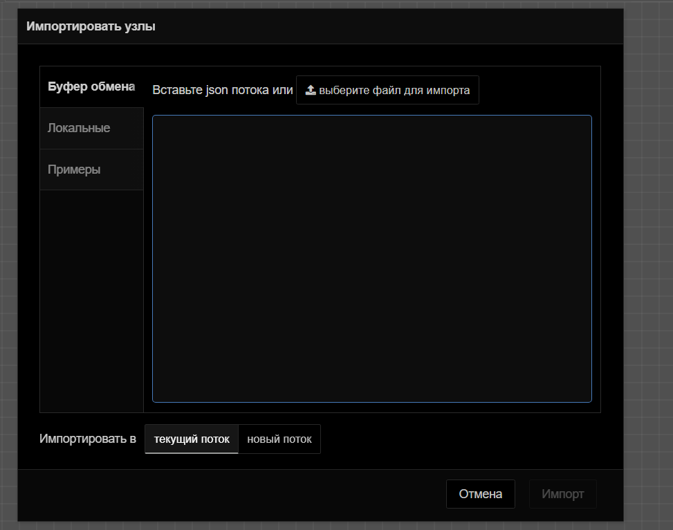
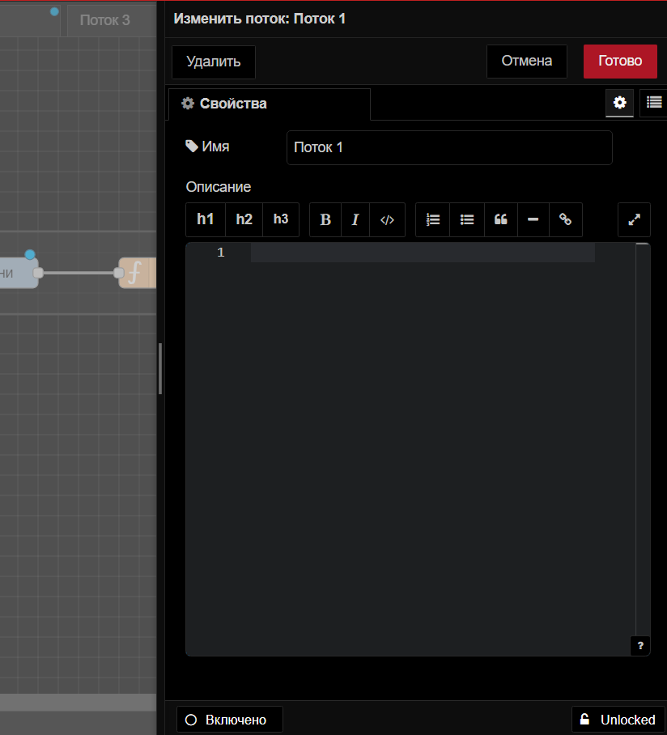

# U-Logic
```{note}
Вся логика, включая логику интерфейса, программируется в **U-Logic**. 
Для доступа к U-Logic откройте в браузере страницу **<IP Контроллера>:1880**. 
```
## Начало работы с U-Logic

### Редактор
```{figure} ../_static/about.png
:width: 100%
:align: center


Компоненты U-Logic
```

**Окно редактора *U-Logic* состоит из четырех компонентов:**

1. Заголовок вверху содержит кнопку **развернуть**, **главное меню** , **аутентификация пользователя**, **меню пользователя**.
2. Палитра слева содержит доступные для использования узлы.
3. Основное рабочее пространство посередине, где создаются потоки.
4. Боковая панель справа.

#### Заголовок редактора

##### Компонент заголовка редактора U-LOGIC

Заголовок редактора U-LOGIC — это центральный компонент, который упрощает навигацию по основным настройкам U-LOGIC, предоставляет кнопку развертывания для выполнения потоков и доступ к профилю пользователя.


##### Кнопка развертывания

С правой стороны заголовка вы найдете красную кнопку развертывания. Нажатие на нее запускает все потоки в экземпляре. Красный цвет указывает на ожидающие изменения для развертывания, а серый — на отсутствие ожидающих изменений.


Чтобы развернуть все в рабочей обалсти, или только потоки, содержащие измененные узлы, или только узлы, которые были изменены, или перезапустить развернутые потоки, нажмите на значок раскрытия кнопки развертывания. Выберите предпочитаемый вариант и затем нажмите кнопку развертывания соответственно


##### Главное меню

Сразу после профиля пользователя в правом углу вы увидите значок меню. Нажав на него, вы откроете список опций, которые упрощают работу с U-Logic.

Ниже приведены опции, доступные в главном меню.

###### Edit

Первая опция в меню позволяет выполнять основные действия по редактированию. Наведение на нее открывает дополнительные опции, такие как «Отменить последнее выполненное изменение», «Выбрать все узлы», «Скопировать выбранные узлы» и т. д.


- **Отменить последнее выполненное изменение**: Отменяет последнее действие или серию действий, выполненных в редакторе.
- **Redo**: Повторно применяет действие, которое было ранее отменено с помощью команды «Отменить последнее выполненное изменение».
- **Вырезать выбранные узлы**: Удаляет выбранные узлы из рабочей области и временно сохраняет их в буфере обмена.
- **Скопировать выбранные узлы**: Сохраняет дубликат выбранных узлов в буфере обмена, не удаляя их из исходного потока.
- **Вставить узлы**: Позволяет вставлять скопированные или вырезанные узлы из буфера обмена обратно в рабочий процесс.
- **Copy group style**: Сохраняет стиль выбранной группы в буфере обмена.
- **Paste group style**: Применяет сохраненный стиль группы к другой выбранной группе.
- **Выбрать все узлы**: Выбирает все группы потоков в текущей рабочей области.
- **Выбрать все соединенные узлы**: Выбирает узлы, подключенные к текущим выбранным узлам.
- **Select none**: Отменяет выбор всех выбранных узлов или групп.
- **Split selection with Link nodes**: Соединяет выбранные узлы с помощью узлов связи.

###### Вид

Эта опция позволяет пользователям управлять отображением и видимостью различных элементов интерфейса в редакторе U-Logic и обеспечивает им беспрепятственный доступ к этим элементам.


- **Показывать палитру**: переключает видимость палитры U-Logic
- **Показывать боковую панель**: включает и выключает видимость боковой панели.
- **Журнал событий**: открывает журнал, в котором регистрируются события и действия в U-Logic.
- **Список действий**: предоставляет список доступных действий или задач в U-Logic, что позволяет быстро получить доступ к часто используемым операциям и функциям.
- **Отладочные сообщения**: отображает сообщения, сгенерированные узлами отладки.

###### Arrange

Эта опция позволяет вам упорядочивать и управлять выбранными группами потоков в рабочем пространстве U-Logic:


- **Align to Left**: Выравнивает выбранные группы потоков по левому краю рабочей области. *(Сочетание клавиш: alt + a l)*
- **Align to Center**: Центрирует выбранные группы потоков по горизонтали в рабочей области. *(Сочетание клавиш: alt + a c)*
- **Align to Right**: Выравнивает выбранные группы потоков по правому краю рабочей области. *(Сочетание клавиш: alt + a r)*
- **Align to Top**: Выравнивает выбранные группы потоков по верхнему краю рабочей области. *(Сочетание клавиш: alt + a t)*
- **Align to Middle**: Центрирует выбранные группы потоков по вертикали в рабочей области. *(Сочетание клавиш: alt + a m)*
- **Align to Bottom**: Выравнивает выбранные группы потоков по нижнему краю рабочей области. *(Сочетание клавиш: alt + a b)*
- **Distribute Vertically**: Равномерно распределяет выбранные группы потоков по вертикали в рабочей области. *(Сочетание клавиш: alt + a v)*
- **Distribute Horizontally**: Равномерно распределяет выбранные группы потоков по горизонтали в рабочей области. *(Сочетание клавиш: alt + a h)*
- **Move Back**: Перемещает выбранные группы потоков на один слой назад в порядке наложения.
- **Move Front**: Перемещает выбранные группы потоков на один слой вперед в порядке наложения.
- **Move Backward**: Перемещает выбранные группы потоков на одну позицию назад в порядке наложения.
- **Move Forward**: Перемещает выбранные группы потоков на одну позицию вперед в порядке наложения.

###### Импорт

Эта опция позволяет импортировать файл приложения flow.json. В общем, вам доступны два основных метода импорта: вы можете использовать поле «Буфер обмена» или загрузить файл из локальной системы, нажав «выберите файл для импорта».



Кроме того, снизу можно выбрать область, в которой поток должен импортироваться:

- **текущий поток**: Выбор «текущий поток» импортирует поток в существующую рабочую область.
- **новый поток**: Выбор «новый поток» создаст новое рабочее пространство для импортированного потока после нажатия кнопки импорта.

С левой стороны после буфера обмена вы найдете три опции:

- **Локальные**: Здесь вы можете просмотреть локальную библиотеку потоков, которая содержит потоки, созданные в том же экземпляре U-Logic. Эта библиотека доступна только из того же экземпляра, где были созданы потоки.
- **Примеры**: В этом разделе содержатся примеры потоков для всех основных узлов, а также сторонних узлов, которые вы установили, если они были добавлены.

###### Экспорт

Эта опция позволяет экспортировать созданный вами поток приложений. Обычно она предоставляет две основные опции: «Скопировать в буфер обмена», которая позволяет копировать flow.json, и «Скачать», которая загружает flow.json файл.


Кроме того, вы можете выбрать область, из которой будет экспортироваться поток приложений, из верхних опций:


- **выбранные узлы**: Выбор этой опции позволяет экспортировать только выбранные узлы из потока.
- **текущий поток**: Выбор этой опции позволяет экспортировать приложение из текущей рабочей области потока.
- **все потоки**: Выбор этой опции позволяет экспортировать поток из всех потоков в данном экземпляре.

В верхней части вы увидите две вкладки:

- **Экспортировать узлы**: Эта вкладка позволяет увидеть узлы и потоки, которые вы собираетесь экспортировать.
- **JSON**: Эта вкладка покажет поток в формате JSON, который вы собираетесь экспортировать.


- **компактно**: Это уплотнит ваш JSON-файл потока в одну строку.
- **форматированно**: Это отформатирует JSON-файл потока, сделав его более удобным для чтения или проверки.

С левой стороны после буфера обмена вы найдете еще опцию:


**Локальные:** Эта опция позволяет создать коллекцию потоков, которые вы создали в текущем экземпляре U-Logic. Вы можете создать новую папку, нажав на значок с тремя точками в правом верхнем углу и выбрав "Новая папка". Кроме того, внизу вы найдете поле ввода, которое позволяет изменить имя файла потока. Нажатие на "Экспорт в библиотеку" сохранит его в коллекции. Теперь вы можете получить доступ к своей коллекции в том же экземпляре.

###### Поиск в потоках


Эта опция позволяет выполнять поиск групп потоков, созданных в этом экземпляре U-Logic.

###### Конфигурационные узлы


При нажатии на эту опцию откроется вкладка "конфиг" боковой панели, которая позволит вам управлять всеми узлами конфигурации текущего экземпляра U-Logic.

###### Потоки


<!--- add link-->
Эта опция позволяет управлять вкладками [потока]().

- **Добавить**: добавляет новую вкладку потока.
- **Edit**: Редактирует текущую вкладку потока.
- **Удалить**: удаляет текущую вкладку потока.

###### Подпотоки


<!--- add link--->
Эта опция позволяет создать [подпоток]().

- **Создать подпоток**: создает новую вкладку подпотока.
- **Выделение в подпоток**: преобразует выбранные узлы в подпоток.

###### Группы


Эта опция позволяет управлять группами потоков.

- **Сгруппировать выделенное**: группирует выбранные узлы.
- **Разгруппировать выделенное**: разгруппирует выбранную группу потоков.
- **Объединить выделение**: объединяет выбранные группы потоков.
- **Удалить из группы**: удаляет выбранные узлы из группы.

###### Управление палитрой
<!-- названия сторонних узлов содержат nod-red -->
Это позволяет пользователям управлять узлами, доступными в их среде U-Logic. Это включает установку новых узлов, обновление существующих и удаление узлов, которые больше не нужны.

Он содержит две основные вкладки:

- **Узлы**: эта вкладка показывает список установленных узлов. В правом углу каждой записи узла есть опции для:

  

- **удалить**: удалить узел.
- **отключить все**: Временно отключить узел.

- **Установить**: эта вкладка позволяет устанавливать сторонние узлы U-Logic из реестра npm.

  

- **сортировать**: это параметры сортировки, которые позволяют сортировать по relevance (по умолчанию), по алфавиту и по дате.
- **Обновить список модулей**: обновить список доступных сторонних узлов.

###### Параметры


- **Вид**: настройка параметров редактора и параметров интерфейса.
  - **Язык**: выберите язык для редактора U-Logic.
  - **Restore zoom level on load**: включение этой опции восстановит уровень масштабирования редактора при загрузке U-Logic.
  - **Restore scroll position on load**: включение этой опции восстановит позицию прокрутки редактора при загрузке U-Logic.
  - **Показывать сетку**: включите отображение сетки в рабочей области редактора.
  - **Привязывать к сетке**: включите привязку узлов к сетке.
  - **Размер сетки**: отрегулируйте размер квадратов сетки.
  - **Показать статус узла**: переключите, чтобы отобразить статус узлов в редакторе.
  - **Показывать метки у недавно добавленных узлов**: переключите, чтобы метки недавно добавленных узлов стали видимыми
  - **Показать советы**: переключите, чтобы отобразить подсказки в редакторе.
  - **Show guided tours for new versions**: включите пошаговые руководства для новых версий U-Logic.
<!--- add link-->
- **Палитра**: эта опция [управления палитрой]() позволяет управлять узлами, доступными в вашей среде U-Logic.

- **Клавиши**: настройте сочетания клавиш для эффективной навигации и работы в U-Logic.

- **Enviroment**: Управление переменными окружения, используемыми в потоках U-Logic. Это включает в себя настройку, редактирование и удаление переменных, к которым узлы могут получить доступ во время выполнения.

  

  - **+ добавить**: Добавляет новую переменную среды.
  - **x**: Удалить соответствующие переменные среды.
  - **Revert**: отменяет изменения, внесенные в переменные среды.

###### Сочетание клавиш

Эта опция перенаправляет вас в интерфейс, где вы можете настроить сочетания клавиш для эффективной навигации и работы в экземпляре U-Logic.

###### Вебсайт U-Logic

Эта опция перенаправит вас на официальный сайт U-Logic.

###### v4.0.9

Эта опция отображает журнал изменений для текущей версии U-Logic на вкладке "Change Log" боковой панели, подробно описывая, что было изменено или исправлено по сравнению с предыдущими версиями.

#### Палитра редактора

Палитра — это левая боковая панель, которая содержит все доступные узлы, включая основные узлы и установленные сторонние узлы.

##### Панель поиска


Расположенная в верхней части палитры строка фильтра узлов позволяет быстро находить узлы по их названию.

##### Категории узлов


Палитра разделена на несколько категорий, каждая из которых содержит коллекции узлов. При установке стороннего узла может быть создана новая категория. Подпотоки категоризируются в разделе «Подпотоки».

Вы можете свернуть или развернуть категории, нажав на нужную категорию.

###### Свернуть все категории


Внизу палитры вы найдете два значка со стрелками. Нажатие на левый значок со стрелкой вверх свернёт все категории.

##### Развернуть все категории

Нажатие на значок со стрелкой вниз развернет все категории обратно в состояние по умолчанию.

##### Показать/скрыть палитру


Нажатие этой кнопки скрывает боковую панель палитры. Чтобы снова ее отобразить, нажмите на кнопку еще раз.

#### Рабочее пространство редактора

Рабочая область — это основная область редактора, в которой вы создаете потоки приложений, перетаскивая узлы из палитры.


##### Просмотреть инструменты


В рабочем пространстве в правом нижнем углу есть инструменты просмотра. Сюда входят кнопки увеличения (`Ctrl`+`+`) и уменьшения (`Ctrl`+`-`) для управления видом рабочего пространства и сброса уровня масштабирования до значения по умолчанию.


Кроме того, он предоставляет навигатор представлений, который позволяет вам видеть уменьшенное изображение всего рабочего пространства. В этом представлении вы также можете видеть текущую видимую область рабочего пространства в редакторе. Чтобы перейти к определенной области рабочего пространства, щелкните эту область в навигаторе представлений.

##### Search flows


В левом нижнем углу рабочей области вы увидите значок поиска. Нажатие на него откроет всплывающее окно, позволяющее быстро искать потоки в вашем экземпляре U-Logic по их имени. Вы можете открыть это диалоговое окно, нажав `Ctrl` + `F`.

##### Поток


Поток представлен в виде вкладки в рабочей области редактора, предоставляя новое рабочее пространство для создания приложений путем соединения узлов. «Поток» также неформально используется для описания одного набора соединенных узлов. Таким образом, поток (вкладка) может содержать несколько потоков (наборов соединенных узлов), но формально поток является родительской группой нескольких соединенных узлов. Поток может иметь имя и описание, которые будут отображаться на информационной боковой панели.

###### Добавление потока


Чтобы создать родительский поток, нажмите на значок «+» в правом верхнем углу, или воспользуйтесь опцией добавления потока в главном меню при помощи раздела "Потоки"

###### Редактирование свойств поиска


Чтобы изменить свойства потока, дважды щелкните вкладку потока, чтобы ввести его имя и описание в появившейся всплывающей форме.

###### Удаление потока



Чтобы удалить поток, дважды щелкните по нему. В появившемся всплывающем окне нажмите кнопку "Удалить" в верхнем левом углу.


Либо щелкните правой кнопкой мыши вкладку потока и выберите в меню пункт «Удалить».

###### Включение и выключение потоков


Чтобы включить или отключить поток, дважды щелкните на вкладке потока. Нажмите кнопку «Отключено» в нижнем левом углу или кнопку «Включено», если он уже отключен.


Либо щелкните правой кнопкой мыши по вкладке потока и выберите в меню «Disable flow/Enable flow». Отключенные потоки не выполняются при развертывании.

###### Переупорядочение потоков

Потоки можно переупорядочить, щелкнув и перетащив вкладку потока в нужную позицию. Дополнительные параметры меню вкладки потока можно получить, щелкнув значок раскрывающейся стрелки в правом верхнем углу.

##### Подпоток
<!-- создание gif -->


Подпоток в U-Logic — это набор узлов, которые свернуты в один узел в рабочей области. Он позволяет группировать набор узлов в повторно используемую единицу. Это помогает в организации потоков, содействии повторному использованию и упрощении сложных конструкций потоков путем инкапсуляции нескольких узлов в единое представление узла более высокого уровня.

```{note}
подпоток не может содержать экземпляр самого себя — ни напрямую, ни косвенно.
```

###### Создание подпотока


Чтобы создать подпоток, в разделе "Подпотоки" выберите "Создать подпоток" в главном меню.


Он создаст для вас окно подпотока, похожее на вкладку потока.

###### Редактирование подпотока


Чтобы открыть диалоговое окно редактирования подпотока, дважды щелкните по узлу подпотока, затем щелкните «Изменить шаблон подпотока». Вы можете дать имя для этого подпотока, добавить описание, щелкнув в правом верхнем углу


опцию «Описание», а также настроить внешний вид, нажав на опцию «Внешний вид» в правом верхнем углу.


На вкладке свойств вы можете определить пользовательские свойства, которые будут добавлены в диалог редактирования подпотока. Затем эти свойства будут представлены как переменные среды, которые затем могут использоваться узлами этого подпотока. При определении этих свойств вы также можете определить тип данных и метку для каждого.


###### Удаление подпотока


Чтобы удалить подпоток, нажмите кнопку «удалить подпоток» в верхней части вкладки подпотока.

###### Преобразование узлов в подпоток


Если у вас есть узлы на рабочем пространстве и вы хотите создать из них подпоток, вы можете выбрать их, нажав левую клавишу мыши и нарисовав вокруг них прямоугольник. Затем нажмите на `Подпотоки` -> `Выделение в подпоток` в главном меню.

```{note}
Провода, входящие в выборку, должны быть подключены к одному узлу, поскольку результирующий узел подпотока может иметь не более одного входа.
```

###### Входы и выходы


Входы и выходы подпотока изображены серыми квадратными узлами, которые могут быть соединены в рабочем пространстве подпотока как обычные узлы. Верхняя панель инструментов предлагает функции для добавления и удаления этих узлов. Подобно узлам обычного потока, каждый подпоток может иметь максимум один вход, но может вмещать несколько выходов.

###### Статус узла


Узел Status используется для обновления статуса подпотока. Этот узел статуса можно редактировать как обычные узлы потока. Этот узел использует входные данные, `msg.payload` которые могут быть либо простой строкой, либо объектом Status.

##### Узлы


Узел — это фундаментальный строительный блок, используемый для создания потоков. Каждый узел представляет собой отдельную часть функциональности или определенное действие, которое может быть выполнено в потоке. Эти узлы могут быть сторонними дополнениями с использованием менеджера палитры или основных узлов.


Узлы могут иметь один входной и несколько выходных портов, соединенных проводами, которые определяют поток данных внутри потоков. Как входные, так и выходные узлы могут подключаться к нескольким проводам.


Некоторые узлы имеют кнопки либо слева, либо справа. Например, узел inject имеет кнопку слева, а узел debug — справа. Функция этих кнопок различается между узлами.
<!-- 
 -->

Кроме того, некоторые узлы отображают статус внизу со значками, указывающими на их статус выполнения. Например, узлы mqtt in и websocket in показывают текст «подключено» с зеленым кружком, указывающим на успешное подключение.


Все узлы в U-Logic обозначают ошибки красным треугольником, неразвернутые изменения — синим кружком.

###### Добавление узлов в рабочее пространство

Добавить узлы в рабочую область можно тремя способами:

**Перетаскивание из палитры**

Узлы можно добавлять из палитры U-Logic , перетаскивая их на рабочую область.

**Использование диалогового окна быстрого добавления**

Редактор U-Logic предоставляет быстрый и простой способ добавления узлов с помощью палитры:


- Нажмите `Ctrl` или `Command` и щелкните по рабочей области.
- Выберите нужный узел в диалоговом окне, которое содержит все доступные узлы из основной палитры узлов.
- Используйте строку поиска для быстрого поиска узлов.

При рисовании провода от одного узла оставьте провод на рабочем пространстве, чтобы подключить его к узлу, который будет добавлен с помощью того же диалогового окна быстрого добавления.

**Импорт из библиотеки или буфера обмена**

Узлы также можно добавлять, импортируя их из командной или локальной библиотеки или используя буфер обмена (`главное меню` -> `импорт`).

###### Редактирование свойств узла


Чтобы настроить свойства узла, дважды щелкните по нему или выберите узел и нажмите Enter. Появится всплывающая форма для настройки узла. Параметры конфигурации различаются в зависимости от типа узла.


- При нажатии на вторую из трех опций в правом верхнем углу открывается вкладка «Описание», позволяющая написать описание в формате Markdown, которое будет отображаться на боковой панели информации.


- При нажатии на третий параметр открывается вкладка для изменения внешнего вида узла, например, для изменения значков, присвоения имен входным и выходным портам и переключения видимости меток.

###### Включение и отключение узлов


Чтобы включить или отключить узлы, дважды щелкните по узлу и нажмите нижнюю кнопку «Включено» или кнопку «Отключено», если они уже включены.

###### Доступ к справочной информации Node


Чтобы получить доступ к справочной информации об узле, дважды щелкните по узлу и щелкните нижний значок «Показать справку», который отображает информацию, связанную с этим узлом, на информационной боковой панели.

###### Конфигурационные узлы

Узлы конфигурации в U-Logic хранят конфигурации, общие для нескольких узлов в потоке.

Например, узлы HTTP-прокси или настройки TLS представляют собой конфигурации для узлов HTTP-запросов.

```{note}
Узлы конфигурации не шифруют данные после конфигурации, что потенциально может раскрыть конфиденциальную информацию при неправильном распространении. Рекомендуется использовать переменные среды для настройки этих узлов, чтобы предотвратить их раскрытие в потоке.
```

Узлы конфигурации можно добавлять с помощью диалогового окна редактирования узлов, требующих настройки:


- Нажмите на значок «+» рядом со значком карандаша и полем с текстом.
- Введите необходимую информацию в диалоговом окне редактирования и нажмите «Добавить».

Узлы конфигурации не видны в рабочей области, как другие узлы, но ими можно управлять на вкладке узлов конфигурации на боковой панели.


Чтобы узнать, сколько узлов используют определенную конфигурацию, проверьте информацию в нижнем колонтитуле диалогового окна редактирования узла конфигурации.

Кроме того, как и общие узлы, узлы конфигурации можно отключать и включать таким же образом.

##### Провода


«Провода» относятся к соединениям, которые связывают узлы вместе, чтобы определить поток данных. Эти провода визуально представляют направление и поток информации от одного узла к другому в потоке U-Logic.

###### Соединение узлов вместе
<!-- 
 -->

Чтобы соединить узлы с помощью проводов, щелкните левой кнопкой мыши на выходном порту узла и перетащите провод к входному порту назначения. Кроме того, если вы нажмете `Ctrl/Command` и левую клавишу мыши на входном или выходном порту, вам не нужно будет удерживать левую клавишу мыши или любую другую кнопку для перетаскивания провода. Чтобы подключить его к порту назначения, нажмите левую клавишу мыши на порту назначения. Если клавиша `Ctrl/Command` останется нажатой после подключения к порту назначения, и если узел этого порта имеет выходной порт, будет перетащен новый провод.

Провода можно подключать от входного порта к выходному порту, а не от входного порта к входному порту или от выходного порта к выходному порту.

###### Удаление проводов
<!-- 
 -->

Чтобы удалить провода, щелкните левой кнопкой мыши, чтобы выбрать первый провод. Чтобы выбрать несколько проводов, нажмите и удерживайте клавишу, `Ctrl\Command` щелкая каждый провод левой кнопкой мыши. Если вы используете только левую кнопку мыши, вы можете выбрать только один провод за раз. После выбора проводов нажмите клавишу «delete» или «backspace», чтобы удалить их.

###### Движущиеся провода
<!-- 
 -->

Чтобы отключить провод от порта, выберите провод, щелкнув по нему. Затем нажмите и удерживайте клавишу `Shift` , пока левая клавиша мыши нажата на порту. При перетаскивании мыши вы увидите, что провод отключается от порта и может быть подключен к другому порту.

Если к порту подключено несколько проводов, и при нажатии кнопки с удерживаемой клавишей Shift ни один из них не выбран, то будут перемещаться все провода.

###### Резка проводов
<!-- 
 -->

Провода также можно удалить, разрезав их. Это можно сделать, удерживая клавишу `Alt/Option`, а затем нарисовав линию разрезания, удерживая левую кнопку мыши.

###### Отсоединение узлов

**Сохранение провода при удалении узла**
<!-- 
 -->

Для этого нажмите и удерживайте клавишу Ctrl/ Command, выберите узел, щелкнув левой клавишей мыши, а затем нажмите клавишу «delete» или «backspace».

**Отсоединение узла от проводов**
<!-- 
 -->

Чтобы использовать эту опцию, необходимо задать сочетание клавиш для действия «Detach Selected Nodes»

##### Группы


В U-Logic можно создавать группы для лучшей организации, содержащие один объект с включенными конфигурациями узлов в редакторе.

###### Создание группы потоков


Чтобы создать группу потоков, выберите узлы (удерживая клавишу Ctrl или рисуя вокруг них прямоугольник). Перейдите `Группы` -> `Сгруппировать выделение` в главном меню или нажмите `Ctrl` + `Shift` + `G`.

###### Редактирование свойств группы


Группа потока может иметь имя, цвет фона и метку границы, видимую в рабочей области. По умолчанию она имеет серую границу без фона или имени.

Чтобы задать стиль и имя группы, дважды щелкните по ней. Введите имя, выберите цвета контура и фона в свойстве заливки, настройте положение и цвет метки, затем щелкните «Готово» в правом верхнем углу.

###### Добавление переменных среды на уровне группы


Чтобы добавить переменные среды на уровне группы, дважды щелкните по ним. Выберите вторую опцию в правом верхнем углу всплывающего окна, расположенного под кнопкой «Готово». Нажмите самую нижнюю кнопку «добавить», чтобы добавить переменные.

###### Добавление описания


Чтобы добавить описание в группу, дважды щелкните по ней. Выберите третий вариант в правом верхнем углу всплывающего окна под кнопкой «Готово». Введите описание в формате Markdown.

###### Добавление узлов в группу
<!-- 
 -->

Чтобы добавить узлы в существующую группу, перетащите их в группу. Это можно делать по одному узлу за раз. Группы также могут быть вложены друг в друга таким же образом.

###### Удаление узлов из группы
<!-- 
 -->

Чтобы удалить узлы из группы, выберите узлы и перейдите `Группы` -> `Удалить из группы` в главном меню. Аналогично удалите группу из другой группы. Или щелкните по узлу, удерживайте клавишу «Alt» и перетащите его за пределы группы.

###### Объединение групп


Чтобы объединить несколько групп в одну, выберите группы. Перейти к главному меню и выбрать раздел `Группы` -> `Объединить выделение`.

###### Разгруппировка выбранных узлов


Чтобы разгруппировать узлы из группы, выберите узлы. Перейти к главному меню в раздел `Группы` -> `Разгруппировать выделение`.

##### Выбор

Редактор U-Logic предоставляет простой интерфейс для выбора узлов и проводов на рабочем пространстве.

Узел можно выбрать или отменить выбор, щелкнув по нему. Чтобы выбрать несколько узлов, нажмите `Ctrl/Command` клавишу и выберите нужные узлы. Чтобы выбрать все узлы в рабочей области, щелкните `Ctrl`+`A`.

###### Инструмент "Лассо"


U-Logic предоставляет инструмент лассо для более быстрого выбора. Чтобы использовать инструмент лассо, нажмите левую клавишу мыши и перетащите курсор, затем вы можете выбрать несколько узлов, нарисовав вокруг них прямоугольник.

###### Выбор подключенных узлов
<!-- 
 -->

Чтобы выбрать все подключенные к определенному узлу узлы, нажмите `Shift` и щелкните по середине этого узла.

###### Выбор всех вышестоящих узлов
<!-- 
 -->

Чтобы выбрать все подключенные узлы, которые находятся перед этим конкретным узлом, нажмите `Shift` и, удерживая ее, щелкните левую часть этого узла.

###### Выбор всех нижестоящих узлов
<!-- 
 -->

Чтобы выбрать все подключенные узлы, которые находятся после данного конкретного узла, нажмите `Shift` и, удерживая ее, щелкните правую часть этого узла.

###### Выбор потоков


Чтобы выбрать вкладки потока, нажмите клавишу `Ctrl/Command` и, удерживая ее, щелкните на вкладке потока, которую вы хотите выбрать. Теперь вы можете удалить, экспортировать или скопировать их все вместе.

#### Боковая панель редактора

Боковая панель расположена на правой стороне редактора U-Logic. Она содержит набор различных инструментов, которые упрощают использование U-Logic, например, управление узлами, конфигурация, хранилище контекста и многое другое.


Инструменты, доступные на боковой панели, называются панелями.

##### Панели по умолчанию

Боковая панель U-Logic поставляется со следующими панелями по умолчанию:

##### Панель "инфо"

На информационной панели отображается информация обо всех потоках, узлах, присутствующих в них, подпотоках и узлах, присутствующих в них, а также узлах глобальной конфигурации в древовидной структуре.

Если навести курсор на любой элемент в этой древовидной структуре, вы увидите несколько опций, которые упрощают и ускоряют работу, например, вызвать действие (для активации узлов, если у наведенного узла есть кнопка), включить/отключить (для отключения и включения наведенного узла), Show/Hide (для скрытия и отображения наведенного элемента в рабочей области), Lock/Unlock (для блокировки и разблокировки наведенного элемента), Найти в рабочей области (для быстрого поиска наведенного элемента в рабочей области). Эти опции представлены различными значками.

###### Поиск в потоках

Панель "инфо" имеет строку поиска в верхней части, которая позволяет легко искать потоки, подпотоки и узлы на информационной панели.

Кроме того, он предоставляет фильтр, позволяющий фильтровать эти элементы по различным параметрам, таким как
- Узлы конфигурации
- Неиспользуемые узлы конфигурации
- Modified nodes and flows
- Недействительные узлы
- Неизвестные узлы
- Неиспользуемые подпотоки
- Hidden flows
- Current flow

###### Свойства элемента

Если щелкнуть элемент в древовидной структуре информационной панели, на второй вкладке панели "инфо" вы увидите идентификатор потока, если выбранный элемент является потоком, а также идентификатор узла и тип, если это узел.

Значение узла можно копировать с помощью опции копирования справа от значения

Чтобы увидеть дополнительную информацию, нажмите кнопку «Показать больше», которая отобразит дополнительную информацию обо всех свойствах узла.

В верхней части вы увидите три опции: первая — "Показать справку", при нажатии на которую вы перейдете на панель справки и увидите файл readme, предоставленный автором для выбранного элемента; вторая опция скопирует URL-адрес выбранного элемента, вы можете использовать эту функцию, когда хотите указать или обсудить определенный элемент в рабочей области с членом вашей команды; и третья опция позволяет вам найти этот элемент в рабочей области.

##### Панель "справка"

Эта панель позволяет просматривать docs/readme, добавленные авторами пакета node для помощи пользователям. Макет этой панели немного похож на информационную панель и разделен на две вкладки.

Первая вкладка представляет собой древовидную структуру с двумя основными темами: «U-Logic» и «Справка по Node». U-Logic включает в себя последний журнал изменений и приветственный тур (краткое руководство по недавно добавленным функциям) для всех версий U-Logic.

На второй вкладке отображаются справочные документы/файлы readme выбранного узла.

###### Скрытие тем

Чтобы скрыть/показать первую вкладку панели справки, нажмите на верхнюю левую кнопку "Hide topics".

###### Просмотр документации Node на вкладке "Справка"

Чтобы просмотреть файлы readme/docs на панели справки для узлов, щелкните один раз по узлам в рабочей области или щелкните элемент узла в древовидной структуре раздела «Справка по узлам».

##### Панель "отладка"

Панель отладки отображает сообщения, выводимые узлом отладки. Эта панель помогает легко отлаживать ваше приложение.

Когда сообщения печатаются на панели отладки, каждое сообщение включает дату и время, имя узла, который напечатал это сообщение, имя свойства, его тип данных и значение.

###### Фильтрация отладочных сообщений

В верхней части панели отладки вы увидите опцию фильтра с тремя параметрами, которая позволяет отображать только те сообщения, которые вам нужны:

- все узлы: при выборе этого параметра будут отображаться сообщения, распечатанные всеми узлами.
- выбранные узлы: эта опция позволяет выбрать конкретные узлы отладки, сообщения которых вы хотите видеть на панели отладки.
- текущий поток: при выборе этого параметра будут печататься только сообщения, напечатанные узлами, присутствующими в текущем потоке.

```{note}
боковая панель "отладка" может отображать только 100 последних сообщений. Если боковая панель в данный момент отображает отфильтрованный список сообщений, скрытые сообщения все равно учитываются в пределе 100.
```

###### Очистка сообщений

Чтобы очистить сообщения, нажмите на кнопку "Очистить журнал" в правом верхнем углу. Или нажмите на `ctrl`+`alt`+`l`.

###### Открытие отдельного окна

Чтобы открыть панель отладки в отдельном окне, щелкните по правой нижней кнопке "Открыть в новом окне" со значком компьютера. Щелчок по нему откроет панель отладки в новом окне браузера, что позволит легко просматривать и управлять сообщениями отладки.


##### Панель "узлы конфигурации"

Панель узлов конфигурации показывает список всех узлов конфигурации, добавленных к текущему экземпляру U-Logic. Все узлы конфигурации организованы по их области действия, например, по всем потокам, по определенному потоку и подпотоку.

Каждый узел конфигурации на панели узлов конфигурации отображает тип и метку этого узла, а также количество текущих узлов, использующих эту конфигурацию.

Эта панель конфигурации также обеспечивает легкий доступ к диалоговому окну редактирования узлов конфигурации. Чтобы открыть его, дважды щелкните по узлам конфигурации на панели.

Для доступа к этой панели узлов конфигурации нажмите `Ctrl/command`+`g` +`c`.

###### Фильтрация узлов конфигурации

Панель конфигурации узлов предоставляет возможность фильтровать узлы по всем и неиспользуемым.

##### Панель "контекст"

Эта панель отображает переменные контекста по их области действия. Каждая переменная включает такие данные, как дата и время, ее хранилище (память или постоянное), а также имя и значение. Чтобы получить доступ к этой панели, нажмите `ctrl/command`+`g`+`x`.

###### Обновление переменных контекста

Чтобы обновить контекстные переменные, нажмите кнопку обновления, расположенную в правом верхнем углу каждой вкладки области действия, или, чтобы обновить определенную переменную, наведите на нее курсор и нажмите кнопку обновления, которая появляется справа от нее.

###### Удаление контекстных переменных

Чтобы удалить контекстную переменную, наведите указатель мыши на переменную, которую вы хотите удалить, и нажмите кнопку удаления, которая появляется справа от нее.

###### Копирование свойств и значений

Чтобы скопировать имя этой переменной, наведите на нее курсор и нажмите первую кнопку, которая появится справа.

Чтобы скопировать значение этой переменной, наведите на нее курсор и нажмите вторую кнопку, которая появится справа.

##### Сокрытие боковой панели

Чтобы скрыть боковую панель, нажмите на кнопку "Показать/скрыть боковую панель". Чтобы снова отобразить ее, нажмите на кнопку переключения еще раз. В качестве альтернативы вы можете использовать сочетание клавиш `ctrl/command`+`space`.

##### Изменение размера боковой панели

Чтобы изменить размер боковой панели, наведите указатель мыши на границу боковой панели, пока курсор не изменится. Затем нажмите левую кнопку мыши и удерживайте ее во время изменения размера.

## Быстрый страт

```{note}
За работу графического интерфейса отвечает узел **UI Control Panel**. 
Без этого узла графический интерфейс панели управления неактивен и недоступен. 
```

1. Для инициализации интерфейса добавьте узел **UI Control Panel** в рабочую область.
```{figure} ../_static/ADDUIPanelNode.png
:width: 100%
:align: center


Добавленные узлы UI Control Panel
```

2. Откройте его настройки, дважды кликнув на него. В появившемся окне нажмите на иконку  
```{figure} ../_static/EditNodeUI.png
:width: 100%
:align: center


Настройка узла
```

напротив поля `path`, добавьте конфигурацию `\web-client`, примените настройки узла и запустите поток **U-Logic**. 
Используйте только один экземпляр узла UI Control Panel для работы всех графических интерфейсов; не дублируйте и не 
создавайте новые экземпляры. В U-Logic по умолчанию включены все необходимые узлы для работы с популярными 
протоколами, а также дополнительные вспомогательные узлы. Для каждого узла есть описание и примеры его использования. 
Чтобы вызвать справку по узлу, выберите его и нажмите **Ctrl + G**, затем **H**. Если возможностей узлов недостаточно 
для взаимодействия с оборудованием, в U-Logic включены библиотеки, которые можно использовать в узлах **Function**:
```
ws: require("ws"),
ssh2: require("ssh2"),
http: require("node:http"), 
net: require("node:net"), 
tls: require("node:tls")
```
```{note}
Пример использования библиотек находится в разделе [Function](./U-Logic-Function.md)
```
## Палитра узлов

