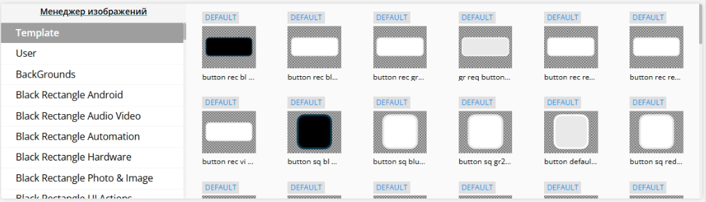
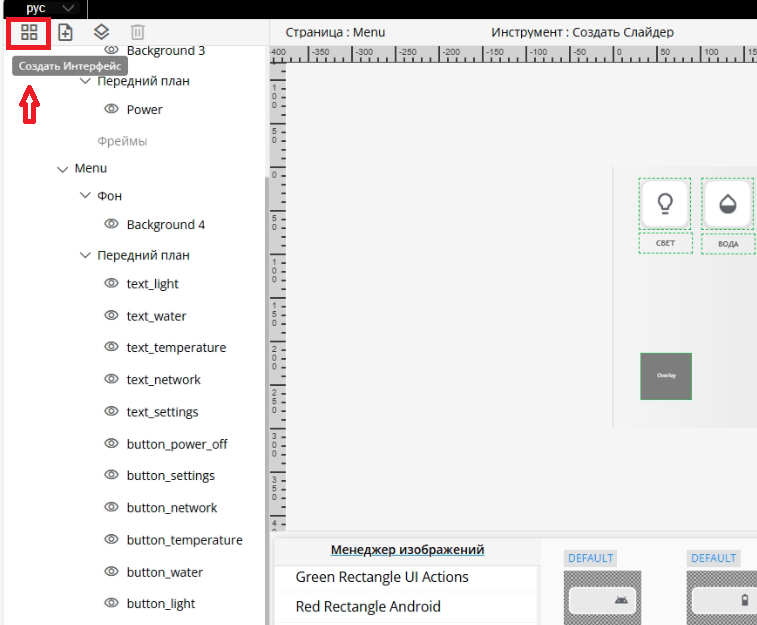
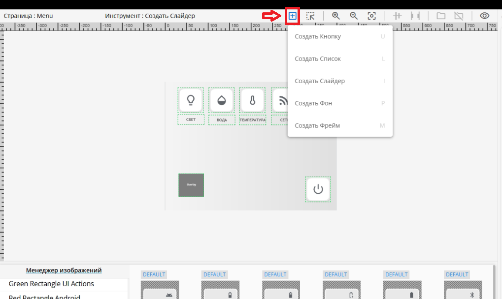
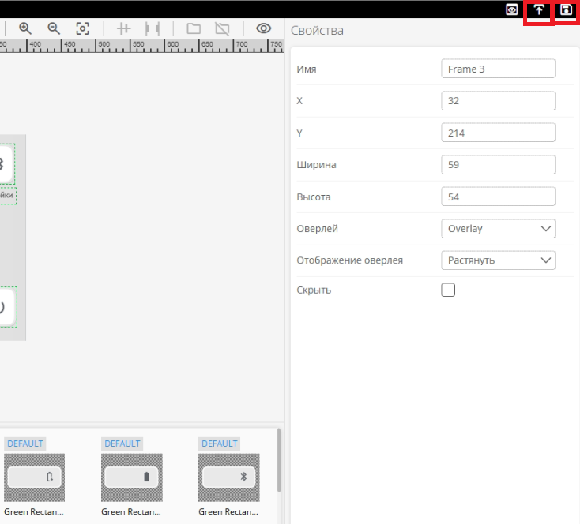

# UI-Designer

**UI-Designer**– это инструмент для создания и настройки пользовательских интерфейсов с помощью drag-and-drop (перетаскивания). Пользователь может управлять структурой интерфейса, настраивая страницы и элементы на страницах, такие как фоны, текст, кнопки, слайдеры, списки, Оверлеи(подстраницы). UI-Designer интерфейсов позволяет легко изменять свойства каждого элемента через панель настроек. Для доступа к UI-Designer введите в браузере <IP-Controller:8000>

## Обзор

**UI-Designer** служит для создания интерфейсов, для панели управления. Все имена объектов — это их **ID**, 
с помощью которых производится управление состоянием этих элементов. При создании каждого элемента интерфейса тщательно 
продумывайте их имена, это упростит взаимодействие с интерфейсом в **U-Logic**. Имена объектов могут дублироваться, 
но в таком случае состояние, отправленное из U-Logic, будет применяться ко всем элементам с одинаковым именем. 
Не создавайте объекты разных типов с одинаковыми именами. Используйте только английские символы для имен объектов.

[//]: # (## Сохранение и загрузка интерфейса)

[//]: # (Для сохранения и загрузки проекта в панель управления в UI-Designer существует панель в левом верхнем углу.)

[//]: # (Кнопка **Save**  служит только для сохранения изменений в проекте. )

[//]: # ()
[//]: # ()
[//]: # (Кнопка **Upload Project**  загружает UI-Designer проект в панель )

[//]: # (управления и применяет изменения. При нажатии кнопки Upload Project автоматически перезагрузится U-Logic.)


Основные элементы:

*   **Дерево интерфейса** – служит для навигации по созданным элементам.
*   **Холст** – основная рабочая область для создания интерфейсов.
*   **Панель свойств элементов** – служит для изменения размеров, положения, стилей и других параметров
*   **Менеджер изображений** – загрузка и выбор изображений для использования в интерфейсе.

### Верхняя панель


В верхней панели интерфейса расположены следующие элементы управления:

- Выбор языка — позволяет переключаться между доступными языками: английским и русским.
- Предпросмотр — отключает возможность редактирования интерфейсов, позволяя оценить их финальный вид.
- Опубликовать — отправляет внесённые изменения в UI-Panel, делая их доступными для использования.
- Сохранить — фиксирует текущие изменения в UI-Designer, обеспечивая их сохранность для дальнейшей работы.

### Левая панель  


На левой панели расположены следующие кнопки управления элементами интерфейса:

- Создать интерфейс
- Создать страницу
- Создать оверлей
- Удалить

**Создать интерфейс**


При нажатии на кнопку "Создать интерфейс" открывается форма, в которой предлагается:

- Ввести название интерфейса

```{note}
Имя интерфейса выступает в роли ID, который используется для взаимодействия с интерфейсом в U-Logic. Рекомендуется использовать латинские символы без пробелов (как для самого интерфейса, так и для всех элементов).
```

- Выбрать соотношение сторон:
  - 4:3
  - 16:9
  - 16:10
  - Пользовательское (возможность задать произвольные параметры).

```{note}
Примечание: Все указанные свойства можно изменить позже.
```

**Создать страницу**

Добавляет новую страницу на выбранном интерфейсе.

**Создать оверлей**

Добавляет оверлей на выбранном интерфейсе.

Оверлей — это подстраница или всплывающий элемент, добавляемый к основному интерфейсу. Он позволяет организовать многоуровневую структуру интерфейса, избегая создания множества отдельных страниц. Основная страница содержит глобальные статичные элементы, такие как фон и элементы навигации, а функциональные элементы, например, настройки звука, видео или системные параметры, выносятся на оверлей. Это даёт возможность гибко управлять контентом, накладывая дополнительные слои поверх основной структуры интерфейса.

Фрейм – это контейнер, в котором отображаются оверлеи. Он обеспечивает динамическое изменение содержимого без создания новых страниц, что позволяет избежать дублирования элементов и упрощает навигацию.

Назначение фрейма:
- Определяет область, в которой будет размещаться оверлей.
- Позволяет уменьшить количество страниц за счёт добавления дополнительных слоёв интерфейса.
- Может находиться внутри оверлеев, что даёт возможность создавать сложные иерархические интерфейсы.
- Позволяет изменять содержимое динамически, без смены основной страницы.

```{note}
Один и тот же оверлей может быть показан в разных фреймах на любых страницах.
```

**Удалить**

Удаляет выбранный элемент интерфейса.

**Дерево интерфейса**

Также на левой панели расположено дерево в котором отображается структура и элементы интерфейса и служит для навигации по элементам интерфейса. Пользовательский интерфейс может содержать страницы и оверлеи, которые могут содержать:

- Фон
- Передний план
- Фреймы

В дереве интерфейсов доступны следующие функции:
- **Добавление элементов** – рядом с типом элемента интерфейса расположен значок "+", нажав на который, можно добавить новую страницу или оверлей.
- **Скрытие элементов** – слева от каждого элемента находится значок "глаза", при нажатии на него элемент скрывается.
- **Сворачивание и разворачивание разделов** – группы элементов в дереве можно сворачивать и разворачивать для удобства навигации.

### Центральная панель


Центральная панель содержит:

- **Холст** для редактирования выбранной страницы
- **Менеджер изображений** для выбора изображения из библиотек

#### Холст

Холст отображает выбранную страницу в дереве проекта и элементы, расположенные на этой странице

В верхней части холста отображается:
- Имя выбранной страницы или оверлея
- Выбранный инструмент

Также в верхней части холста доступны следующие кнопки:
- **Создать виджет**
  - Создать Кнопку
  - Создать Список
  - Создать Слайдер
  - Создать Фон
  - Создать Фрейм
  
  Для создания виджета выделите область на рабочем пространстве

- **Выделение**: Позволяет выбрать один или несколько элементов интерфейса для редактирования.
- **Приблизить**: Увеличивает масштаб рабочей области.
- **Отдалить**: Уменьшает масштаб рабочей области.
- **Исходный масштаб**: Сбрасывает масштабирование к стандартному значению.
- **Инструменты выравнивания**: Автоматически выравнивает выбранные элементы в зависимости от выбранной опции.
  - Центрировать по горизонтали
  - Центрировать по вертикали
  - Выровнять по левому краю
  - Выровнять по правому краю
  - Выровнять по верхнему краю
  - Выровнять по нижнему краю

- **Интсрументы распределения**: Распределяет выбранные элементы в зависимости от выбранной опции.
  - Распределить по горизонтали
  - Распределить по вертикали
  - Интервал: Задать интервал между элементами для распределения

- **Группировать элементы**: Объединяет несколько выбранных элементов в одну группу.
- **Разгруппировать элементы**: Отменяет группировку.
- **Показывать имена элементов**: Отображает имена элементов на рабочей области.

Рабочее пространство - это рабочая зона UI-Designer для размещения элементов

#### Менеджер изображений



Левая часть менеджера изображений представляет из себя список библиотек, содержащих изображения. В правой части отображается содержимое выбранной библиотеки.

При нажатии на "Менеджер изображений" появится следующее окно:


В левой части представлен список библиотек

В центре представлены элементы выбранной в левой части библиотеки, кнопка добавления пользовательских изображений в библиотеку и строка для поиска библиотеки

В правой части представлена информация о группе (элементе библиотеки), а именно название элемента, его изображение в следующих состояниях:

- **DEFAULT**: Состояние по умолчанию. Отображается на начальном экране пользовательского интерфейса. Это изображение статично на интерфейсе, пока не будет изменено нажатием или другим событием.
- **SELECTED**: Отображается во время нажатия на кнопку.
- **PRESSED**: Отображается после отправки соответствующей команды из U-Logic.
- **DISABLED**: Отображается, когда кнопка больше не активна.

Для каждого изобажения элемента указан размер (ширина x высота) в пикселях и его разамер (КБайт)

Для удаления изображения элемента требуется навестить на него, нажать на появившуюся снизу кнопку удаления и подтвердить удаление

### Правая панель

На правой панели отображаются свойства элемента. Панель Свойств предоставляет возможность редактировать определенные параметры элементов интерфейса:

- Имя - Задает название элемента.
- Скрыть - Позволяет скрыть элемент с пользовательского интерфейса.

**Положение и размер элемента**

- X - Изменение значения X перемещает элемент по горизонтали страницы.
- Y - Изменение значения Y перемещает элемент по вертикали страницы.
- Ширина - Изменение ширины элемента.
- Высота - Изменение высоты элемента.

**Настройка текста**

- Текст – Добавляет текст для идентификации кнопки, страницы или интерфейса.
- Размер шрифта – Определяет размер текста. Допустимым размером шрифта является число от 0 (текст не отображается) и больше.
- Цвет шрифта - Определяет цвет и прозрачность отображаемого текста. Цвет можно выбрать при помощи палитры цветов или ввода цвета вручную в формате HEX, RGBA, HSLA.
- Выравнивание текста – Регулирует положение текста внутри элемента интерфейса. Текст можно расположить в одном из следующих положений: верхний левый, верхний средний, верхний правый, центр слева, центр по центру, центр справа, нижний левый, нижний средний или нижний правый.
- Отступ текста – Задаёт расстояние между текстом и границами элемента интерфейса. Отступ регулируется в пикселях и может быть установлен отдельно для каждой стороны: верхний, нижний, левый и правый.
- Шрифт – Задает шрифт текста, отображаемого в пользовательском интерфейсе.
- Жирный шрифт – Применяет полужирное начертание текста.

**Настройка оформления**

- Цвет фона - Определяет цвет и прозрачность отображаемого фона. Цвет можно выбрать при помощи палитры цветов или ввода цвета вручную в формате HEX, RGBA, HSLA.
- Стиль границы - Определяет вид границы элемента в пользовательском интерфейсе. Возможные значения:
  - Сплошной
  - Пунктирный
  - Точечный
  - Двойной
  - Канавка
  - Гребень
  - Вдавленный
  - Выпуклый
- Ширина границы - Задаёт ширину границы элемента пользовательского интерфейса.
- Цвет границы - Определяет цвет и прозрачность отображаемой границы. Цвет можно выбрать при помощи палитры цветов или ввода цвета вручную в формате HEX, RGBA, HSLA.
- Радиус закругления углов - Регулирует степень скругления углов границ элемента пользовательского интерфейса.

**Настройка изображения**

- Изображение - Отображает в виде миниатюры изорабежние, добавленное в качестве фона страницы. Для добавления изображения найдите изображение для фона в менеджере изображений и перенесите его в поле "Изображение".
- Размер изображения - Определяет отображение изображение в элементе. Доступны следующие варианты:
  - Вписать - Вписывает изображение под размер элемента, сохраняя пропорции.
  - Растянуть - Растягивает изображение для заполнения области элемента, игнорируя пропорции.
- Изображения состояния Default, Pressed, Selected, Disabled можно изменить вручную. Для этого необходимо выбрать изображение в соответствующем окне. Изображения состояния отображаются в виде миниаютр в панели свойств

**Настройка кнопки**

- Состояние кнопки - Определяет отображаемое состояние кнопки по умолчанию.
- Повтор нажатия при удержании - Определяет возможность повторной нажатия на кнопку при удержании.
- Частота повтора (сек) - Определяет длительность удержания (в секундах) кнопки для повторного нажатия.
- Кнопка переключения - Делает формат кнопки переключаемым. Кнопка формата переключения имеет два состояния:
  - Default
  - Pressed

**Оверлей**

- Оверлей - Выбор оверлея для фрейма, который будет отображаться поверх фрейма.
- Отображение оверлея - Определяет отображение оверлея в фрейме:
  - Растянуть
  - Прокручиваемый

**Слайдер**

- Ориентация - Определяет определяет ориентацию слайдера:
  - вертикально - Движение от низа к верху, где нижняя часть – минимальное значение, а верхняя – максимальное
  - горизонатльно - Движение слева направо, где левая сторона – минимальное значение, а правая – максимальное
- Отправлять команды после:
  - Отпускание - Отправка команды после отпускания ручки слайдера.
  - Перетаскивание - Отправка команд при перемещении ручки слайдера.
- Шаги - Задает количество команд, которые могут быть выполнены с помощью слайдера. Например, для регулятора яркости можно установить 100 шагов (от 0% до 100%).
- Цвет ручки - Определяет цвет и прозрачность ручки слайдера. Цвет можно выбрать при помощи палитры цветов или ввода цвета вручную в формате HEX, RGBA, HSLA.
- Радиус ручки - Регулирует размер ручки слайдера.
- Цвет заполненной полоски - Определяет цвет и прозрачность заполненной полоски, который указывает текущий уровень параметра, контролируемого слайдером. Цвет можно выбрать при помощи палитры цветов или ввода цвета вручную в формате HEX, RGBA, HSLA.
- Цвет пустой полоски - Определяет цвет и прозрачность пустой полоски. Цвет можно выбрать при помощи палитры цветов или ввода цвета вручную в формате HEX, RGBA, HSLA.
- Толщина полоски - Задает ширину вертикального слайдера и высоту горизонтального.

<!-- дальше не отредактировано -->

## Создание и управление элементами интерфейса

### Создание интерфейса

При первом запуске **UI-Designer** для создания интерфейса нажмите кнопку **Создать Интерфейс**



После нажатия, в появившемся окне необходимо ввести уникальное название интерфейса и настроить соотношение сторон создаваемого интерфейса


```{note}
Имена всех элементов используются как ID в U-Logic поэтому должны быть указаны на латинице.
```

### Создание страницы

После создания интерфейса появится холст, где можно увидеть структуру страницы и её элементы. Каждая страница должна иметь уникальное имя, которое будет использоваться как ID для взаимодействия с **U-Logic**. На странице можно создавать следующие элементы: **Фон**, **Кнопки**, **Слайдеры**, **Списки** и **Фреймы**. Каждый элемент и созданная страница отображаются в дереве проекта, где корнем выступает интерфейс. Для добавления новой страницы используйте кнопку **Добавить страницу**, расположенную в панели над деревом проекта

Чтобы добавить элемент на страницу, нажмите кнопку "**Создать Виджет** в панели над холстом. 



Откроется выпадающий список с типами доступных элементов. Выберите нужный элемент, затем зажмите левую кнопку мыши и выделите область на холсте, где должен появиться выбранный элемент. Элемент будет создан в выбранной области.

Кнопки можно создавать и другим способом — через **Менеджер изображений**. В Менеджере изображений находятся готовые изображения кнопок, которые можно использовать в проекте. Просто выберите нужное изображение и перетащите его на холст. При этом, если удерживать клавишу `Shift`, будет создан элемент **Фон**, покрывающий весь холст. Для каждого состояния кнопки можно сменить изображение, для этого нужно выбрать кнопку на холсте и перетащить изображение из «менеджера изображений» в нужное состояние в панели свойств.

Чтобы создать Фрейм для Оверлея:

Нажмите на кнопку создания виджета в панели инструментов холста и выберите "**Создать Фрейм**".

В окне свойств можно настроить размеры и местоположение фрейма, а также указать оверлей и его отображение.

### Создание оверлея

В панели интерфейсов выберите название нужного интерфейса. В панели инструментов дерева, нажмите **Добавить Оверлей**. Также можно создать оверлей в дереве интерфейса, нажав на знак "+" напротив "Оверлей". Настроить размеры оверлея можно в окне свойств.

```{note}
Один и тот же оверлей может быть показан в разных фреймах на любых страницах.
```

## Управление проектом

### Сохранение и публикация проекта

После того как дизайн интерфейса готов, интерфейс можно загрузить на UI-Panel. Для этого сначала необходимо сохранить проект нажав на кнопку **Сохранить**, затем нажать кнопку **Опубликовать** для отправки проекта на панель.



### Настройка интерфейса в U-logic

- Откройте U-Logic и настройте узлы **UI-Panel** для запуска созданного интерфейса. Подробнее смотреть в документации U-Logic.
- Откройте **UI-Panel** для работы с загруженным интерфейсом по адресу `IP-Controller:5001`.