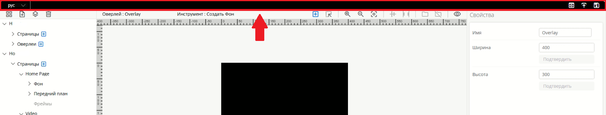
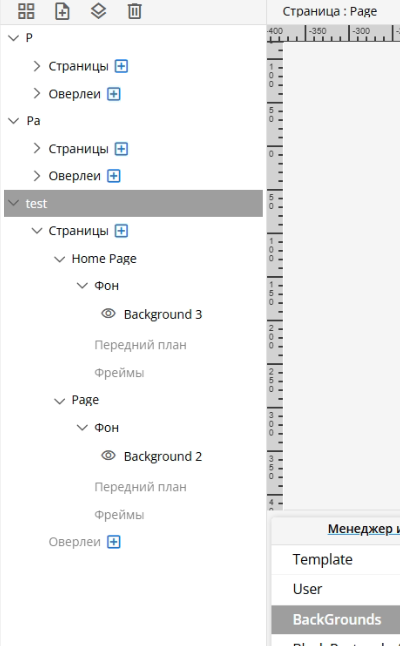
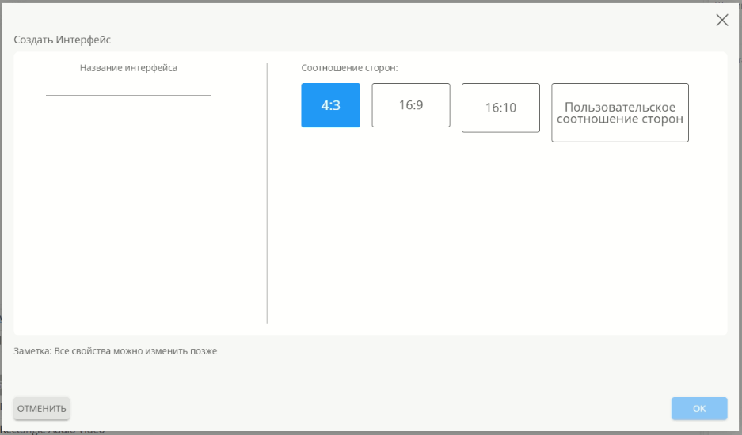
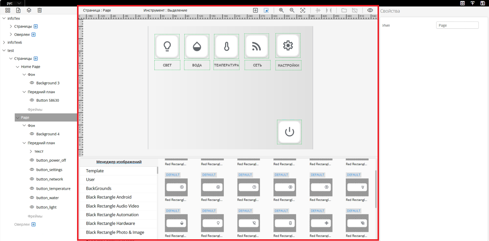
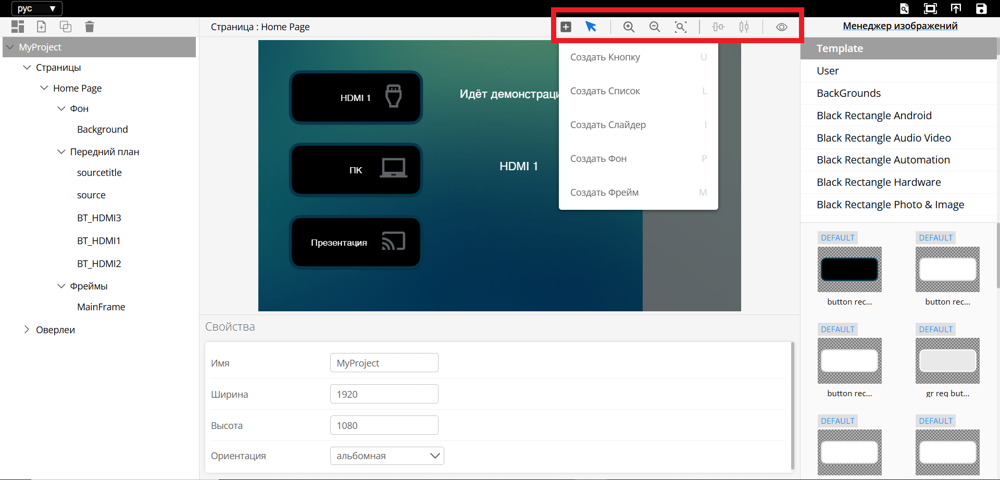
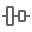
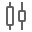
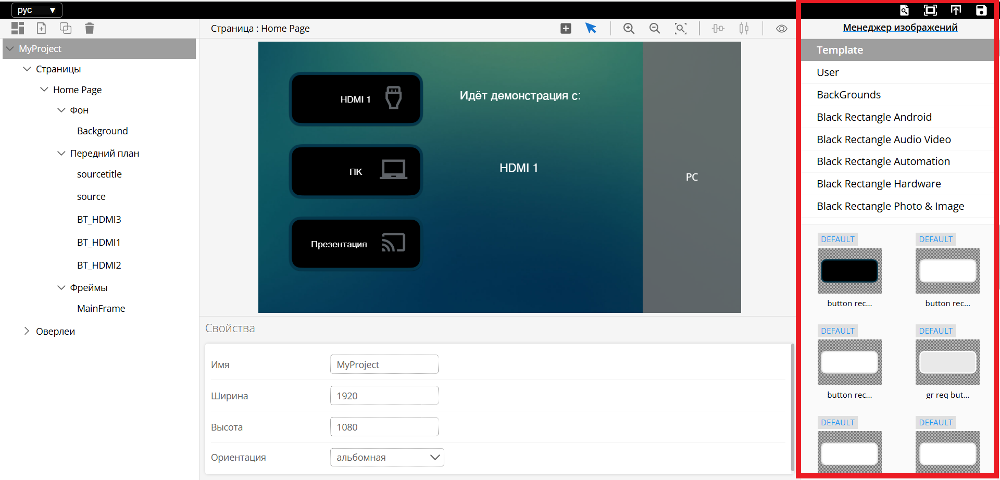

# UI-Designer

**UI-Designer**– это инструмент для создания и настройки пользовательских интерфейсов с помощью drag-and-drop (перетаскивания). Пользователь может управлять структурой интерфейса, настраивая страницы и элементы на страницах, такие как фоны, текст, кнопки, слайдеры, списки, Оверлеи(подстраницы). UI-Designer интерфейсов позволяет легко изменять свойства каждого элемента через панель настроек. Для доступа к UI-Designer введите в браузере <IP-Controller:8000>

## Обзор

**UI-Designer** служит для создания интерфейсов, для панели управления. Все имена объектов — это их **ID**, 
с помощью которых производится управление состоянием этих элементов. При создании каждого элемента интерфейса тщательно 
продумывайте их имена, это упростит взаимодействие с интерфейсом в **U-Logic**. Имена объектов могут дублироваться, 
но в таком случае состояние, отправленное из U-Logic, будет применяться ко всем элементам с одинаковым именем. 
Не создавайте объекты разных типов с одинаковыми именами. Используйте только английские символы для имен объектов.

[//]: # (## Сохранение и загрузка интерфейса)

[//]: # (Для сохранения и загрузки проекта в панель управления в UI-Designer существует панель в левом верхнем углу.)

[//]: # (Кнопка **Save**  служит только для сохранения изменений в проекте. )

[//]: # ()
[//]: # ()
[//]: # (Кнопка **Upload Project**  загружает UI-Designer проект в панель )

[//]: # (управления и применяет изменения. При нажатии кнопки Upload Project автоматически перезагрузится U-Logic.)


Основные элементы:

*   **Дерево интерфейса** – служит для навигации по созданным элементам.
*   **Холст** – основная рабочая область для создания интерфейсов.
*   **Панель свойств элементов** – служит для изменения размеров, положения, стилей и других параметров
*   **Менеджер изображений** – загрузка и выбор изображений для использования в интерфейсе.

### Верхняя панель



В верхней панели интерфейса расположены следующие элементы управления:

- Выбор языка — позволяет переключаться между доступными языками: английским и русским.
- Предпросмотр — отключает возможность редактирования интерфейсов, позволяя оценить их финальный вид.
- Опубликовать — отправляет внесённые изменения в UI-Panel, делая их доступными для использования.
- Сохранить — фиксирует текущие изменения в UI-Designer, обеспечивая их сохранность для дальнейшей работы.

### Левая панель  



На левой панели расположены следующие кнопки управления элементами интерфейса:

- Создать интерфейс
- Создать страницу
- Создать оверлей
- Удалить

**Создать интерфейс**



При нажатии на кнопку "Создать интерфейс" открывается форма, в которой предлагается:

- Ввести название интерфейса
- Выбрать соотношение сторон:
  - 4:3
  - 16:9
  - 16:10
  - Пользовательское (возможность задать произвольные параметры).

```{note}
Примечание: Все указанные свойства можно изменить позже.
```

**Создать страницу**

Добавляет новую страницу на выбранном интерфейсе.

**Создать оверлей**

Добавляет оверлей на выбранном интерфейсе.

**Удалить**

Удаляет выбранный элемент интерфейса.

**Дерево интерфейса**

Также на левой панели расположено дерево в котором отображается структура и элементы интерфейса и служит для навигации по элементам интерфейса. Пользовательский интерфейс может содержать страницы и оверлеи, которые могут содержать:

- Фон
- Передний план
- Фреймы

В дереве интерфейсов доступны следующие функции:
- **Добавление элементов** – рядом с типом элемента интерфейса расположен значок "+", нажав на который, можно добавить новую страницу или оверлей.
- **Скрытие элементов** – слева от каждого элемента находится значок "глаза", при нажатии на него элемент скрывается.
- **Сворачивание и разворачивание разделов** – группы элементов в дереве можно сворачивать и разворачивать для удобства навигации.

### Центральная панель



Центральная панель содержит:

- **Холст** для редактирования выбранной страницы
- **Менеджер изображений** для выбора изображения из библиотек

#### Холст

Холст отображает выбранную страницу в дереве проекта и элементы, расположенные на этой странице

В верхней части холста отображается:
- Имя выбранной страницы или оверлея
- Выбранный инструмент

Также в верхней части холста доступны следующие кнопки:
- Создать виджет
  - Создать Кнопку
  - Создать Список
  - Создать Слайдер
  - Создать Фон
  - Создать Фрейм

<!-- дальше не отредактировано -->

*   **Холст** для редактирования выбранной страницы
*   **Свойства** для редактирования свойств выбранного элемента
*   **Панель инструментов** для создания элементов и работы с холстом

Холст отображает выбранную страницу в дереве проекта и элементы, расположенные на этой странице

Панель **Свойств** предоставляет возможность редактировать определенные параметры элементов интерфейса, такие как имена интерфейсов, размеры кнопок, шрифт, цвет текста и цвет фона.

##### Настройки текста

*   **Текст** – добавляет текст для идентификации кнопки, страницы или интерфейса.
*   **Шрифт** – задает шрифт текста, отображаемого в пользовательском интерфейсе.
*   **Размер шрифта** – определяет размер текста. Допустимые значения – от 1 и до бесконечности.
*   **Жирный** – применяет полужирное начертание текста.
*   **Цвет фона** – задает цвет фона для элемента интерфейса.
*   **Цвет шрифта** – открывает палитру для выбора и редактирования цвета текста.
*   **Выравнивание текста** – регулирует положение текста внутри элемента интерфейса. Текст можно расположить в одном из следующих положений: верхний левый, верхний средний, верхний правый, центр слева, центр по центру, центр справа, нижний левый, нижний средний или нижний правый.

##### Параметры положения на странице

*   **X** – изменение значения X перемещает элемент по горизонтали страницы (слева направо).
*   **Y** – изменение значения Y перемещает элемент по вертикали страницы (сверху вниз).

##### Параметры размера

*   **Ширина**– изменение ширины объекта
*   **Высота**– изменение высоты объекта

С их помощью можно отрегулировать **Ширину** и **Высоты** (ширину и высоту) элемента интерфейса.

##### Параметры изображения

*   **Изображение Defalt, Изображение Pressed, Изображение Selected, Изображение Disabled**– миниатюры изображения, используемого для кнопки в соответствующих состояниях.

**Размер изображения**– включает следующие настройки:

*   **Contain** – подгоняет изображение под элемент, сохраняя пропорции.
*   **Stretch** – растягивает изображение для заполнения области элемента, игнорируя пропорции.
*   **Normal** – сохраняет исходные пропорции изображения, независимо от размера элемента.

**Параметры границы**

*   **Стиль границы** включает следующие настройки:
    *   **Сплошной**
    *   **Пунктирный**
    *   **Точечный**
    *   **Двойной**
    *   **Канавка**
    *   **Гребень**
    *   **Вдавленный**
    *   **Выпуклый**
*   **Ширина границы** – задает размер границы.
*   **Цвет границы** – задает цвет границы
*   **Радиус закругления углов** – закругляет углы границы

**Размер изображения**– включает следующие настройки:

*   **Contain** – подгоняет изображение под элемент, сохраняя пропорции.
*   **Stretch** – растягивает изображение для заполнения области элемента, игнорируя пропорции.
*   **Normal** – сохраняет исходные пропорции изображения, независимо от размера элемента.

##### Параметры слайдера

*   **Ориентация** – определяет ориентацию слайдера. Доступные варианты:
    *   **Вертикальная** – движение от низа к верху, где нижняя часть – минимальное значение, а верхняя – максимальное.
    *   **Горизрнтальная** – движение слева направо, где левая сторона – минимальное значение, а правая – максимальное.
*   **Шаг** – задает количество команд, которые могут быть выполнены с помощью слайдера. Например, для регулятора яркости можно установить 100 шагов (от 0% до 100%).
*   **Отправлять команду после** – включает два варианта:
    *   **Перетаскивание** – отправка команд при перемещении ручки слайдера.
    *   **Отпускание** – отправка команды после отпускания ручки слайдера.
*   **Цвет ручки** – задает цвет ручки слайдера.
*   **Цвет заполненной полоски** – определяет цвет заполненной части слайдера, который указывает текущий уровень параметра, контролируемого слайдером.
*   **Цвет пустой полоски** – определяет цвет пустой области слайдера над текущим уровнем.
*   **Толщина полоски** – задает ширину вертикального слайдера и высоту горизонтального.
*   **Радиус ручки** – определяет размер ручки слайдера.

##### Панель инструментов центральной панели



содержит следующие компоненты:

|                              Изображение                               | Описание                                                                                                                                                                                 |
|:----------------------------------------------------------------------:|:-----------------------------------------------------------------------------------------------------------------------------------------------------------------------------------------|
|                    | «**Создать Виджет**» - вызывает выпадающий список с выбором доступных для создания элементов на странице. После выбора элемента из списка курсор переходит в режим «рисования» элементов |
|                 | «**Выделить**» – выключает режим рисования                                                                                                                                               |
|                 | **Увеличить**– увеличивает масштаб холста                                                                                                                                                |
|                | **Уменьшить**– уменьшает масштаб холста                                                                                                                                                  |
|              | **Масштаб по размеру**– исходный масштаб холста                                                                                                                                          |
|            | Выравние элементов                                                                                                                                                                       |
|  | Задать интервал между элементами                                                                                                                                                         |
|                   | Просмотреть имена элементов                                                                                                                                                              |


### Правая панель




На правой панели находится - Менеджер изображений, Библиотека изображений, Панель инструментов (правый верхний угол). 

Каждое изображение может содержать следующие состояния:

*   **Default** (По умолчанию) – отображается на начальном экране пользовательского интерфейса. Это изображение статично на интерфейсе, пока не будет изменено нажатием или другим событием.
*   **Pressed** (Нажато) – отображается во время нажатия на кнопку.
*   **Selected** (Выбрано) – отображается после отправки соответствующей команды из U-Logic.
*   **Disabled** (Отключено) – отображается, когда кнопка больше не активна.

##### Панель инструментов

|                                                Изображение                                                 | Описание                                                                                             |
|:----------------------------------------------------------------------------------------------------------:|:-----------------------------------------------------------------------------------------------------|
|         | «**Сохранить**» -Сохраняет проект, без загрузки на панель                                            |
|      | «**Опубликовать**» – Загружает проект на панель управления                                           |
|      | **Предпросмотр**– Включает отображение Оверлея внутри фрейма                                         |
|  | **Предпросмотр с дейтсвительными значениями**– предпросмотр интерфейса в его действительном масштабе |


**Создание интерфейса**

При первом запуске **UI-Designer** для создания интерфейса нажмите кнопку **Create Interface**


После нажатия, в появившемся окне необходимо настроить разрешение интерфейса в соответствии с разрешением устройства, на котором будет работать интерфейс, например, Сенсорная панель с разрешением экрана 1920x1080. Для этого необходимо выбрать **Пользовательское соотношение сторон** и задать ширину экрана 1920 и высоту экрана1080. Так же необходимо задать уникальное имя интерфейса. После того как все поля заполнены нажать ОК.  
**Примечание: Имена всех элементов это ID которые используются в API для взаимодействия с программой управления созданной в визуальной среде прогрпшаммирования, имена должны быть указаны на латинице**


#### Создание страницы

После создания интерфейса появится холст, где можно увидеть структуру страницы и её элементы. Каждая страница должна иметь уникальное имя, которое будет использоваться как ID для взаимодействия с **визуальной средой программирования**. На странице можно создавать следующие элементы: **Фон**, **Кнопки**, **Слайдеры**, **Списки** и **Фреймы**. Каждый элемент и созданная страница отображаются в дереве проекта, где корнем выступает интерфейс. Для добавления новой страницы используйте кнопку **Добавить страницу**, расположенную в панели над деревом проекта


#### Создание элементов страницы

Чтобы добавить элемент на страницу, нажмите кнопку "**Создать элемент**"  в панели над холстом. Откроется выпадающий список с типами доступных элементов. Выберите нужный элемент, затем зажмите левую кнопку мыши и выделите область на холсте, где должен появиться выбранный элемент. Элемент будет создан в выбранной области. После создания элемента нажмите клавишу **S** на клавиатуре, чтобы выйти из режима создания элементов.

Кнопки можно создавать и другим способом — через **Менеджер изображений**. В Менеджере изображений находятся готовые изображения кнопок, которые можно использовать в проекте. Просто выберите нужное изображение и перетащите его на холст. При этом, если удерживать клавишу **Shift**, будет создан элемент **Background** (фон), покрывающий весь холст. Для каждого состояния кнопки можно сменить изображение, для этого нужно выбрать кнопку на холсте и перетащить изображение из «менеджера изображений» в нужное состояние в панели свойств

##Оверлей и Фрейм

Оверлеи — это подстраницы, которые добавляются в основной интерфейс. Они позволяют использовать главный интерфейс для размещения базовых статичных объектов, таких как фон или элементы навигации, а нужный функционал, например, настройки звука, видео или системные параметры, выносить на оверлеи.

**Создание Фрейма для Оверлея:**

Нажмите на кнопку создания виджета в панели инструментов холста и выберите "**Создать Фрейм**".

В окне свойств можно настроить размеры и местоположение фрейма, а также указать размеры отображаемого в нём **Оверлея**.

**Создание и настройка Оверлея:**

В панели интерфейсов выберите название нужного интерфейса. В панели инструментов дерева, нажмите  "**Добавить Оверлей**". Настройте размеры оверлея в окне свойств. Размер оверлея должен соответствовать размеру фрейма, в котором он будет отображаться.

Один и тот же оверлей может быть показан в разных фреймах на любых страницах.

**Сохранение и публикация проекта**

После того как дизайн интерфейса готов, интерфейс можно загрузить на панель управления. Для этого сначала необходимо сохранить проект нажав на кнопку **Сохранить**  на панели интсрументов над менеджером изображений, затем нажать кнопку **Опубликовать**  для отправки проекта на панель


### Создание интерфейса

#### Добавление интерфейса
1. Откройте **UI-Designer**.  

2. **Создайте новый интерфейс:**
   - Нажмите кнопку **«Создать интерфейс»**.  
   
       
   
   - Нажмите на кнопку **«Пользовательское соотношение сторон»**.
   - В левом углу укажите имя интерфейса.
   - **Задайте разрешение интерфейса.** Разрешение должно соответствовать экрану панели, на которой будет использоваться интерфейс.
   - **Подтвердите создание интерфейса:**  
   - Нажмите кнопку **«Ок»**. После этого появится интерфейс с одной страницей.

  


```{note}
   Имя интерфейса выступает в роли ID, который используется для взаимодействия с интерфейсом в U-Logic. Рекомендуется использовать латинские символы без пробелов (как для самого интерфейса, так и для всех элементов).
```
---
#### Добавление изображений и кнопок
**Задний фон страницы:**

1. Выберите нужное изображение из библиотеки изображений.

     

2. Зажмите **ЛКМ + SHIFT** и перетащите изображение на холст.
3. В панели свойств в параметре **«Размер изображения»** выберите значение **«Растянуть»**.
     
   

   - **Добавление кнопки:**
   1. Выберите нужное изображение из библиотеки изображений
   2. Нажмите и удерживайте ЛКМ, затем перетащите изображение на холст.
   3. В панели свойств задайте имя кнопки, текст и другие необходимые параметры.
   
   

```{note}
Имена всех объектов это их ID, используются при взаимодействии U-Logic с интерфейсом.
```
   
---

#### Создание текстового объекта   
   - Нажмите на кнопку **«Создать виджет»** на панели инструментов над холстом. 

   

   - В появившемся меню выберите **«Создать кнопку»**.
   - Наведите курсор на холст, зажмите ЛКМ и потяните курсор, чтобы указать область расположения и размеры кнопки.

   

   - Отпустите ЛКМ и нажмите клавишу **F** для выхода из режима рисования.
   - В панели свойств задайте текст и размер шрифта.

   

   - Для создания второго текстового поля (в котором в дальнейшем будет меняться текст в зависимости от сценариев программы в U-Logic), наведите курсор на уже созданный объект.
   - Зажмите **ЛКМ + CTRL** или **CTRL + С**  и перетащите объект в нужное место.
   - Измените или удалите текст и задайте новое имя объекта.
   
   

7. **Добавьте дополнительные кнопки:**  
   Для каждой кнопки задайте уникальное имя.
8. **Сохранение и публикация проекта:**
   - Сохраните результат.  
     
   - Опубликуйте проект.  


9. **Настройка интерфейса в U-Logic:**
    - Откройте U-Logic и настройте узлы **UI-Panel** для запуска созданного интерфейса.
    - Откройте **UI-Panel** для работы с загруженным интерфейсом по адресу `IP-Controller:5001`.

---


#### Фреймы и оверлеи (Подстраницы)

**Оверлеи** – это подстраницы или всплывающие страницы, позволяющие организовать многоуровневую структуру интерфейса без необходимости создавать множество отдельных страниц. Вместо этого используется единая основная страница с глобальными элементами управления, а оверлеи (подстраницы) накладываются на неё.

**Фрейм** – это контейнер, в котором отображаются оверлеи. Он обеспечивает динамическое изменение содержимого без создания новых страниц, что позволяет избежать дублирования элементов и упрощает навигацию.

**Назначение фрейма:**
- Определяет область, в которой будет размещаться оверлей.
- Позволяет уменьшить количество страниц за счёт добавления дополнительных слоёв интерфейса.
- Может находиться внутри оверлеев, что даёт возможность создавать сложные иерархические интерфейсы.
- Позволяет изменять содержимое динамически, без смены основной страницы.

#### Создание фрейма и оверлея

1. **Создание фрейма:**
   - Выберите нужную страницу в дереве интерфейсов (левая часть UI-Designer).
   - Нажмите кнопку **«Создать элемент интерфейса»** на панели инструментов.
   - Выберите **«Создать фрейм»**.
   


   - На холсте зажмите ЛКМ и перетащите курсор, чтобы создать фрейм.
   - Нажмите клавишу **F** для выхода из режима рисования.
   - Отредактируйте размер и положение фрейма в панели свойств и задайте имя фрейма.


2. **Создание и настройка оверлея:**
   - Выберите нужный интерфейс (если их несколько), оверлеи создаются отдельно для каждого интерфейса.

   - На панели инструментов над деревом проекта нажмите кнопку **«Добавить оверлей»**.

     

   - Новый оверлей появится в списке оверлеев выбранного интерфейса.
   - В окне свойств настройте размер оверлея, который должен соответствовать размеру фрейма.
   
    


#### **Создание объектов в оверлее**
```{note}
Создание объектов для Оверлея ни чем не отличается от создания объектов для страницы.
```

   - **Создание слайдера:**
     1. На панели инструментов над холстом нажмите кнопку **«Создать виджет»**.
   
        
   
     2. В выпадающем меню выберите **«Создать слайдер»**.
     3. Наведите курсор на холст, зажмите ЛКМ и выделите область, где должен располагаться слайдер.
     4. Для выхода из режима рисования нажмите клавишу **F**.
     5. В панели свойств задайте имя слайдера.
     
        

   - **Создание дополнительных кнопок:**
     - Создайте кнопки для увеличения/уменьшения громкости и для включения/выключения звука.
     - Задайте уникальные имена для каждого объекта.
     
       
```{note}
Чтобы оверлей (подстраница) был прозрачным, не добавляйте для него фон.
```
4. **Просмотр результата:**
   - Для предварительного просмотра нажмите на нужную страницу в дереве интерфейсов (левая часть UI-Designer).
   - Выберите фрейм на холсте или в дереве интерфейсов и в панели свойств выберите нужный overlay из списка.
   
   
   
   - Нажмите на кнопку **«Предпросмотр»** (или нажмите клавишу **1**) для просмотра оверлея на странице.  
   
   
   - Для выхода из режима предпросмотра также нажмите клавишу **1**.

```{note}
В режиме предпросмотра редактирование интерфейса невозможно. Выключите этот режим для внесения изменений.
```

5. **Копирование оверлеев:**
   - Скопируйте созданный оверлей и измените имена оверлеев и элементов внутри них при необходимости.

```{note}
Если в настройках фрейма в разделе **«Отображение оверлея»** выбран конкретный оверлей, он будет отображаться по умолчанию при первом запуске интерфейса. Чтобы фрейм оставался пустым по умолчанию, выберите опцию **«Нет оверлея»**.
```

6. **Завершение работы:**
   - Сохраните и опубликуйте проект.
   - Откройте U-Logic для настройки поведения интерфейса.
   - Запустите UI-Panel для работы с обновлённым интерфейсом.


