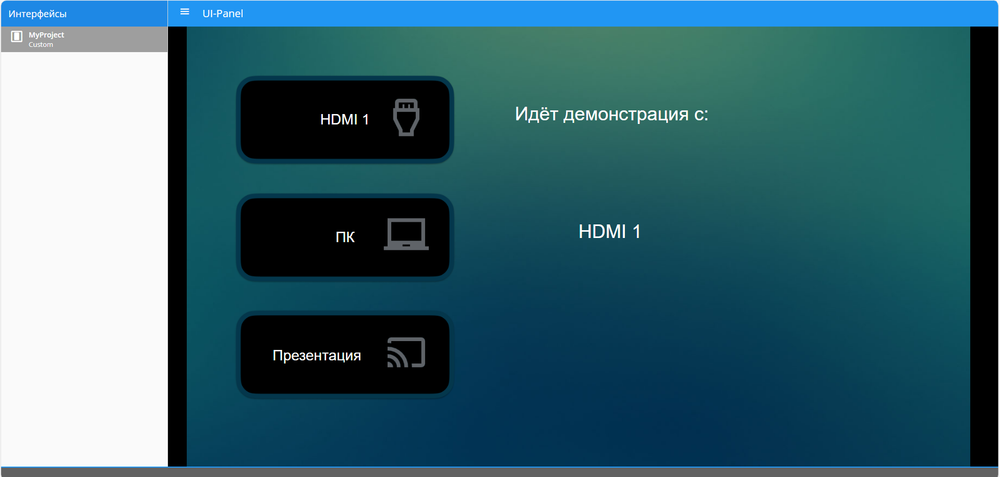
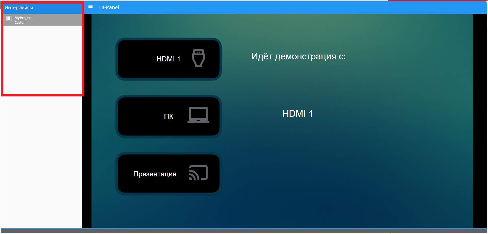

# UI-Panel

### Панель управления (Графический интерфейс)

- Графический интерфейс доступен по адресу **<IP Контроллера>:5001**. По этому адресу открываются все доступные интерфейсы. 

- Чтобы открыть нужный интерфейс, выберите его в селекторе интерфейсов в левой части страницы. После выбора в адресной строке появится адрес выбранного интерфейса. 

- Чтобы открыть интерфейс в полноэкранном режиме, добавьте к адресу ключ **&immersive=true**.

**Пример:**

**http://192.168.1.250:5001/?interface=4481370f-5d5b-4604-8c3b-030daa93c4ac&page=3ea383c4-7c1e-4db7-8788-352fedb9696b&immersive=true**

